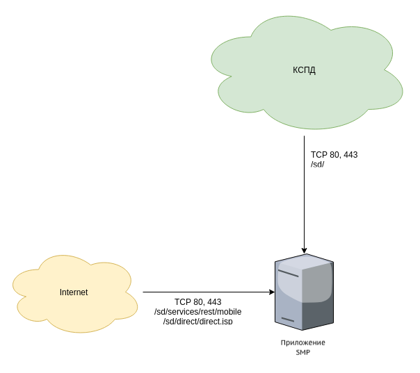

# Настройка сетевых ресурсов

Для работы мобильного приложения из сети Интернет, в том числе отправки push-уведомлений, требуется доступ к сетевым ресурсам.

Доступ устанавливается при настройке обратного прокси (reverse-proxy). Reverse-proxy (чаще всего nginx) выполняет функцию ретрансляции запросов клиентов из внешней среды на один или несколько серверов внутренней сети.

На рисунке приведена схема взаимодействия приложения SMP с сетью Интернет и корпоративной сетью с указанием необходимых для работы мобильного приложения ресурсов.



### Работа из сети Интернет

При настройке reverse-proxy необходимо предоставить доступ к ресурсам:

```groovy
/
^/sd/?$ # с версии МК 15.0 эта строка необязательна
/sd/services/rest-mobile
/sd/jwt-mobile
```

<note type="info">

С версии МК 15.0 не требуется выполнять настройку, которая возвращает код 204 для ресурса /sd (включая корневой и вложенные).

</note>

По http-запросу к ресурсам /sd (корневому /sd и вложенным в него) reverse-proxy должен возвращать код 204.

Пример настройки в nginx:

```groovy
# с версии МК 15.0 эта настройка необязательна
location ~ ^/sd/$ {
return 204;
}
```

### Встроенные приложения

Для работы встроенных приложений в мобильном приложении необходимо предоставить доступ к ресурсам:

```groovy
/sd/services/eamobile
^/sd/application-.*
/sd/operator/cache/apps
/sd/services/earest
```

### SSO-аутентификация

Для работы SSO-аутентификации в мобильном приложении необходимо предоставить доступ к ресурсам:

```groovy
/sd/services/rest-mobile/authentication/callback
/sd/callback
/sd/externalError
/sd/logout
```

### Страница перенаправления

Страница перенаправления позволяет осуществить переход пользователя из веб-интерфейса в мобильное приложение.

Настройка reverse-proxy в части доступа к ресурсам для страницы перенаправления:

```groovy
/
^/sd/?$
/sd/operator
/sd/index.jsp
/sd/direct/direct.jsp
/sd/operator/cache/direct
/sd/fonts
/sd/images/logo
^.+\.(png|svg|ico)$
```

### Ограничение доступа из сети Интернет

Ограничить доступ из Интернет к указанным ресурсам можно по условию соответствия User-Agent регулярному выражению ru\.naumen.+(Android|iOS).

<note type="info">

**Пример настройки в nginx**

```groovy
# блок 1: настройка ограничения по значению полей $http_user_agent в заголовке
# определяем $http_user_agent и объявляем переменную $is_mobile
# мобильный клиент - $is_mobile = 1, иное - $is_mobile = 0
map $http_user_agent $is_mobile {
    ~*ru\.naumen.+(Android|iOS).*   1;
    default                         0;
}

# блок 2: настройка ограничения по ВПН
# модуль geo объяляет переменную $vpn, зависящую от IP-адреса клиента
# если клиентский IP соответствует одному из пула IP в списке - $vpn = 1, иное - $vpn = 0
geo $vpn {
    10.0.0.0/8                      1;
    192.168.0.0/16                  1;
    127.0.0.1/32                    1;
    default                         0;
}

# блок 3: относится к блоку выше
# задаёт ограничение перехода по $uri в зависимости от значения переменной $vpn
map $uri $is_vpn {
    ~/sd/                           $vpn;
    ~/sd/admin/                     $vpn;
    ~/sd/ws/                        $vpn;
    ~/sd/services/rest-mobile       $vpn;
    default                            0;
}

# блок 4: в соответствии с совокупностью значений переменных $is_mobile, $is_vpn, объявляем переменную $permission denied 
# если мобильный клиент и без впн - $permission_denied = 0 (доступ разрешен)
# мобильный клиент под впн -        $permission_denied = 0 (доступ разрешен)
# не мобильный клиент под впн -     $permission_denied = 0 (доступ разрешен)
# иное -                            $permission_denied = 1 (доступ запрещен)
map "$is_mobile:$is_vpn" $permission_denied {
    "1:0"                           0;
    "1:1"                           0;
    "0:1"                           0;
    default                         1;
}

# перенаправляем весь траффик http на https
server {
    listen 80;
    server_name _;

    location / {
        return 302 https://$host$request_uri;
    }
}

server {
    listen   443 ssl;
    server_name   _;
    client_max_body_size 50m;

    # по умолчанию разрешаем все подключения
    allow all;

    # запрещаем подключение, если хоть одно из условий, определенных в блоке 4
    # возвращает страницу с http статус кодом 403 (запрещено)
    if ($permission_denied) {
        return 403;
    }

    rewrite ^/$ /sd/ redirect;
```

</note>

### Push-уведомления

Для возможности отправки push-уведомлений в мобильное приложение, с сервера приложения необходим доступ к https://fcm.googleapis.com/fcm/send (возможна организация доступа к указанному сервису через reverse-proxy).

<note type="info">

Для получения уведомлений на iOS необходимо, чтобы у мобильного устройства был доступ к серверам APNs. Адреса и порты описаны в [документации Apple](https://support.apple.com/en-us/HT203609).

</note>

<note type="info">

Устройства Huawei не поддерживают Google Services, push-уведомления для них не доступны.

</note>

Push-уведомления через FCM (необходимо для работы мобильных push-уведомлений в закрытом контуре):

- oauth2.googleapis.com — получение access-токена для отправки push-уведомлений в FCM;
- fcm.googleapis.com 	— отправка пуш-уведомлений в FCM.
