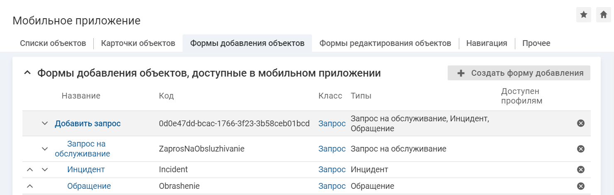

# Рекомендации по настройке форм добавления

Форма добавления — это привычный для пользователя экран, основная задача которого удобно и быстро создавать объект в системе.

При настройке формы добавления технолог может столкнуться со следующей проблемой — при создании объекта определенного типа на форме должен отображаться набор атрибутов, включающий атрибуты данного типа и атрибуты, общие для всех типов, созданные в классе. В таком случае технолог создает формы добавления для каждого типа и добавляет их в навигационном меню. Из-за большого количества элементов меню пользователю сложно ориентироваться.

Разгрузить навигационное меню поможет дерево форм добавления, элемент меню для добавления объекта будет ссылаться на корневой элемент, а набор атрибутов будет формироваться далее при выборе конкретного типа.

Дерево форм добавления – это настройка, которая позволяет объединить формы добавления объектов в мобильном приложении, созданные для разных типов класса. Для пользователя набор полей на форме добавления будет формироваться согласно дереву форм.

Дерево форм выстраивается в веб-интерфейсе при настройке мобильного приложения и состоит только из двух уровней. На первом уровне расположена родительская форма, на втором вложенные в нее.

### Настройка дерева форм добавления

Если для создания объектов конкретного типа нужен определенный набор атрибутов класса, необходимо создать отдельные формы добавления для каждого типа, которые войдут в дерево форм добавления.

<note type="info">

Для настройки дерева форм добавления предварительно поделите типы объектов определенного класса на группы. В одну группу следует объединить типы, для которых на форме добавления объекта нужен один и тот же набор атрибутов.

</note>

Настройки мобильного приложения в SMP

1. Создайте родительскую форму добавления.

    В параметре "Класс" укажите класс, для которого выполняется настройка дерева форм добавления. В параметре "Типы" укажите все типы класса, которые были предварительно определены в группы.
    - [Настройка формы добавления объектов](./add-form-create)
2. Выведите на созданную форму атрибут "Тип объекта"/"Тип запроса". Возможно добавить и другие атрибуты, необходимые для создания объекта.
    - [Настройка атрибутов на форме добавления](./add-form-attributes)
3. Создайте вложенные формы добавления.

    В параметре "Родитель" укажите созданную родительскую форму добавления. В параметре "Типы" укажите типы, для которых на форме добавления объекта нужен один и тот же набор атрибутов.
4. Выведите на вложенные формы добавления необходимые атрибуты. Для удобства используйте наследование настроек от родительской формы в блоках "Атрибуты, выводимые на форму добавления" и "Создание объекта голосом".

### Важно учитывать

- На все формы добавления обязательно выводить атрибут "Тип объекта"/"Тип запроса". Атрибут отвечает за изменение набора полей на форме добавления согласно выбранному типу. Если набор полей для указанного типа форма не найден, то отображается набор полей родительской формы.
- Совокупность значений параметра "Типы" у всего дерева форм влияет на типы, доступные пользователю для выбора.

### Пример хорошей настройки

