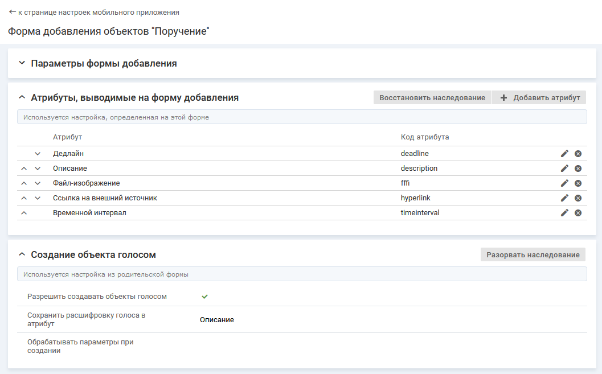

- [Добавление атрибута для отображения на форме добавления](./add-form-attributes#add)
- [Настройка порядка отображения атрибутов на форме добавления](./add-form-attributes#order)
- [Удаление атрибута с формы добавления](./add-form-attributes#dell)

### Добавление атрибута для отображения на форме добавления {#add}

Набор атрибутов настраивается для каждой формы отдельно.

На форме добавления объекта отображается определенный набор атрибутов.

#### Наследование

Если при создании формы добавления указана родительская форма (заполнен параметр "Родитель"), то настройка атрибутов наследуется из родительской формы. Чтобы добавить на форму новый атрибут или изменить существующий набор атрибутов, необходимо разорвать наследование (кнопка **Разорвать наследование**). Наследование восстанавливается при нажатии на кнопку **Восстановить наследование**.

#### Место настройки в интерфейсе

Меню навигации "Настройка системы" → настройка "Мобильное приложение" → вкладка "Формы добавления объектов" → страница настройки формы добавления → блок "Атрибуты, выводимые на форму добавления".

#### Выполнение настройки

В блоке "Атрибуты, выводимые на форму добавления" нажмите кнопку **Добавить атрибут**, заполните поля на форме добавления атрибута и нажмите **Сохранить**.

Поля на форме добавления атрибута:

- **Атрибут** — атрибут, который будет отображаться на форме добавления в мобильном приложении.

    Атрибуты, доступные для выбора, определяются значением параметра "Типы" для формы добавления в мобильном приложении:
    - Типы объекта указаны — на форму добавления можно вывести редактируемые атрибуты, созданные в классе (параметр "Класс") и в выбранных типах, и атрибут "Тип объекта" (metaClass).
    - Типы объектов не выбраны — на форму добавления  можно вывести все редактируемые атрибуты, созданные в классе (параметр "Класс") и всех его типах, и атрибут "Тип объекта" (metaClass).

    Для запросов на форму добавления можно вывести атрибуты "Контрагент" (client) и "Соглашение/Услуга" (agreementService).

#### Результат настройки

Добавленные атрибуты отображаются в блоке "Атрибуты, выводимые на форму добавления".

При редактировании формы добавления (изменение значения параметра "Типы") на форме добавления могут оказаться атрибуты, определенные в типах объектов, для которых недоступна форма добавления в мобильном приложении. Такие атрибуты выделяются цветом. Также на странице настройки формы отображается информационное сообщение: "Атрибуты с кодом [] не будут отображаться в мобильном приложении, так как они определены в рамках недоступных типов".

В мобильном приложении на форме добавления объекта будет отображаться указанный набор атрибутов.

<note type="info">

При заполнении значения атрибута типа "Временной интервал" доступны только единицы измерения, заданные при настройке атрибута в веб-интерфейсе (параметр "Единицы измерения, доступные при редактировании").

</note>

### Настройка порядка отображения атрибутов на форме добавления {#order}

#### Описание настройки

Порядок отображения атрибутов в блоке "Атрибуты, выводимые на форму добавления" определяет порядок отображения атрибутов на форме добавления.

#### Место настройки в интерфейсе

Меню навигации "Настройка системы" → настройка "Мобильное приложение" → вкладка "Формы добавления объектов" → страница настройки формы добавления → блок "Атрибуты, выводимые на форму добавления".

#### Выполнение настройки

В блоке "Атрибуты, выводимые на форму добавления" укажите порядок отображения атрибутов с помощью инструмента Drag and drop или стрелок {width=15 height=10} и {width=17 height=10} в строке атрибута.

### Удаление атрибута с формы добавления {#dell}

#### Место настройки в интерфейсе

Меню навигации "Настройка системы" → настройка "Мобильное приложение" → вкладка "Формы добавления объектов" → страница настройки формы добавления → блок "Атрибуты, выводимые на форму добавления".

#### Выполнение настройки

В блоке "Атрибуты, выводимые на форму добавления" нажмите иконку удаления {width=19 height=18} в строке атрибута.

Удаленный атрибут не будет отображаться в блоке "Атрибуты, выводимые на форму добавления".
