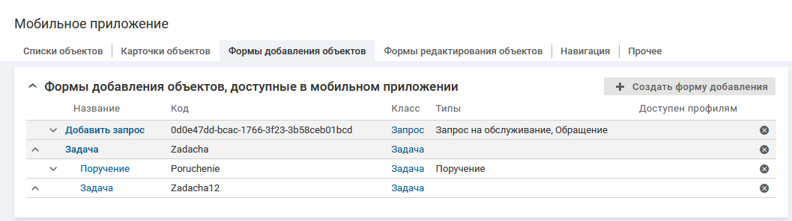

### Описание настройки

Форма добавления отображается на отдельном экране мобильного приложения.

Для одного класса/типа объектов может быть настроено несколько форм добавления в мобильном приложении.

На форму добавления объекта можно перейти из меню мобильного приложения  и из меню действий списка объектов.

### Место настройки в интерфейсе

Раздел "Настройка системы" → "Мобильное приложение" → вкладка "Формы добавления объектов".

На вкладке отображается иерархический список форм добавления. Список состоит из двух уровней, на первом уровне расположены родительские формы, на втором вложенные в них.

### Выполнение настройки

Чтобы добавить форму добавления объекта определенного класса в мобильное приложение, выполните следующие действия:

1. На вкладке "Формы добавления объектов" нажмите кнопку **Создать форму добавления**.
2. На форме "Создание формы добавления" заполните параметры формы добавления для мобильного приложения:
    - **Название** — введите название формы добавления.
    - **Код** — введите уникальный код формы. Значение заполняется автоматически (транслитерация названия формы при переводе фокуса с поля "Название"), код можно изменить.
    - **Класс** — выберите класс объектов, для которого будет доступна форма добавления в мобильном приложении.
    - **Типы** — выберите тип объектов, для которого будет доступна форма добавления в мобильном приложении.

        Для выбора доступны все типы объектов класса, указанного в параметре "Класс".

        Типы выбраны (выбранными являются типы, рядом с названиями которых установлен флажок; выбор типа не распространяется на вложенные типы):
        - В мобильном приложении будут доступны формы добавления объектов указанных типов.
        - На форму добавления можно вывести редактируемые атрибуты, созданные в классе (параметр "Класс") и в выбранных типах, и атрибут "Тип объекта" (metaClass), см. [Атрибуты на форме добавления](./add-form-attributes)

            Для запросов на форму добавления можно вывести атрибуты "Контрагент" (client) и "Соглашение/Услуга" (agreementService).

        Типы не выбраны:
        - Форма добавления в мобильном приложении будут доступна для всех типов класса (параметр "Класс").
        - На форму добавления  можно вывести все редактируемые атрибуты, созданные в классе (параметр "Класс") и всех его типах, и атрибут "Тип объекта" (metaClass), см. [Атрибуты на форме добавления](./add-form-attributes).

            Для запросов на форму добавления можно вывести атрибуты "Контрагент" (client) и "Соглашение/Услуга" (agreementService).

        Типы (выбранные или все) будут доступны пользователю для выбора в поле "Тип объекта"/"Тип запроса" на форме добавления объекта в мобильном приложении. Если выбрано несколько типов, то при открытии формы поле "Тип объекта"/"Тип запроса" автоматически заполняется первым типом из списка доступных для выбора.

        В зависимости от выбранного типа формируется набор полей на форме добавления, см. [Логика формирования набора полей на форме добавления](./add-form-create#01).
    - **Родитель** — выберите форму добавления, настройки которой (атрибуты, выводимые на форму добавления и создание объекта голосом) могут наследоваться для создаваемой формы. Если значение не выбрано, то сама создаваемая форма является корневой.

        Для выбора доступны существующие формы добавления, у которых параметр "Класс" имеет аналогичное значение и параметр "Родитель" пустой.

        Параметр влияет на логику формирования набора полей на форме добавления, см. [Логика формирования набора полей на форме добавления](./add-form-create#01).
    - **Доступна профилям** — выберите профиль, обладатель которого может работать с формой добавления в мобильном приложении.

        Если не выбран ни один профиль, то ограничения видимости формы нет.

        Для выбора доступны общие профили и относительные профили класса (параметр "Класс").
    - **Метки** — выберите одну или несколько меток, определяющих процессы, в которых используется данная форма.
    - **Передавать геопозицию устройства**.
        - флажок снят (по умолчанию) — геопозиция не передается.
        - флажок установлен — при добавлении объекта в систему будет передаваться местоположение мобильного устройства, с которого выполняется добавление.

            Текущее местоположение устройства хранится в переменной контекста geo, которая может использоваться в скриптах действия по событию и кастомизации оповещения.

            Условие выполнения настройки. У мобильного приложения должно быть разрешение на передачу геопозиции.
3. Нажмите **Сохранить**.

### Результат настройки

На экране отобразится страница настройки формы добавления объектов.

#### Логика формирования набора полей на форме добавления {#01}

Набор полей на форме определяется типом объекта, указанным в поле "Тип объекта"/"Тип запроса". При открытии формы поле автоматически заполняется первым типом из списка доступных для выбора и подбирается соответствующий набор полей.

Тип может быть изменен вручную. Выбор типа влияет на набор полей формы следующим образом:

- Если выбран тип, для которого настроенная форма добавления не является родительской формой и не имеет родительской формы, то на форме добавления отобразятся только атрибуты, настроенные для данной формы.
- Если выбран тип, для которого настроенная форма добавления является родительской или вложенной формой, то на форме добавления отобразятся атрибуты формы, у которой параметр "Типы" содержит выбранный тип, и эта форма отображается первой в списке вложенных форм.
- Если подходящая вложенная форма не найдена, на форме добавления отобразятся атрибуты, настроенные для родительской формы.

При подборе формы учитываются права текущего пользователя на добавление объектов (параметр "Доступна профилям") и настройки меток (параметр "Метки").

### Последующие настройки

На странице списка объектов доступны следующие настройки:

- [Параметры формы добавления](./add-form-parameters)
- [Атрибуты на форме добавления](./add-form-attributes)
- [Создание объекта голосом](./add-form-voice)

### Связанные настройки

- Для отображения формы добавления в меню мобильного приложения необходимо настроить соответствующий элемент на вкладке "Навигация". Описание добавления элементов меню приводится в разделе [Настройка элементов меню](../navigation-3/navigation-items-create)

    Также на форму добавления объекта можно перейти из меню действий в контенте со списком объектов. Описание добавления элементов меню приводится в разделе [Настройка действий в контенте](../cards/card-view/card-obj-parameters#act).
- У пользователя должны быть права на добавление объекта для класса/типа добавляемого объекта и на просмотр и редактирование хотя бы одного атрибута, из размещенных на форме добавления.
