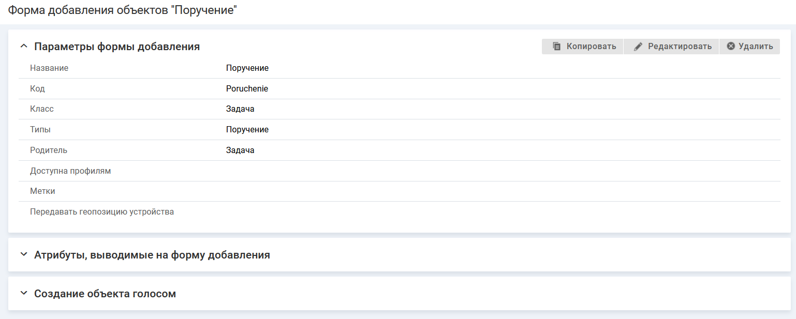

# Параметры формы добавления

- [Редактирование параметров формы добавления](#edit)
- [Копирование формы добавления](#copy)
- [Удаление формы добавления](#dell)

### Редактирование параметров формы добавления

#### Описание настройки

Можно внести изменения в параметры формы добавления, указанные при добавлении.

#### Место настройки в интерфейсе

Меню навигации "Настройка системы" → настройка "Мобильное приложение" → вкладка "Формы добавления объектов" → страница настройки формы добавления в мобильном приложении → блок "Параметры формы добавления".

Поля блока "Параметры формы добавления"^

- Название.
- Код.
- Класс.
- Типы.
- Родитель.
- Доступен профилям.
- Метки.
- Передавать геопозицию устройства.

#### Выполнение настройки

В блоке "Параметры формы добавления" нажмите кнопку **Редактировать**. На форме "Изменение параметров формы добавления" измените значения параметров и нажмите **Сохранить**.

<note type="info">

Параметры "Код", "Класс" и "Родитель" не редактируются.

</note>

Форма редактирования закроется, новые параметры формы добавления отобразятся на странице "Форма добавления объектов".

### Копирование формы добавления

#### Описание настройки

Можно создать новую форму добавления и скопировать в нее настройки уже существующей формы.

Операция копирования позволяет быстро воспроизводить однотипные настройки формы добавления (включая родительскую формы добавления, если она указана).

Копирование настроек формы возможно только в рамках одного общего родителя (параметр "Родитель").

#### Место настройки в интерфейсе

Меню навигации "Настройка системы" → настройка "Мобильное приложение" → вкладка "Формы добавления объектов" → страница настройки формы добавления в мобильном приложении → блок "Параметры формы добавления".

#### Выполнение настройки

1. В блоке "Параметры формы добавления" нажмите кнопку 
**Копировать**.
2. На форме "Копирование формы добавления" заполните параметры:
    - **Название** — введите название формы добавления.
    - **Код** — введите уникальный код формы. Значение заполняется автоматически (транслитерация названия формы при переводе фокуса с поля "Название"), код можно изменить.

    Если у формы, с которой копируются настройки, заполнен параметр "Родитель", то на форме отображается информационное поле "Родитель".
3. Нажмите **Сохранить**. Форма копирования закроется, на экране отобразится страница настройки новой формы добавления.
4. Внесите изменения в скопированные настройки формы добавления.

### Удаление формы добавления

#### Место настройки в интерфейсе

Меню навигации "Настройка системы" → настройка "Мобильное приложение" → вкладка "Формы добавления объектов" → страница настройки формы добавления в мобильном приложении → блок "Параметры формы добавления".

Также форму можно удалить на вкладке "Формы добавления объектов", нажав иконку удаления  в строке формы.

#### Выполнение настройки

В блоке "Параметры формы добавления" нажмите кнопку **Удалить**.

Форма добавления удалится с вкладки "Формы добавления объектов".
