# Примеры настройки пользовательских действий

На карточке объекта в мобильном приложении можно настроить элементы управления для выполнения различных действий.

В разделе описана настройка элементов управления для выполнения отдельных действий.

- [Согласовать и отклонить](#approve)
- [Оценить выполнение запроса](#rate)
- [Изменить ответственного по задаче](#resp)
- [Создать подзадачу](#add)
- [Отчитаться о работе по задаче](#report)

#### Согласовать и отклонить задачу

Чтобы настроить возможность согласования задачи, нужно создать соответствующий статус, настроить действия по событию и добавить кнопки для выполнения действий на карточку.

#### Настройка статуса

Перейдите на карточку настройки класса "Задача" → "Жизненный цикл" и создайте статус "Согласование".

#### Настройка действий по событию

1. Перейдите "Настройка системы" → "Действия по событиям" и добавьте два действия.

    Параметры действия "Согласовать":
    - **Название** — "Согласовать".
    - **Код** — approve.
    - **Объекты** — "Задача" (task).
    - **Событие** — "[Пользовательское событие]".
    - **Действие** — "Скрипт".
    - **Скрипт** — введите текст скрипта:

        utils.edit(subject, ['state': 'inprogress'])

    Параметры действия "Отклонить":
    - **Название** — "Отклонить".
    - **Код** — reject.
    - **Объекты** — "Задача" (task).
    - **Событие** — "[Пользовательское событие]".
    - **Действие** — "Скрипт".
    - **Скрипт** — введите текст скрипта:

        utils.edit(subject, ['state': 'registered'])
2. Включите добавленные действия.

    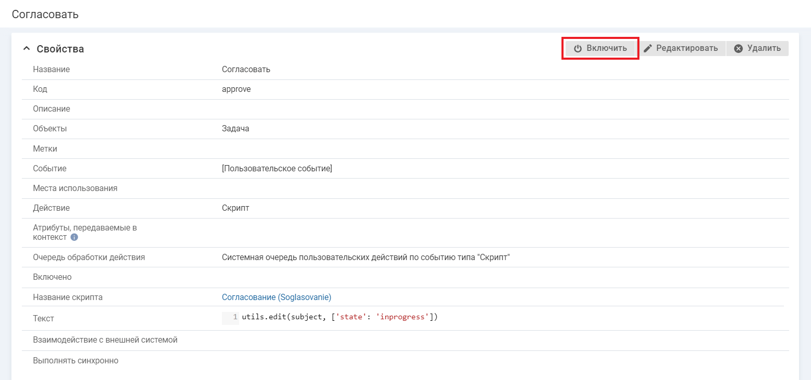 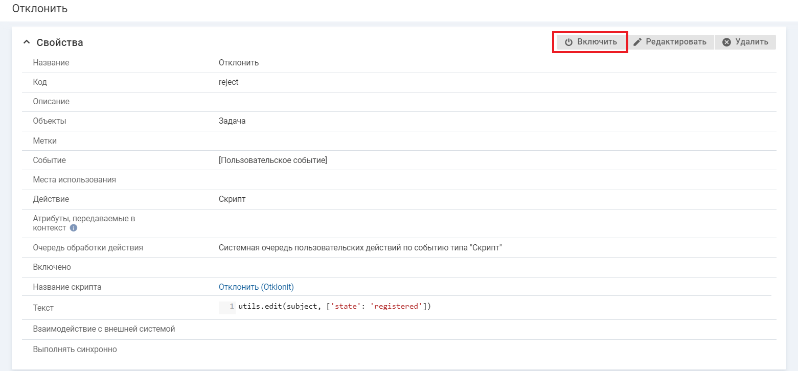

#### Настройка кнопок

1. Перейдите к настройке карточки задачи в мобильном приложении ("Настройка системы" → "Мобильное приложение" → "Карточки объектов" → карточка задачи) и добавьте контент с параметрами:
    - **Тип контента** — "Параметры объекта".
    - **Название** — "Согласование".
    - **Отображать название** — флажок снят.
    - **Код** — произвольный.
    - **Группа атрибутов** — "[не указано]".
    - **Доступен профилям** — укажите профили прав, пользователям которых доступно согласование, например, "Руководитель".
2. Перейдите к настройке действий в добавленном контенте (иконка меню → "Настроить действия") и добавьте два элемента управления.

    Параметры элемента "Согласовать":
    - **Область контента** — "Верхний блок действий".
    - **Название** — "Согласовать".
    - **Внешний вид** — "Кнопка с подписью".
    - **Действие** — "Согласовать".
    - **Цвет фона** — зеленый.

    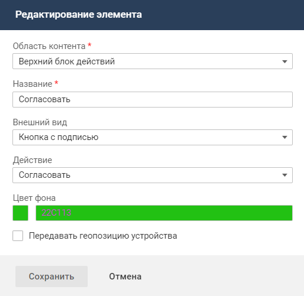

    Параметры элемента "Отклонить":
    - **Область контента** — "Верхний блок действий".
    - **Название** — "Отклонить".
    - **Внешний вид** — "Кнопка с подписью".
    - **Действие** — "Отклонить".
    - **Цвет фона** — красный.

    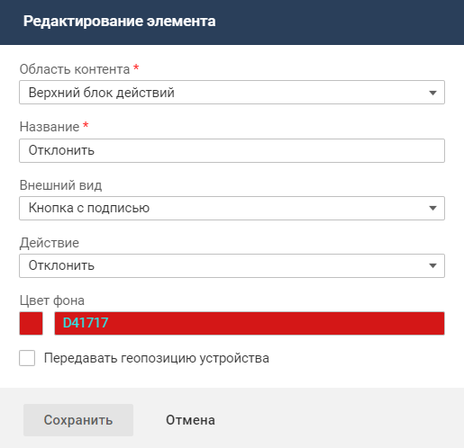

#### Результат в мобильном приложении

В статусе "Согласование" на карточке задачи для руководителя видны кнопки **Согласовать** и **Отклонить**.

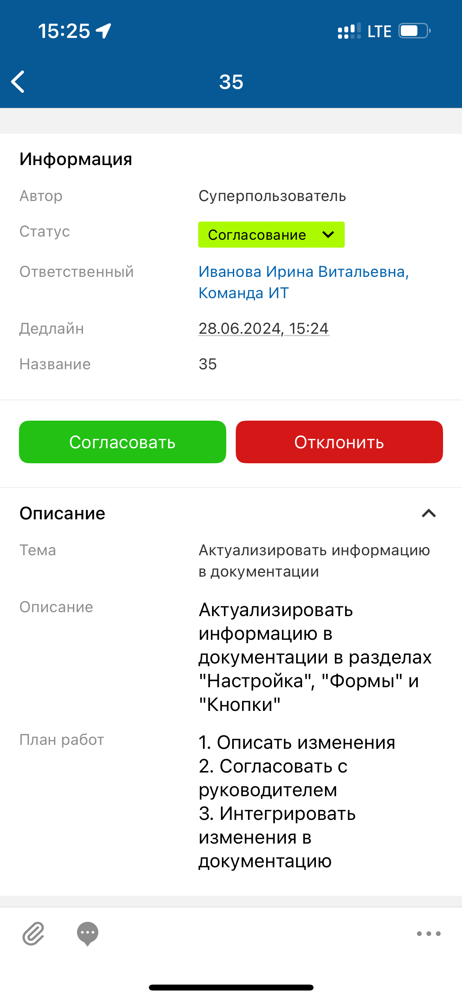

#### Оценить выполнение запроса

Чтобы настроить возможность оценки запроса, нужно создать справочник и атрибут для хранения оценок, настроить действия по событию и добавить кнопки для выполнения действий на карточку.

#### Настройка справочника с оценками

*Если в системе уже есть справочник, пропустите этот шаг.*

Создайте справочник "Оценка" (mark) и добавьте в него элементы, соответствующие возможным оценкам.

#### Настройка атрибута с оценками

*Если в системе уже есть атрибут, пропустите этот шаг.*

Создайте в классе "Запрос" (serviceCall) атрибут с параметрами:

- **Название** — "Оценка".
- **Код** — rate.
- **Тип значения** — "Элемент справочника".

#### Настройка действия по событию

1. Перейдите "Настройка системы" → "Действия по событиям" и добавьте действие с параметрами:
    - **Название** — "Оценка 1".
    - **Код** — rate1.
    - **Объекты** — "Запрос" (serviceCall).
    - **Событие** — "[Пользовательское событие]".
    - **Действие** — "Скрипт".
    - **Атрибуты, передаваемые в контекст** — "Оценка" (rate).
    - **Скрипт** — введите текст скрипта:

        utils.edit(subject, ['rate': utils.get('mark', ["code": "1"])])
2. Включите добавленное действие.

    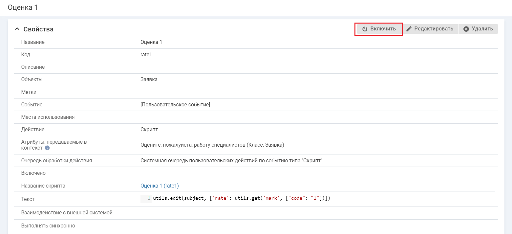
3. Настройте аналогичные действия для других оценок.

#### Настройка кнопок

1. Перейдите к настройке карточки запроса в мобильном приложении ("Настройка системы" → "Мобильное приложение" → "Карточки объектов" → карточка запроса) и добавьте контент с параметрами:
    - **Тип контента** — "Параметры объекта".
    - **Название** — "Оценка".
    - **Отображать название** — флажок установлен.
    - **Код** — произвольный.
    - **Группа атрибутов** — "[не указано]".
    - **Условия отображения контента** — настройте условия, при которых возможность оценить запрос будет доступна на его карточке, например, если запрос находится в статусах "Выполнен", "Ожидает ответа контрагента" и оценка за запрос не выставлена.

        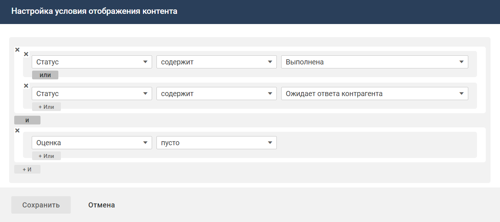
2. Перейдите к настройке действий в добавленном контенте (иконка меню → "Настроить действия") и добавьте элемент управления с параметрами:
    - **Область контента** — "Верхний блок действий".
    - **Название** — "1".
    - **Внешний вид** — "Кнопка с подписью".
    - **Действие** — "Оценка 1".
    - **Цвет фона** — выберите цвет, соответствующий оценке (опционально).
3. Настройте аналогичные элементы для других оценок.

    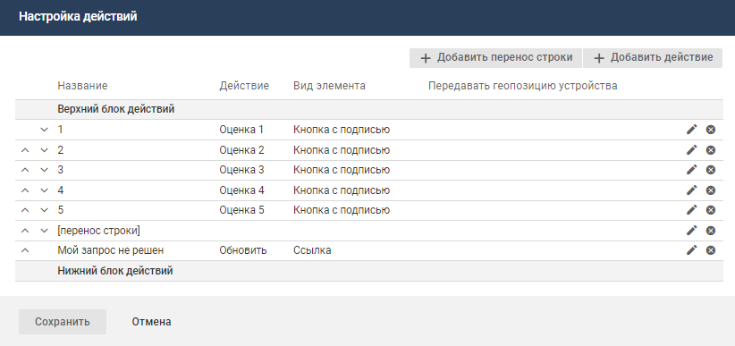

#### Результат в мобильном приложении

На карточке запроса в статусе "Решена" отображаются кнопки для оценки выполнения запроса.

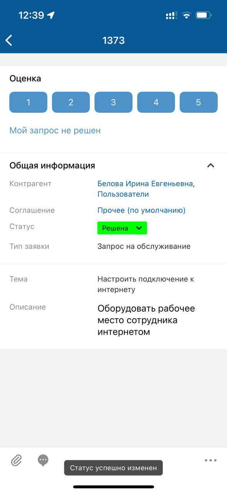

#### Изменить ответственного по задаче

<note type="info">

В примере создается элемент управления с иконкой. Для настройки элементов управления с иконками используются иконки в формате SVG версии 1.1 и старше из справочника "Иконки для элементов управления (векторные)". Перед началом настройки добавьте иконки в справочник. Можно загрузить свои или использовать готовые иконки [скачать](https://www.naumen.ru/docs/sd/file/icon_mk.zip).

</note>

Чтобы настроить смену ответственного по задаче, откройте карточку задачи в мобильном приложении ("Настройка системы" → "Мобильное приложение" → "Карточки объектов" → карточка задачи), перейдите к настройке действий в произвольном контенте (иконка  → "Настроить действия") и добавьте элемент управления с параметрами:

- **Область контента**: "Нижний блок действий".
- **Название**: "Сменить ответственного".
- **Внешний вид**: "Иконка и подпись".
- **Иконка** — "Изменить ответственного".
- **Действие**: "Изменить ответственного".

#### Результат в мобильном приложении

На карточке задачи в блоке "Информация" отображается кнопка для смены ответственного.

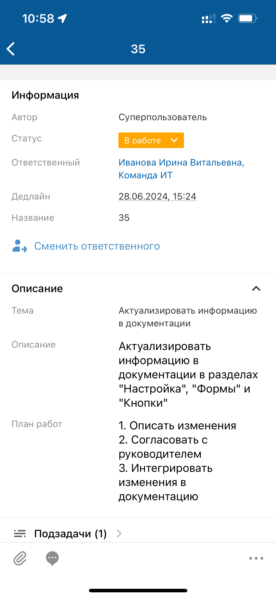 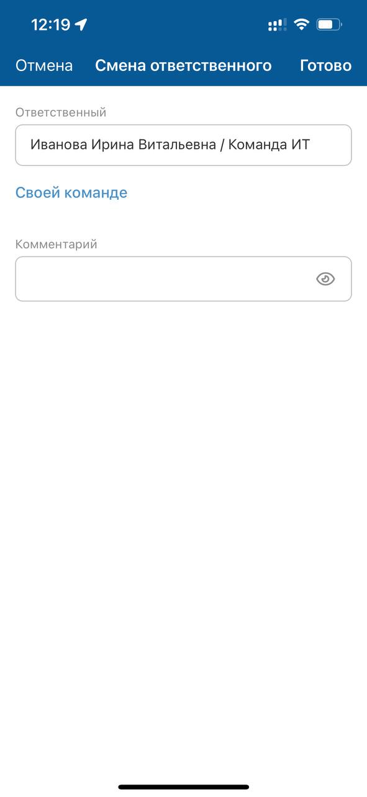

#### Создать подзадачу

<note type="info">

В примере создается элемент управления с иконкой. Для настройки элементов управления с иконками используются иконки в формате SVG версии 1.1 и старше из справочника "Иконки для элементов управления (векторные)". Перед началом настройки добавьте иконки в справочник. Можно загрузить свои или использовать готовые иконки [скачать](https://www.naumen.ru/docs/sd/file/icon_mk.zip).

</note>

Чтобы настроить возможность создания подзадачи, нужно добавить действие по событию и настроить кнопку для выполнения действия на карточке.

#### Настройка действия по событию

1. Перейдите "Настройка системы" → "Действия по событиям" и добавьте действие с параметрами:
    - **Название** — "Создать подзадачу".
    - **Код** — addSubtask.
    - **Объекты** — "Задача" (task).
    - **Событие** — "[Пользовательское событие]".
    - **Действие** — "Скрипт".
    - **Выполнять синхронно** — флажок установлен.
    - **Скрипт** — введите текст скрипта:
        def attr =  ['metaClass':'task$subTask', 'mainTask':subject];
result.goToMobileAddForm("newTask", attr)

        где:
        - task$subTask — код типа "Подзадача" в классе "Задача";
        - mainTask — код атрибута типа "Ссылка на бизнес-объект" в типе "Подзадача", который содержит ссылку на головную задачу (task);
        - newTask — код формы добавления.
2. Включите добавленное действие.

#### Настройка кнопки

1. Перейдите к настройке карточки задачи в мобильном приложении ("Настройка системы" → "Мобильное приложение" → "Карточки объектов" → карточка задачи) и добавьте контент с параметрами:
    - **Тип контента** — "Параметры объекта".
    - **Название** — "Создание подзадачи".
    - **Отображать название** — флажок снят.
    - **Код** — произвольный.
    - **Группа атрибутов** — "[не указано]".
2. Перейдите к настройке действий в добавленном контенте (иконка меню → "Настроить действия") и добавьте элемент управления с параметрами:
    - **Область контента** — "Верхний блок действий".
    - **Название** — "Создать подзадачу".
    - **Внешний вид** — "Кнопка с иконкой и подписью".
    - **Иконка** — "Добавить".
    - **Действие** — "Создать подзадачу".

#### Результат в мобильном приложении

На карточке задачи отображается кнопка для создания вложенной задачи.

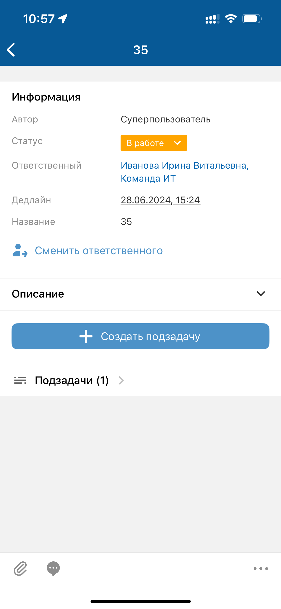 

#### Отчитаться о работе по задаче

<note type="info">

В примере создается элемент управления с иконкой. Для настройки элементов управления с иконками используются иконки в формате SVG версии 1.1 и старше из справочника "Иконки для элементов управления (векторные)". Перед началом настройки добавьте иконки в справочник. Можно загрузить свои или использовать готовые иконки [скачать](https://www.naumen.ru/docs/sd/file/icon_mk.zip).

</note>

Чтобы настроить возможность формировать отчет о трудозатратах по задаче, нужно создать действие по событию с параметрами и добавить кнопку для выполнения действия на карточку.

#### Настройка действия по событию

1. Перейдите "Настройка системы" → "Действия по событиям" и добавьте действие с параметрами:
    - **Название** — "Отчитаться о работе".
    - **Код** — workReport.
    - **Объекты** — "Задача" (task).
    - **Событие** — "[Пользовательское событие]".
    - **Действие** — "Скрипт".
    - **Скрипт** — введите текст скрипта:
        utils.create('workRecord$workRecord', 
             [
               'employee' : user,
               'time' : params.time,
               'actualDate' : params.date,
               'description' : params.description,
               'task' : subject
             ]  
)
2. Включите добавленное действие.

#### Настройка кнопки

1. Перейдите к настройке карточки задачи в мобильном приложении ("Настройка системы" → "Мобильное приложение" → "Карточки объектов" → карточка задачи) и добавьте контент с параметрами:
    - **Тип контента** — "Параметры объекта".
    - **Название** — "Создание подзадачи".
    - **Отображать название** — флажок снят.
    - **Код** — произвольный.
    - **Группа атрибутов** — "[не указано]".
2. Перейдите к настройке действий в добавленном контенте (иконка меню → "Настроить действия") и добавьте элемент управления с параметрами:
    - **Область контента** — "Верхний блок действий".
    - **Название** — "Отчитаться о работе".
    - **Внешний вид** — "Кнопка с иконкой и подписью".
    - **Иконка** — "Часы".
    - **Действие** — "Отчитаться о работе".

#### Результат в мобильном приложении

На карточке задачи отображается кнопка **Отчитаться о работе**, при нажатии на которую открывается экран с полями для отчета о выполненной работе.

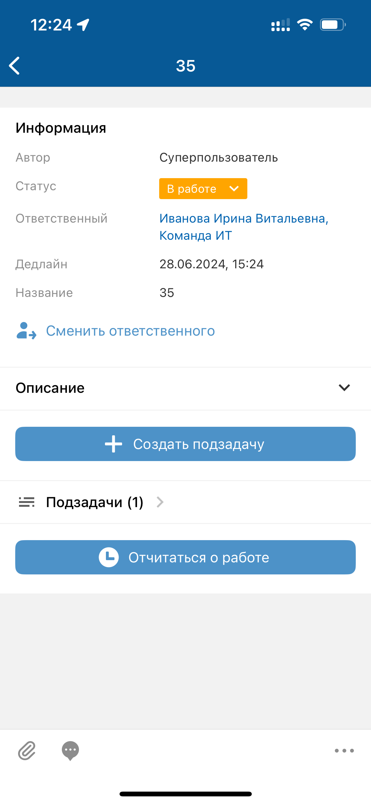 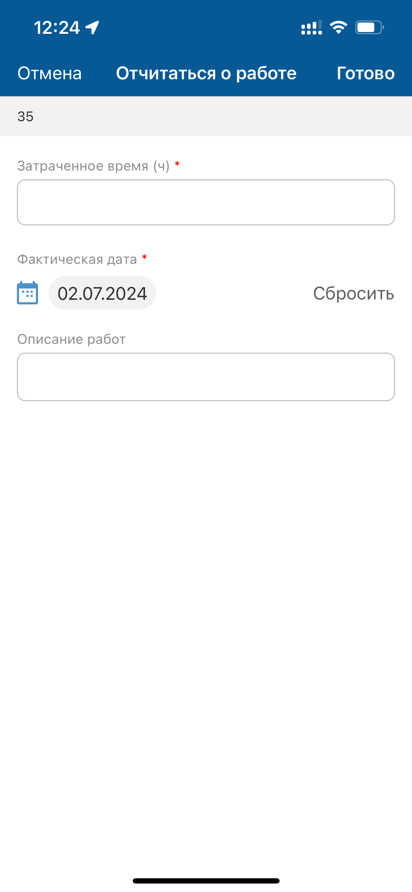
