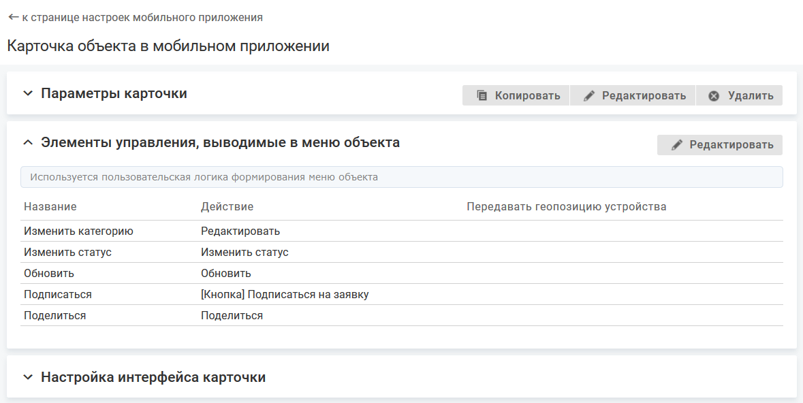
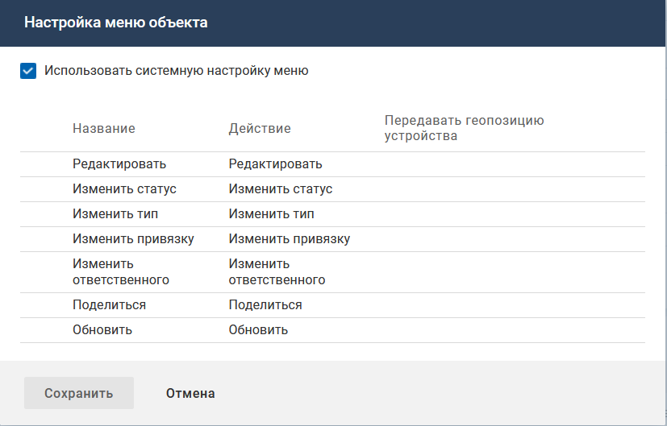
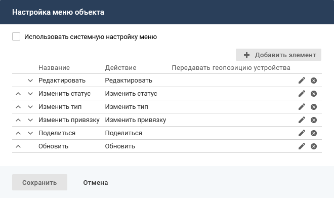

На карточке объекта кнопки, инициирующие действия с объектом, также могут располагаться в отдельных контентах.

- [Включение системной логики меню действий с объектом](./card-actions#sistem)
- [Редактирование элемента меню](./card-actions#edit)
- [Добавление элемента меню действий с объектом](./card-actions#add)
- [Настройка порядка отображения элементов меню](./card-actions#order)
- [Удаление элемента меню](./card-actions#dell)

### Включение системного меню действий с объектом {#sistem}

#### Описание настройки

Меню действий с объектом предназначено для инициации действий с объектом в мобильном приложении. Иконка вызова меню доступна на карточке объекта или в списке объектов. Иконка отображается, если в меню выведен хотя бы один элемент управления.

Меню действий с объектом настраивается отдельно для каждой карточки объекта.

По умолчанию используется системная настройка меню:

- "Редактировать" — при нажатии на кнопку открывается экран редактирования, на котором отображается первая по списку форма редактирования для класса/типа.

    При редактировании элемента можно выбрать форму редактирования, которая будет открываться при нажатии на данный элемент меню.
- "Изменить статус" (для объектов с жизненным циклом) — при нажатии на кнопку открывается форма выбора целевого статуса.

    Необходимые настройки системы описаны в разделе [Смена статуса объекта](../from-web/change-state-3).
- "Изменить ответственного" (для объектов с возможностью назначения ответственного) — при нажатии на кнопку открывается экран изменения ответственного.

    Необходимые настройки системы описаны в разделе [Смена ответственного](../from-web/change-assignee-3).
- "Изменить тип" — при нажатии на кнопку открывается экран смены типа.

    Необходимые настройки системы описаны в разделе [Смена типа объектов](../from-web/change-type-3).
- "Изменить привязку" (для объектов класса "Запрос" (serviceCall)) — при нажатии на кнопку открывается экран изменения связи запроса с другими объектами: сотрудником, отделом или командой, соглашением и услугой.

    Необходимые настройки системы описаны в разделе [Смена привязки запроса](../from-web/change-association-3).
- "Поделиться" — используется для отправки ссылки на данную карточку объекта кому-либо через другие каналы связи.

    Отдельных прав на видимость кнопки в меню не предусматривается, ее видят все пользователи.
- "Обновить" — используется для обновления данных на карточке объекта.

На странице настройки карточки объекта в блоке "Элементы управления, выводимые в меню объекта" отображается информационное сообщение об использовании системной или пользовательской логики.

#### Место настройки в интерфейсе

Меню навигации "Настройка системы" → настройка "Мобильное приложение" → вкладка "Карточки объектов" → страница настройки карточки объектов в мобильном приложении → блок "Элементы управления, выводимые в меню объекта".

В блоке "Элементы управления, выводимые в меню объекта" нажмите кнопку **Редактировать**.

Откроется форма "Настройка меню объекта".

#### Выполнение настройки

Чтобы применить системную настройку после использования пользовательской логики, откройте форму "Настройка меню объекта", установите флажок "Использовать системную настройку меню" и нажмите **Сохранить**.

#### Результат настройки

Меню действий с объектом в мобильном приложении содержит системный набор элементов.

<note type="info">

Для выполнения пользовательской настройки меню действий с объектом отключите флажок "Использовать системную настройку меню" на форме "Настройка меню объекта". 
При повторном включении флажка "Использовать системную настройку меню" пользовательские настройки не сохраняются.

</note>

#### Связанные настройки

В системе необходимо выполнить настройку прав на действия с объектом в мобильном приложении. Права на работу с карточкой объекта, на которую указывает ссылка "Поделиться", регламентируются существующими правами на просмотр карточки объекта и просмотр атрибутов на карточке объекта.

### Редактирование элемента меню {#edit}

#### Описание настройки

При редактировании можно изменить параметры системного или пользовательского элемента меню.

Настройка доступна при отключенном флажке "Использовать системную настройку меню".

#### Место настройки в интерфейсе

Меню навигации "Настройка системы" → настройка "Мобильное приложение" → вкладка "Карточки объектов" → страница настройки карточки объектов в мобильном приложении → блок "Элементы управления, выводимые в меню объекта".

В блоке "Элементы управления, выводимые в меню объекта" нажмите кнопку **Редактировать**.

Откроется форма "Настройка меню объекта".

#### Выполнение настройки

Чтобы изменить параметры элемента меню, выполните следующие действия:

1. На форме "Настройка меню объекта" нажмите иконку редактирования {width=19 height=18} в строке элемента.
2. Измените параметры элемента меню. Описание параметров см. [Добавление элемента меню действий с объектом](./card-actions#add).
3. Нажмите **Сохранить** на форме редактирования элемента. Форма редактирования закроется, измененный элемент меню отобразится на форме "Настройка меню объекта".
4. Нажмите **Сохранить** на форме "Настройка меню объекта".

### Добавление элемента меню действий с объектом {#add}

#### Описание настройки

Пользовательская настройка меню действий с объектом в мобильном приложении позволяет скрыть неиспользуемые системные элементы меню и добавить новые пользовательские элементы, при нажатии на которые может выполняться системное или пользовательское действие.

Настройка доступна при отключенном флажке "Использовать системную настройку меню".

#### Место настройки в интерфейсе

Меню навигации "Настройка системы" → настройка "Мобильное приложение" → вкладка "Карточки объектов" → страница настройки карточки объектов в мобильном приложении → блок "Элементы управления, выводимые в меню объекта".

В блоке "Элементы управления, выводимые в меню объекта" нажмите кнопку **Редактировать**.

Откроется форма "Настройка меню объекта".

#### Выполнение настройки

Чтобы добавить элемент меню, выполните следующие действия:

1. На форме "Настройка меню объекта" нажмите кнопку **Добавить элемент**.
2. Заполните поля на форме "Добавление элемента":
    - **Название** — введите название элемента меню (127 символов).
    - **Действие** — выберите действие, которое инициируется данным элементом меню. По умолчанию "[не указано]".

        Для выбора доступны:
        - Системные действия — системные действия для объектов класса, карточка которого настраивается в мобильном приложении.
        - Пользовательские действия — настроенные в системе действия по событию, для которых параметр "Событие" = "[Пользовательское событие]" и параметр "Объекты" содержит класс и/или типы объектов, для которых настраивается карточка в мобильном приложении.

        Для пользовательского действия по событию могут быть настроены параметры, которые необходимо заполнять при выполнении данного действия на специальной форме. Описание настройки действия по событию "[Пользовательское событие]".

        Выключенные действия по событию отображаются серым цветом.
    - **Форма редактирования** (отображается, если в параметре "Действия" выбрано системное действие "Редактировать") — выберите код формы редактирования, которая будет открываться при нажатии на данный элемент меню. По умолчанию "[не указано]".

        Для выбора доступны коды форм редактирования, которые настроены для класса объектов карточки.

        Если карточка настроена для некоторых типов класса (в параметре "Типы" для карточки заданы типы), то в списке доступны коды форм, настроенные хотя бы для одного из типов (параметр "Типы" для формы).

        Если выбрано значение "[не указано]", то при нажатии на элемент меню будет открываться первая по списку форма редактирования для класса/типа.
    - **Передавать геопозицию устройства**. Параметр доступен для всех действий, кроме системных действий "Поделиться" и "Обновить".
        - Флажок снят (по умолчанию) — геопозиция не передается.
        - Флажок установлен — при выполнении действия с объектом в систему будет передаваться текущее местоположение мобильного устройства, с которого выполняется действие.

            Текущее местоположение устройства хранится в переменной контекста geo, которая может использоваться в скриптах действия по событию и кастомизации оповещения.

            Условие выполнения настройки. У мобильного приложения должно быть разрешение на передачу геопозиции.
3. Нажмите **Сохранить** на форме добавления элемента. Форма добавления закроется, новый элемент меню отобразится на форме "Настройка меню объекта".
4. Нажмите **Сохранить** на форме "Настройка меню объекта".

#### Результат настройки

В мобильном приложении при вызове из списка объектов или из карточки объекта будет открываться меню с указанными настройками.

### Настройка порядка отображения элементов меню {#order}

#### Описание настройки

Порядок отображения элементов меню объекта определяется порядком отображения элементов на форме "Настройка меню объекта".

Настройка доступна при отключенном флажке "Использовать системную настройку меню".

#### Место настройки в интерфейсе

Меню навигации "Настройка системы" → настройка "Мобильное приложение" → вкладка "Карточки объектов" → страница настройки карточки объектов в мобильном приложении → блок "Элементы управления, выводимые в меню объекта".

В блоке "Элементы управления, выводимые в меню объекта" нажмите кнопку **Редактировать**.

Откроется форма "Настройка меню объекта".

#### Выполнение настройки

На форме "Настройка меню объекта" определите порядок отображения элементов меню с помощью инструмента Drag and drop или стрелок {width=15 height=10} и {width=17 height=10} в строке элемента.

Нажмите **Сохранить** на форме "Настройка меню объекта".

#### Результат настройки

В мобильном приложении при вызове из списка объектов или из карточки объекта будет открываться меню с указанными настройками.

### Удаление элемента меню {#dell}

#### Описание настройки

Настройка доступна при отключенном флажке "Использовать системную настройку меню".

#### Место настройки в интерфейсе

Меню навигации "Настройка системы" → настройка "Мобильное приложение" → вкладка "Карточки объектов" → страница настройки карточки объектов в мобильном приложении → блок "Элементы управления, выводимые в меню объекта".

В блоке "Элементы управления, выводимые в меню объекта" нажмите кнопку **Редактировать**.

Откроется форма "Настройка меню объекта".

#### Выполнение настройки

На форме "Настройка меню объекта" нажмите иконку удаления {width=19 height=18} в строке элемента меню. Удаленный элемент меню перестанет отображаться на форме "Настройка меню объекта".

Нажмите **Сохранить** на форме "Настройка меню объекта".
