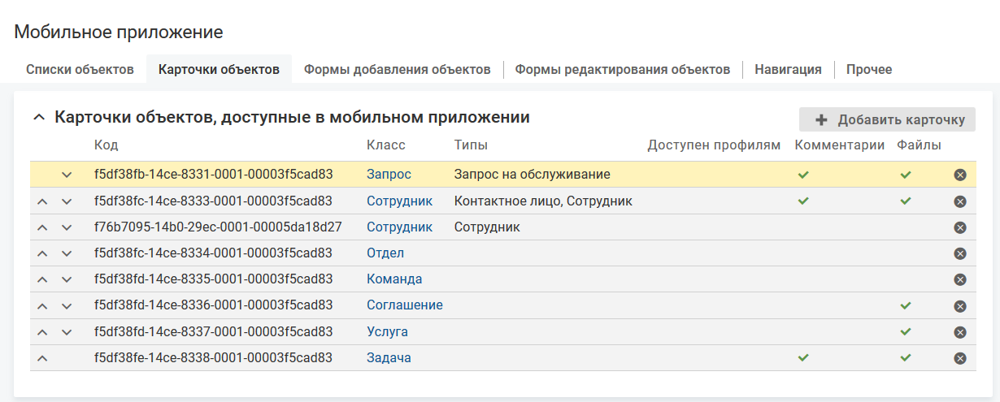

# Добавление карточки

- [Добавление карточки объекта в мобильное приложение](./card-create#add)
- [Подбор карточки для отображения](./card-create#order)

### Добавление карточки объекта в мобильное приложение {#add}

#### Описание настройки

Карточка объекта в мобильном приложении (далее карточка объекта) отображается на отдельном экране. Для класса/типа объектов может быть созданы одна или несколько карточек.

#### Место настройки в интерфейсе

Меню навигации "Настройка системы" → настройка "Мобильное приложение" → вкладка "Карточки объектов".

#### Выполнение настройки

Чтобы добавить карточку объекта в мобильное приложение, на вкладке "Карточки объектов" нажмите кнопку **Добавить карточку**, заполните параметры на форме добавления и нажмите **Сохранить**.

Поля на форме "Добавление карточки":

- **Код** — уникальный код карточки.
- **Класс** — класс объектов, карточка которого будет доступна в мобильном приложении.
- **Типы**:

    Для выбора доступны все типы объектов класса, указанного в параметре "Класс".

    Типы выбраны (выбранными являются типы, рядом с названиями которых установлен флажок, выбор типа не распространяется на вложенные типы):
    - в мобильном приложении будут доступны карточки объектов указанных типов;
    - на карточку объекта можно вывести атрибуты, созданные в классе (параметр "Класс"), и в выбранных типах

    Типы не выбраны:
    - в мобильном приложении будут доступны карточки объектов всех типов класса (параметр "Класс");
    - на карточку объекта в мобильном приложении можно вывести все атрибуты, созданные в классе (параметр "Класс"), и всех его типах
- **Доступна профилям** — профиль, обладатель которого может видеть карточку объекта в мобильном приложении.

    Если не выбран ни один профиль, то ограничения видимости карточки нет.

    Для выбора доступны общие профили и относительные профили класса (параметр "Класс").
- **Заголовок объекта в мобильном приложении** — заголовок карточки объекта предназначен для вывода информации, уникально характеризующей объект в системе.

    Доступные варианты заголовка карточки объекта, кроме карточки объекта класса "Уведомление в мобильном приложении":
    - **[без заголовка]**:

        В интерфейсе администратора в заголовке карточки выводится "[без заголовка]").

        В мобильном приложении в заголовке карточки отображается "Карточка объекта". В заголовках форм комментариев объекта, файлов объекта, смены типа, смены статуса и редактирования вместо заголовка карточки указана пустая строка.
    - **Название типа + Название атрибута с кодом title**.

        В интерфейсе администратора в заголовке карточки выводится "Название класса/типа" и "Название атрибута с кодом title".

        В мобильном приложении в заголовке карточки выводится "Название класса/типа объекта" и "Значение атрибута с кодом title".
    - **Название атрибута типа "Строка"**, определенного в классе/типе, для которого настраивается заголовок.

        Значение по умолчанию: "Название" (системный атрибут "Название" (title)).

        Исключения: для выбора в качестве заголовка не доступны вычислимые атрибуты и атрибут "Пароль" (password) класса "Сотрудник" (employee).

        В интерфейсе администратора в заголовке карточки выводится "Название выбранного атрибута".

        В мобильном приложении в заголовке карточки выводится "Значение выбранного атрибута". Выполняется проверка прав текущего пользователя на просмотр атрибута, при отсутствии прав заголовок отображается согласно варианту "[без заголовка]".

    Доступные варианты заголовка карточки объекта класса "Уведомление в мобильном приложении":
    - **[без заголовка]**:

        В интерфейсе администратора в заголовке карточки выводится "[без заголовка]").

        В мобильном приложении в заголовке карточки отображается "Карточка объекта".
    - **Название атрибута типа "Строка"**, определенного в классе "Уведомление в мобильном приложении".

        Значение по умолчанию: "Заголовок" (системный атрибут "Заголовок" (titleSys)).

        Исключения: для выбора в качестве заголовка не доступны атрибуты "UUID действия по событию", "Получатель", "Ссылка".

        В интерфейсе администратора в заголовке карточки выводится "Название выбранного атрибута".

        В мобильном приложении в заголовке карточки выводится "Значение выбранного атрибута".
- **Метки** — одна или несколько меток, определяющих процессы, в которых используется данная карточка.
- **Меню "Комментарии" доступно**:
    - флажок снят (по умолчанию) — меню "Комментарии" на экране карточки не отображается, работа с комментариями не доступна;
    - флажок установлен — меню "Комментарии" отображается на экране карточки объекта, при нажатии на иконку выполняется переход на экран "Комментарии".

        Настройки системы, необходимые для работы с комментариями в мобильном приложении, приведены в разделе [Настройка комментариев](../from-web/comments-3).
- **Меню "Файлы" доступно**:
    - флажок снят (по умолчанию) — меню "Файлы" на экране карточки не отображается, работа с файлами не доступна;
    - флажок установлен — меню "Файлы" отображается на экране карточки объекта.

        У пользователя должны быть права на просмотр и добавление файлов для класса/типа просматриваемого объекта.
- **Использовать настройку переходов между статусами из веб-клиента**:
    - флажок установлен (значение по умолчанию) — в мобильном приложении доступны все переходы между статусами, которые добавлены для класса/типа объектов в настройках веб-интерфейса.

        При определении новых переходов в классе (типе) объектов, они сразу становятся доступными в мобильном приложении.
    - флажок снят — на форме отображается параметр "Доступные переходы между статусами" для выбора переходов, доступных в мобильном приложении.

    Параметр отображается, если в параметре "Класс" выбран класс объектов с жизненным циклом.
- **Доступные переходы между статусами** — переходы между статусами, которые будут доступны в мобильном приложении.

    Для выбора доступны переходы между статусами, настроенные в выбранных типах (параметр "Типы"), не зависимо от состояния статуса: включен или выключен (переход в выключенный статус в мобильном приложении не возможен).

    Если в параметре "Типы" не выбран ни один тип, то для выбора доступны все переходы всех типов выбранного класса (параметр "Класс").

    Переходы с одинаковым кодом, определенные в разных типах, отображается как один элемент.

    Параметр отображается, если снят флажок "Использовать настройку переходов между статусами из веб-клиента".
- **Быстрая смена статуса доступна**:
    - флажок снят (по умолчанию) — быстрая смена статуса не доступна;
    - флажок установлен — быстрая смена статус доступна.

    Быстрая смена статуса — это возможность вызвать форму выбора целевого статуса при нажатии на название статуса, выделенное цветом. Параметр доступен для объектов с жизненным циклом.

    Настраивается для iOS 7.3, Android 7.4.
- **Передавать геопозицию устройства при быстрой смене статуса**:

    Параметр отображается, если установлен флажок "Быстрая смена статуса доступна".
    - флажок снят (по умолчанию) — при быстрой смене статуса геопозиция не передается;
    - флажок установлен — при быстрой смене статуса объекта в систему будет передаваться текущее местоположение мобильного устройства, с которого выполняется действие.

        Текущее местоположение устройства хранится в переменной контекста geo, которая может использоваться в скриптах действия по событию и кастомизации оповещения.

        Условие выполнения настройки. У мобильного приложения должно быть разрешение на передачу геопозиции.

#### Результат настройки

На экране отобразится страница настройки карточки объекта.

#### Последующие настройки

На странице списка объектов доступны следующие настройки:

- [Параметры карточки](./card-parameters)
- [Настройка действий с объектом](./card-actions)
- [Настройка интерфейса карточки](./card-view)

#### Связанные настройки

Ссылки для перехода на карточку можно разместить:

- В списке объектов. Переход на карточку будет выполняться при нажатии на название объекта в списке. В мобильном приложении должен быть настроен список объектов соответствующего класса, см. [Добавление списка](../lists/list-create);
- В карточке объекта. Переход на карточку будет выполняться при переходе по ссылке с названием объекта на карточке другого объекта. В карточке объекта должен быть размещен соответствующий ссылочный атрибут.
- В пуш-уведомлении. Переход на карточку будет выполняться при переходе по ссылке в пуш-уведомлении. В уведомлении должна быть настроена ссылка на карточку объекта.

### Подбор карточки для отображения {#order}

#### Описание настройки

Для класса/типа объектов может быть созданы одна или несколько карточек. В мобильном приложении открывается первая по списку карточка объекта определенного класса/типа, доступная для текущего пользователя.

Пример. На вкладке "Карточки объектов" сверху вниз отображаются карточки объектов класса "Задача", а затем карточка объектов типа "Поручение" (класса "Задача"). В мобильном приложении будет открываться карточка объектов класса "Задача".

#### Место настройки в интерфейсе

Меню навигации "Настройка системы" → настройка "Мобильное приложение" → вкладка "Карточки объектов".

#### Выполнение действия

Чтобы настроить подбор карточек объекта для отображения в мобильном приложении, в списке определите порядок подбора карточек с помощью инструмента Drag and drop или стрелок  и  в строке списка.
