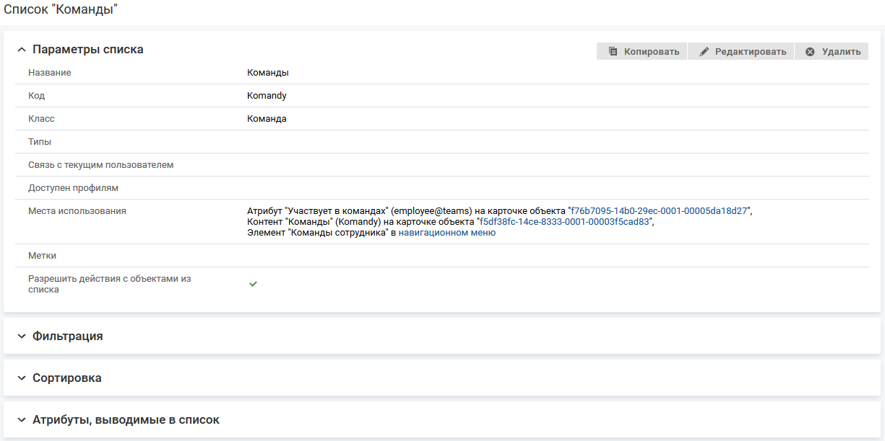

# Параметры карточки

- [Редактирование параметров списка объектов](./card-parameters#edit)
- [Копирование карточки объектов](./card-parameters#copy)
- [Удаление карточки объектов](./card-parameters#dell)

### Редактирование параметров карточки объекта {#edit}

#### Место настройки в интерфейсе

Меню навигации "Настройка системы" → настройка "Мобильное приложение" → вкладка "Карточки объектов" → страница настройки карточки объектов в мобильном приложении → блок "Параметры карточки".

Поля блока "Параметры карточки":

- Код.
- Класс.
- Типы.
- Доступен профилям.
- Заголовок объекта в мобильном приложении.
- Метки.
- Меню "Комментарии" доступно.
- Меню "Файлы" доступно.
- Использовать настройку переходов между статусами из веб-клиента.
- Быстрая смена статуса доступна.
- Передавать геопозицию устройства при быстрой смене статуса

#### Выполнение настройки

В блоке "Параметры карточки" нажмите кнопку **Редактировать**. На форме "Редактирование карточки" измените параметры карточки объектов и нажмите **Сохранить**.

<note type="info">

Параметр "Код" не редактируется.
При изменении параметра "Класс" сбрасываются настройки атрибутов и выбранные переходы между статусами.

</note>

### Копирование карточки объектов {#copy}

#### Описание настройки

Операция копирования позволяет быстро воспроизводить однотипные настройки карточки объектов — создать новую карточку объектов и скопировать в нее настройки уже существующей карточки объектов.

#### Место настройки в интерфейсе

Меню навигации "Настройка системы" → настройка "Мобильное приложение" → вкладка "Карточки объектов" → страница настройки карточки объектов в мобильном приложении → блок "Параметры карточки".

#### Выполнение настройки

В блоке "Параметры карточки" нажмите кнопку **Копировать**. На форме "Копирование карточки объекта" укажите код новой карточки и нажмите **Сохранить**.

Форма копирования закроется, на экране отобразится страница настройки новой карточки объектов. В скопированные настройки карточки объектов можно вносить изменения.

### Удаление карточки объектов {#dell}

#### Место настройки в интерфейсе

Меню навигации "Настройка системы" → настройка "Мобильное приложение" → вкладка "Карточки объектов" → страница настройки карточки объектов в мобильном приложении → блок "Параметры карточки".

Также карточку объекта можно удалить на вкладке "Карточки объектов", нажав иконку удаления  в строке карточки.

#### Выполнение настройки

В блоке "Параметры карточки" нажмите кнопку **Удалить**.

Удаленная карточка объекта недоступна для просмотра в мобильном приложении и не отображается на вкладке "Карточки объектов".
