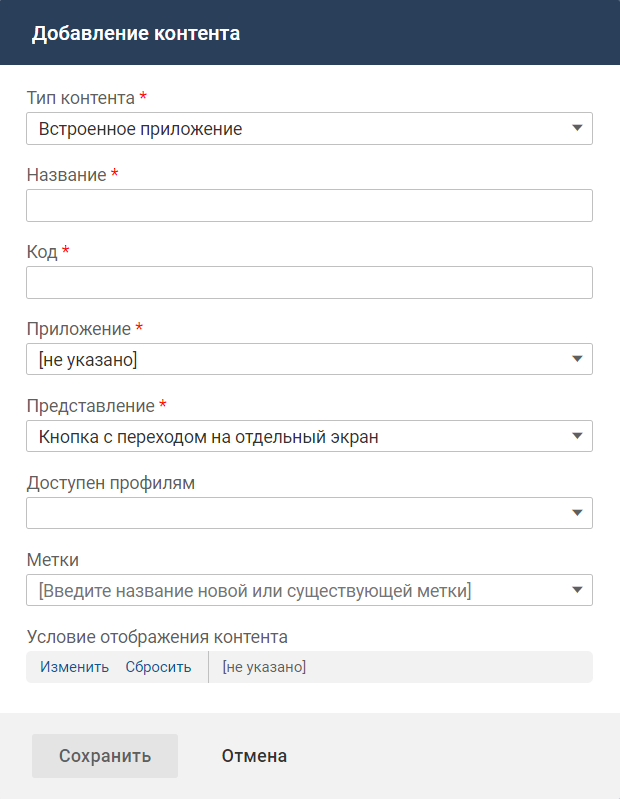
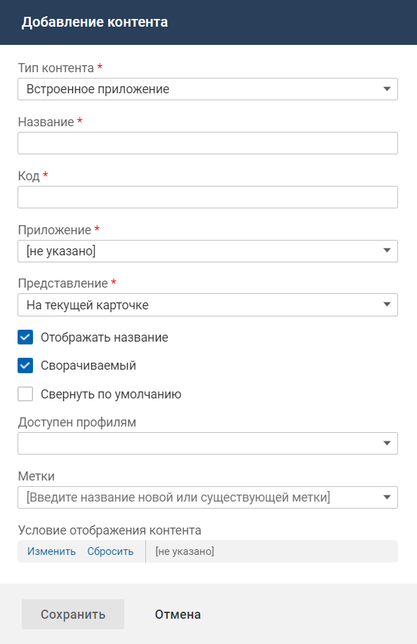

### Описание контента

Контент "Встроенное приложение" предназначен для отображения встроенных приложений на карточке объекта в мобильном приложении.

### Место настройки в интерфейсе

Меню навигации "Настройка системы" → настройка "Мобильное приложение" → вкладка "Карточки объектов" → страница настройки карточки объекта в мобильном приложении → блок "Настройка интерфейса карточки".

### Выполнение настройки

Чтобы разместить контент на карточке объекта, в блоке "Настройка интерфейса карточки" нажмите кнопку **Добавить контент**. На форме добавления контента заполните параметры контента и нажмите **Сохранить**.

Поля на форме добавления контента:

- **Тип контента**: "Встроенное приложение".
- **Название** — название контента, используемое в мобильном приложении.
- **Код** — уникальный идентификатор контента, без учета регистра. Значение заполняется автоматически (транслитерация названия контента при переводе фокуса с поля "Название"), код можно изменить.

    Код может содержать только символы латинского алфавита, цифры и знаки тире.

    
- **Приложение** — приложение для размещения на карточке объекта. Для выбора доступны все приложения, добавленные в систему. Выключенные приложения отображаются серым цветом.

    Если у встроенного приложения заданы дополнительные параметры, то после выбора такого приложения на форме отображаются поля для заполнения дополнительных параметров.
- **Представление**:
    - "Кнопка с переходом на отдельный экран" (по умолчанию) — на экране карточки объекта будет отображаться блок с иконкой и названием контента. При нажатии на блок выполняется переход на отдельный экран приложения.

        
    - "На текущей карточке" — приложение будет отображаться на экране карточки объекта во фрейме заданного размера.

        На экране будет отображаться:
        - Панель с названием контента и иконками "развернуть на весь экран" и "свернуть" (если для данного представления установлен флажок "Сворачиваемый").
        - Основной блок. Если содержимое не помещается в заданные размеры, то появляются полосы прокрутки.

            Вертикальный размер указывается при добавлении встроенного приложения в систему (параметр "Высота контента в мобильном приложении (pt)").

        <image src="../../../how-to-use-2/vp_A1.png" alt="Встроенное приложение. Представление «виджет»" scale="21.7"/>
- **Доступен профилям** — профиль доступа, обладатель которого может видеть данный контент на карточке объекта в мобильном приложении.

    Если не выбран ни один профиль, то ограничения видимости контента нет.
- **Метки** — выберите одну или несколько меток, определяющих процессы, в которых используется данный контент. Контент, помеченный выключенной меткой, не отображается.
- **Условие отображения контента** — настройте условия отображения контента. Условием отображения контента является определенное значение атрибута (нескольких атрибутов) объекта, на карточке которого расположен контент, или связанного с ним объекта.

Дополнительные поля для представления "На текущей карточке":

- **Отображать название** — признак, определяющий будет ли отображаться название контента в интерфейсе мобильного приложения:
    - флажок установлен (по умолчанию) —  название контента отображается;
    - флажок снят —  название контента не отображается.
- **Сворачиваемый** (отображается, если установлен флажок "Отображать название") — признак, определяющий будет ли сворачиваться и разворачиваться контент в интерфейсе мобильного приложения:
    - флажок установлен (по умолчанию) — справа от названия контента будет отображаться иконка "Свернуть" или "Развернуть" (нажатие на иконку или название сворачивает или разворачивает содержимое контента);
    - флажок снят — контент отображается только в развернутом виде.
- **Свернуть по умолчанию** (отображается, если установлен флажок "Сворачиваемый") — состояние по умолчанию для контента в интерфейсе мобильного приложения:
    - флажок установлен — при открытии карточки контент будет отображаться в свернутом виде (только заголовок и иконка "Развернуть");
    - флажок снят (по умолчанию) — при открытии карточки контент будет отображаться в развернутом виде.

    

### Настройки контента

Иконка вызова меню управления контентом отображается при наведении курсора на область контента.

Действия с контентом, размещенным на карточке:

- Переместить вниз или вверх.
- Редактировать свойства контента.
- Удалить контент с карточки.
