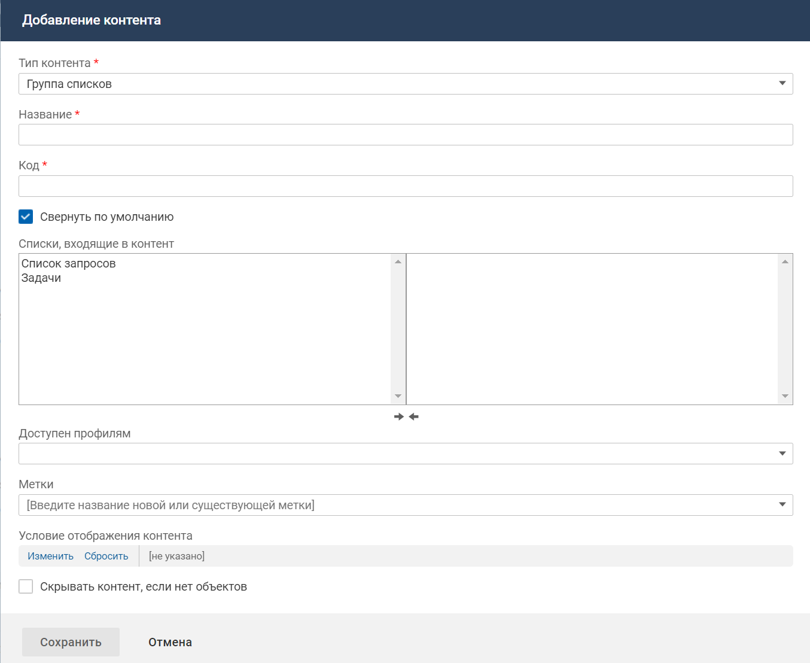

# Контент "Группа списков"

### Описание контента

Контент "Группа списков" предназначен для объединения и размещения на карточке объекта уже созданных контентов типа "Список связанных объектов" и "Список вложенных объектов".

### Место настройки в интерфейсе

Меню навигации "Настройка системы" → настройка "Мобильное приложение" → вкладка "Карточки объектов" → страница настройки карточки объекта в мобильном приложении → блок "Настройка интерфейса карточки".

### Выполнение настройки

Чтобы разместить контент на карточке объекта, в блоке "Настройка интерфейса карточки" нажмите кнопку **Добавить контент**. На форме добавления контента заполните параметры контента и нажмите **Сохранить**.

Поля на форме добавления контента:

- **Тип контента** — "Группа списков".
- **Название** — название контента, используемое в мобильном приложении.
- **Код** — уникальный идентификатор контента, без учета регистра. Значение заполняется автоматически (транслитерация названия контента при переводе фокуса с поля "Название"), код можно изменить.

    Код может содержать только символы латинского алфавита, цифры и знаки тире.
- **Свернуть по умолчанию** — состояние по умолчанию для контента в интерфейсе мобильного приложения:
    - Флажок установлен (значение по умолчанию) — при открытии карточки контент будет отображаться в свернутом виде. Списки, входящие в контент, расположены горизонтально в один ряд.
    - Флажок снят — при открытии карточки контент будет отображаться в развернутом виде. Списки, входящие в контент, расположены вертикально в два ряда.
- **Списки, входящие в контент** — выберите списки, входящие в контент.

    Для выбора доступны уже размещенные на карточке объекта контенты типа "Список связанных объектов" и "Список вложенных объектов".
    - [Контент "Список связанных объектов"](./card-related-list)
    - [Контент "Список вложенных объектов"](./card-nested-list)

    Для выбора контентов используется список с двумя частями. Выбранными являются контенты, расположенные в правой части списка.

    Порядок отображения названий контентов в правой части определяет порядок расположения контентов в "Группе списков".

    В списке с двумя частями доступны следующие виды перемещений Drag and drop:
    - из левой части списка в определенное место правой части;
    - из определенного места правой части в определенное место той же части;
    - из правой части списка в левую часть.

    Возможен быстрый выбор контента в правой и левой части списка (если список находится в фокусе). При вводе на клавиатуре начального символа, в списке отображается и выделяется цветом первый контент, название которого начинается с введенного символа. Если не найдено ни одного контента, то никаких действий не выполняется.
- **Доступен профилям** — профиль доступа, обладатель которого может видеть данный контент на карточке объекта в мобильном приложении. Если не выбран ни один профиль, то ограничения видимости контента нет.
- **Метки** — выберите одну или несколько меток, определяющих процессы, в которых используется данный контент.

    Контент не отображается, если он помечен выключенной меткой или все списки (контенты типа "Список связанных объектов" и "Список вложенных объектов"), входящие в контент, помечены выключенной меткой.
- **Условие отображения контента** — настройте условия отображения контента. Условием отображения контента является определенное значение атрибута (нескольких атрибутов) объекта, на карточке которого расположен контент, или связанного с ним объекта.
- **Скрывать контент, если нет объектов**:
    - флажок установлен — контент не отображается, если во всех списках, входящих в контент, нет объектов;
    - флажок снят (значение по умолчанию) — контент всегда отображается.

    

### Настройки контента

Иконка вызова меню управления контентом отображается при наведении курсора на область контента.

Действия с контентом, размещенным на карточке:

- Переместить вниз или вверх.
- Редактировать свойства контента.
- Удалить контент с карточки.
