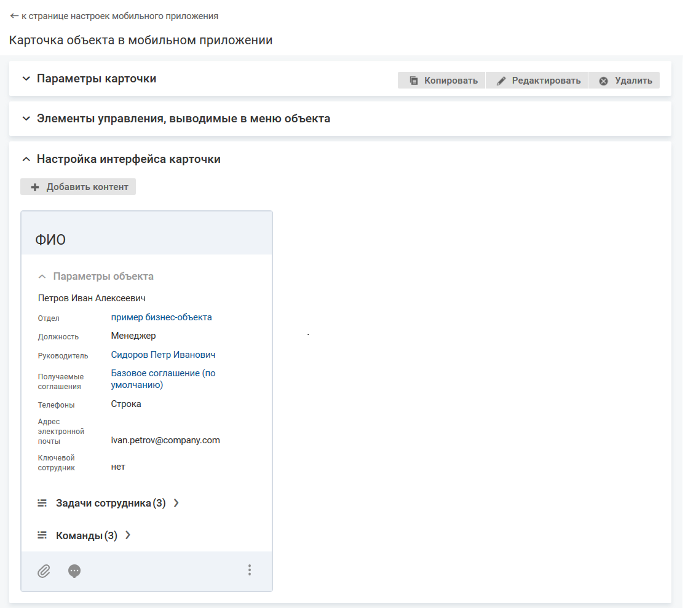
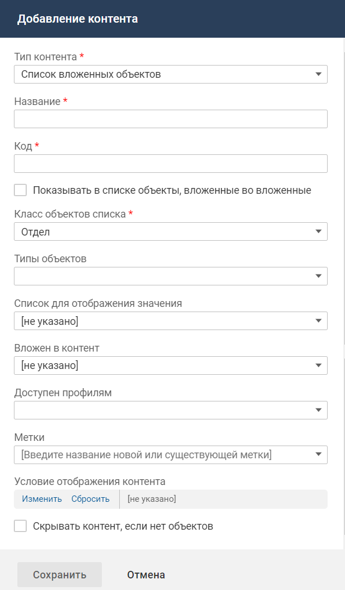
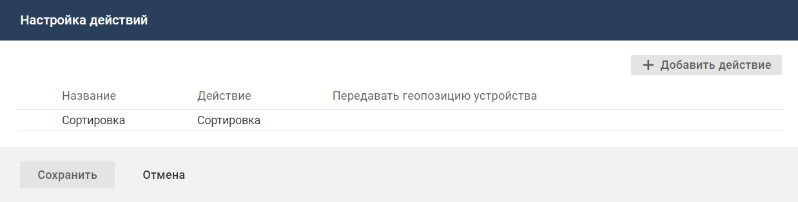

# Контент "Список вложенных объектов"

- [Добавление контента](#add)
- [Настройка действий в контенте](#act)

#### Добавление контента

#### Описание контента

Контент "Список вложенных объектов" предназначен для отображения списка вложенных объектов на карточке родительского объекта. Если класс объектов не имеет вложенных классов, то контент "Список вложенных объектов" для такого класса и его типов недоступен, и в списке контентов не отображается.

Сам список объектов размещается на отдельном экране, а на карточке объекта будет отображаться кнопка для перехода на экран со списком.

В меню действий списка объекта в мобильном приложении можно разместить кнопку добавления объектов.

#### Место настройки в интерфейсе

Меню навигации "Настройка системы" → настройка "Мобильное приложение" → вкладка "Карточки объектов" → страница настройки карточки объекта в мобильном приложении → блок "Настройка интерфейса карточки".

#### Выполнение настройки

Чтобы разместить контент на карточке объекта, в блоке "Настройка интерфейса карточки" нажмите **Добавить контент**. На форме добавления контента заполните параметры контента и нажмите **Сохранить**.

Поля на форме добавления контента:

- **Тип контента** — "Список вложенных объектов".
- **Название** — название контента, используемое в мобильном приложении.
- **Код** — уникальный идентификатор контента, без учета регистра. Значение заполняется автоматически (транслитерация названия контента при переводе фокуса с поля "Название"), код можно изменить.

    Код может содержать только символы латинского алфавита, цифры и знаки тире.
- **Показывать в списке объекты, вложенные во вложенные**:
    - флажок установлен — в списке вложенных объектов будут отображаться все объекты, вложенные в текущий по атрибуту "Родитель" (parent), а также все вложенные во вложенные и так далее вниз по иерархии;
    - флажок снят (значение по умолчанию) — в списке вложенных объектов будут отображаться только объекты, вложенные в текущий по атрибуту "Родитель" (parent).
- **Класс объектов списка** — класс объектов, которые будут отображаться в списке. Выбирается среди классов объектов, вложенных в текущий класс.
- **Типы объектов** — типы для отображения и добавления в контенте. Возможные значения: типы выбранного класса. Если не выбран ни один тип, то в списке могут добавляться и отображаться объекты всех типов выбранного класса.
- **Список для отображения значения** — список, настройки которого (атрибуты, выводимые в список, фильтрация и сортировка) будут использоваться при отображении списка на отдельном экране.

    Для выбора доступны списки, настроенные для мобильного приложения, и значение "[не указано]" (по умолчанию).

    Если выбрано "[не указано]", то в списке отображаются только названия.
- **Вложен в контент** — выберите контент типа "Группа списков", в котором будет размещен данный список.
- **Доступен профилям** — профиль доступа, обладатель которого может видеть данный контент. Если не выбран ни один профиль, то ограничения видимости контента нет.
- **Условие отображения контента** — настройте условия отображения контента. Условием отображения контента является определенное значение атрибута (нескольких атрибутов) объекта, на карточке которого расположен контент, или связанного с ним объекта.
- **Метки** — выберите одну или несколько меток, определяющих процессы, в которых используется данный контент. Контент, помеченный выключенной меткой, не отображается.
- **Скрывать контент, если нет объектов**:
    - флажок установлен — контент не отображается, если в списке нет объектов;
    - флажок снят (значение по умолчанию) — контент всегда отображается.

    

#### Результат настройки

Контент отобразится в блоке "Настройка интерфейса карточки".

С контентом доступны следующие действия. Иконка вызова меню управления контентом отображается при наведении курсора на область контента.

- Переместить вниз или вверх.
- Редактировать свойства контента.
- Настроить действия.
- Удалить контент с карточки.

### Настройка действий в контенте

В меню действий списка объекта в мобильном приложении можно разместить кнопку добавления объектов.

#### Место настройки в интерфейсе

Меню навигации "Настройка системы" → настройка "Мобильное приложение" → вкладка "Карточки объектов" → страница настройки карточки объекта в мобильном приложении.

На странице настройки карточки объекта в мобильном приложении в блоке "Настройка интерфейса карточки" разверните меню управления контентом и нажмите "Настроить действия". Иконка вызова меню управления контентом отображается при наведении курсора на область контента.

Откроется форма "Настройка действий".

#### Выполнение настройки

Чтобы добавить кнопку добавления объектов в списке, выполните следующие действия:

1. На форме "Настройка действий" нажмите **Добавить действие**.

    
2. На форме добавления элемента заполните поля:
    - **Название** — укажите название кнопки добавления.
    - **Действие** — выберите "Добавить объект".
    - **Форма добавления** (отображается после выбора действия) — выберите код формы добавления, которая будет открываться при нажатии на кнопку. По умолчанию "[не указано]".

        Для выбора доступны коды форм добавления, которые настроены для класса объектов списка. Если список настроен для типов, то также доступны коды форм добавления, которые настроены для всех указанных типов одновременно.

        Если выбрано значение "[не указано]", то при нажатии на кнопку действие выполняться не будет.
    - **Передавать геопозицию устройства**:
        - флажок снят (по умолчанию) — геопозиция не передается;
        - флажок установлен — при добавлении объекта в систему будет передаваться текущее местоположение мобильного устройства, с которого выполняется действие.

            Текущее местоположение устройства хранится в переменной контекста geo, которая может использоваться в скриптах действия по событию и кастомизации оповещения.

            Условие выполнения настройки. У мобильного приложения должен быть доступ к текущему местоположению устройства. Для работы геосервисов необходимо предоставлять разрешение на передачу точной геопозиции.
3. Нажмите **Сохранить**.

#### Результат настройки

На форме настройки действий отображается действие "Добавить объект".

В мобильном приложении в меню действий списка будет отображаться кнопка добавления объектов.
