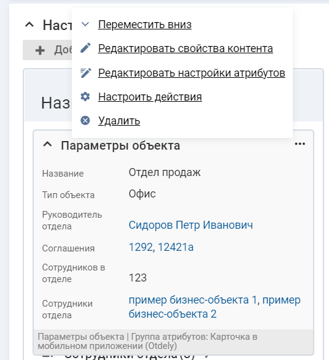
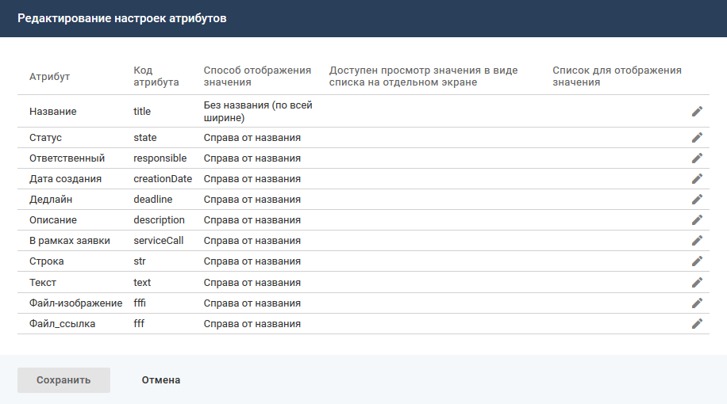
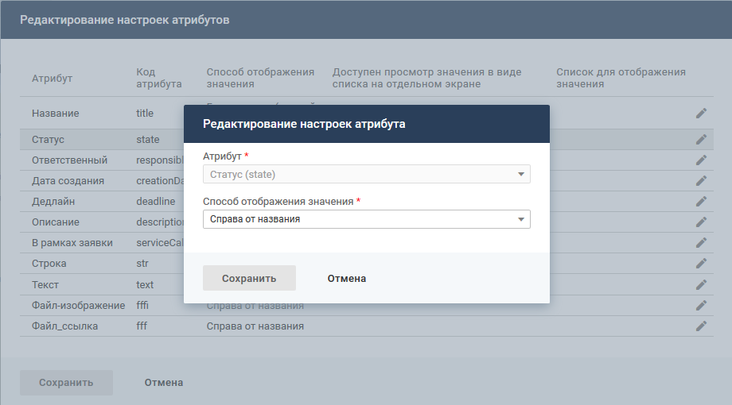
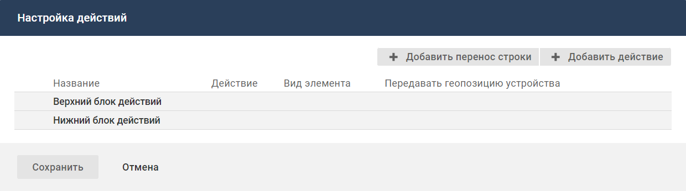
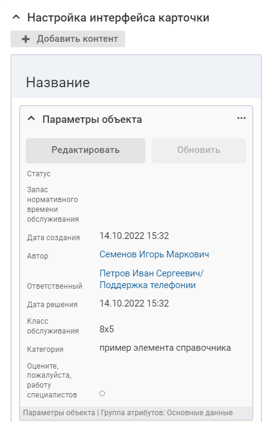
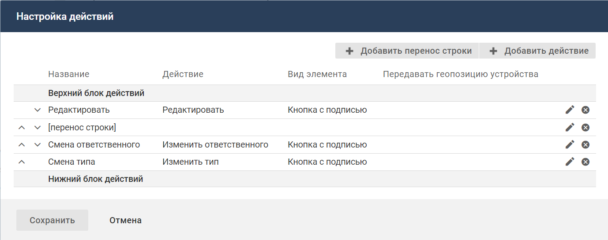

- [Добавление контента](./card-obj-parameters#add)
- [Атрибуты на карточке объекта](./card-obj-parameters#attr)
- [Настройка действий в контенте](./card-obj-parameters#act)

#### Добавление контента {#add}

#### Описание контента

Контент "Параметры объекта" предназначен для отображения на карточке объекта атрибутов, объединенных в определенную группу. На карточке может быть размещен один или несколько контентов с атрибутами.

Для каждого атрибута отдельно можно указать способ отображения значения атрибута относительно его названия: справа от названия, без названия (по всей ширине) или под названием (по всей ширине).

Для атрибутов типа "Набор ссылок на бизнес-объекты" и "Обратная ссылка" можно настроить просмотр значений в виде списка на отдельном экране.

На экране карточки объекта в мобильном приложении в блоках с контентами можно разместить элементы управления (кнопки, иконки, ссылки) для выполнения действий с объектом.

#### Место настройки в интерфейсе

Меню навигации "Настройка системы" → настройка "Мобильное приложение" → вкладка "Карточки объектов" → страница настройки карточки объекта в мобильном приложении → блок "Настройка интерфейса карточки".

#### Выполнение настройки

Чтобы разместить контент на карточке объекта, в блоке "Настройка интерфейса карточки" нажмите кнопку **Добавить контент**. На форме добавления контента заполните параметры контента и нажмите **Сохранить**.

Поля на форме добавления контента:

- **Тип контента** — "Параметры объекта".
- **Название** — название контента, используемое в мобильном приложении.
- **Отображать название** — признак, определяющий будет ли отображаться название контента в интерфейсе мобильного приложения:
    - флажок установлен (значение по умолчанию) — название контента отображается;
    - флажок снят —  название контента не отображается.
- **Код** —  уникальный идентификатор контента, без учета регистра. Значение заполняется автоматически (транслитерация названия контента при переводе фокуса с поля "Название"), код можно изменить.

    Код может содержать только символы латинского алфавита, цифры и знаки тире.
- **Сворачиваемый** (отображается, если установлен флажок "Отображать название") — признак, определяющий будет ли сворачиваться и разворачиваться контент в интерфейсе мобильного приложения:
    - флажок установлен  (значение по умолчанию) — справа от названия контента будет отображаться иконка "Свернуть" или "Развернуть" (нажатие на иконку или название сворачивает или разворачивает содержимое контента);
    - флажок снят — контент отображается только в развернутом виде.
- **Свернуть по умолчанию** (отображается, если установлен флажок "Сворачиваемый") — состояние по умолчанию для контента в интерфейсе мобильного приложения:
    - флажок установлен — при открытии карточки контент будет отображаться в свернутом виде (только заголовок и иконка "Развернуть";
    - флажок снят (значение по умолчанию) — при открытии карточки контент будет отображаться в развернутом виде.
- **Группа атрибутов** — группа атрибутов для отображения в контенте.

    Для выбора доступны группы атрибутов класса/типа объектов, на карточке которого размещается контент.

    Если группа не указана, то контент будет содержать только элементы управления.
- **Доступен профилям** — профиль доступа, обладатель которого может видеть данный контент на карточке объекта в мобильном приложении.

    Если не выбран ни один профиль, то ограничения видимости контента нет.
- **Метки** — выберите одну или несколько меток, определяющих процессы, в которых используется данный контент.

    Контент, помеченный выключенной меткой, не отображается.
- **Условие отображения контента** — настройте условия отображения контента. Условием отображения контента является определенное значение атрибута (нескольких атрибутов) объекта, на карточке которого расположен контент, или связанного с ним объекта.

    <image src="./IT_22_01_4155.png" alt="Добавление контента" scale="28.3"/>

#### Результат настройки

Контент отобразится в блоке "Настройка интерфейса карточки".

С контентом доступны следующие действия. Иконка вызова меню управления контентом отображается при наведении курсора на область контента.

- Переместить вниз или вверх.
- Редактировать свойства контента.
- Редактировать настройки атрибутов.
- Настроить действия.
- Удалить контент с карточки.

### Атрибуты на карточке объекта {#attr}

#### Описание настройки

Атрибуты размещаются на карточка объекта в контенте типа "Параметры объекта". На карточке может быть размещен один или несколько контентов с атрибутами.

<note type="info">

Настройка доступна, если у контента "Параметры объекта" заполнен параметр "Группа атрибутов".

</note>

Если значение атрибута не указано, то данный атрибут, его название и значение, не будет отображаться на карточке объекта в контенте "Параметры объекта".

Отображение отдельных атрибутов на карточке объекта:

- Все значения атрибутов типа "Дата" и "Дата/время" отображаются в часовом поясе, установленном для пользователя в системе.

    Если часовой пояс пользователя не указан, то используется часовой пояс, указанный в мобильном устройстве.

    Загрузка часового пояса пользователя производится один раз за сеанс при входе в мобильное приложение.

    Время может быть показано с секундами и миллисекундами, если их отображение настроено для атрибута "Дата/время".
- Значение ссылочного атрибута является ссылкой на карточку объекта, если карточка соответствующего объекта доступна в мобильном приложении. Ссылка выделяется только цветом (активные объекты — голубым, архивные объекты — серым).

    Набор значений ссылочного атрибута может отображаться списком на отдельном экране. Для перехода к списку используется кнопка **списком ()** в скобках указывается общее количество значений атрибута, на экране карточки объекта отображается максимум 3 значения.
- В строковых и текстовых атрибутах (комментариях) распознаются различные форматы телефонных номеров и электронные адреса. Распознанные контактные данные выделяются цветом как ссылки. При нажатии на ссылку запускается соответствующая системная функция операционной системы устройства.
- Значения атрибута типа "Текст в формате RTF" отображаются без форматирования, если выбрано представление для отображения "Текст в формате RTF" или "Текст в формате RTF (по всей ширине)".

    Чтобы сохранить форматирование текста, необходимо использовать представления "Текст в формате RTF, небезопасный" или "Текст в формате RTF, небезопасный (по всей ширине)".
- Атрибут, у которого не определено значение, не отображается.

#### Место настройки в интерфейсе

Меню навигации "Настройка системы" → настройка "Мобильное приложение" → вкладка "Карточки объектов" → страница настройки карточки объекта.

На странице настройки карточки объекта в мобильном приложении в блоке "Настройка интерфейса карточки" разверните меню управления контентом "Параметры объекта" и нажмите "Редактировать настройки атрибутов".

Откроется форма "Редактирование настроек атрибутов". Набор атрибутов и порядок их отображения определяется настройками группы атрибутов, выбранной при настройке контента "Параметры объекта".

#### Выполнение настройки. Способ отображения значения атрибута

Для каждого атрибута отдельно можно указать способ отображения значения атрибута относительно его названия: справа от названия, без названия (по всей ширине) или под названием (по всей ширине).

Чтобы указать способ отображения значения атрибута относительно его названия, на форме редактирования настроек атрибутов нажмите иконку редактирования {width=19 height=18} в строке атрибута и на форме редактирования выберите способ отображения значения и нажмите **Сохранить**.

#### Выполнение настройки. Просмотр значения в виде списка на отдельном экране

Для атрибутов типа "Набор ссылок на бизнес-объекты" и "Обратная ссылка" можно настроить просмотр значений в виде списка на отдельном экране. На экране карточки объекта будет отображаться максимум 3 значения. Для перехода к списку используется кнопка **списком ()**, в скобках указывается количество значений атрибута с учетом фильтрации из настроек списка для отображения значения.

Чтобы настроить просмотр значения в виде списка на отдельном экране, на форме редактирования настроек атрибутов нажмите иконку редактирования {width=19 height=18}, на форме редактирования заполните параметры и нажмите кнопку "Сохранить".

Поля на форме редактирования:

- Способ отображения значения
- Доступен просмотр значения в виде списка на отдельном экране:
    - Флажок снят (по умолчанию) — значение атрибута отображается на карточке объекта в соответствии с выбранным представлением.
    - Флажок установлен — на карточке объекта отображается максимум 3 значения и кнопка **Списком ()**. Полный список значений открывается на отдельном экране, для перехода к списку используется кнопка **Списком ()**.
- Список для отображения значения — список, настройки которого (атрибуты, фильтрация и сортировка) будут использоваться при отображении значений ссылочного атрибута в виде списка на отдельном экране и при отображении первых трех значений на карточке объекта.

    Поле отображается, если установлен флажок "Доступен просмотр значения в виде списка на отдельном экране".

    Для выбора доступны списки, настроенные для класса, на который ссылается атрибут, и значение "[не указано]" (по умолчанию).

    Если выбрано "[не указано]", то в списке отображаются только названия.

### Настройка действий в контенте {#act}

#### Описание настройки

В контенте "Параметры объекта" можно разместить элемент управления для выполнения действия с объектом. Для контента "Параметры объекта" допустимо не указывать группу атрибутов. Тогда контент будет содержать только элементы управления.

Созданные элементы управления размещаются на карточке горизонтально друг за другом. Перенос строки позволяет расположить элементы управления на разных уровнях — вертикально друг под другом.

В разделе приведено общее описание настройки. Описание настройки элементов управления для выполнения конкретных действий, см. [Примеры настройки пользовательских действий](../card-actions-examples).

#### Место настройки в интерфейсе

Меню навигации "Настройка системы" → настройка "Мобильное приложение" → вкладка "Карточки объектов" → страница настройки карточки объекта в мобильном приложении.

На странице настройки карточки объекта в мобильном приложении в блоке "Настройка интерфейса карточки" разверните меню управления контентом и нажмите "Настроить действия".

Откроется форма "Настройка действий".

#### Выполнение настройки. Добавление действия

Чтобы добавить элемент управления, выполните следующие действия:

1. На форме "Настройка действий" нажмите кнопку **Добавить действие**.
2. На форме "Добавление элемента" заполните поля:
    - **Область контента** — выберите область контента, в которой будет отображаться элемент управления:
        - "Верхний блок действий" — элемент отображается в контенте выше списка атрибутов;
        - "Нижний блок действий" — элемент отображается в контенте ниже списка атрибутов.
    - **Название** — укажите название элемента управления (127 символов).
    - **Внешний вид** — выберите представление элемента управления: кнопка с иконкой и подписью, кнопка с подписью, кнопка с иконкой, ссылка, иконка, иконка и подпись.
        - **Иконка** — выберите иконку для элемента управления в представлении "Кнопка с иконкой и подписью", "Кнопка с иконкой", "Иконка", "Иконка и подпись". Выбранное значение отобразится в виде названия иконки без изображения.

            Для выбора доступны неархивные иконки из справочника "Иконки для элементов управления (векторные)". Для каждой иконки отображается ее изображение и название.

            Для настройки элементов управления с иконками используются иконки в формате SVG версии 1.1 и старше из справочника "Иконки для элементов управления (векторные)". Перед началом настройки добавьте иконки в справочник. Можно загрузить свои или использовать готовые иконки[скачать](https://www.naumen.ru/docs/sd/file/icon_mk.zip).
    - **Действие** — выберите действие по событию, которое будет инициироваться данным элементом управления. По умолчанию "[не указано]". Если значение не указано, то элемент управления будет недоступен для использования.

        Для выбора доступны:
        - системные действия — системные действия для объектов класса, карточка которого настраивается в мобильном приложении;
        - пользовательские действия — настроенные в системе действия по событию, для которых параметр "Событие" = "[Пользовательское событие]" и параметр "Объекты" содержит класс и/или типы объектов, для которых настраивается карточка в мобильном приложении.

        Выключенные действия по событию отображаются серым цветом.
    - **Форма редактирования** (отображается, если в параметре "Действия" выбрано системное действие "Редактировать") — выберите код формы редактирования, которая будет открываться при нажатии на элемент управления. По умолчанию "[не указано]".

        Для выбора доступны коды форм редактирования, которые настроены для класса объектов карточки. Если карточка настроена для некоторых типов класса (в параметре "Типы" для карточки заданы типы), то в списке доступны коды форм, настроенные хотя бы для одного из типов (параметр "Типы" для формы).

        Если выбрано значение "[не указано]", то при нажатии на элемент управления будет открываться первая по списку форма редактирования для класса/типа, см. [Формы редактирования объектов](../../edit-form).
    - **Цвет фона** — выберите цвет фона для элемента управления в представлении "Кнопка с иконкой и подписью", "Кнопка с подписью", "Кнопка с иконкой".

        Если значение не указано, то цвет кнопки определяется цветовой темой, установленной на устройстве.
    - **Передавать геопозицию устройства**  — параметр доступен для всех действий, кроме системных действий "Поделиться" и "Обновить":
        - флажок снят (по умолчанию) — геопозиция не передается;
        - флажок установлен — при выполнении действия с объектом в систему будет передаваться текущее местоположение мобильного устройства, с которого выполняется действие.

            Текущее местоположение устройства хранится в переменной контекста geo, которая может использоваться в скриптах действия по событию и кастомизации оповещения.

            Условие выполнения настройки. У мобильного приложения должно быть разрешение на передачу геопозиции.
3. Нажмите **Сохранить**.

Новый элемент управления будет отображаться в блоке "Настройка интерфейса карточки" (контент "Параметры объекта") и в мобильном приложении.

Отображение элемента зависит от доступности для выполнения действия:

- серым отображается элемент, доступный для использования;
- полупрозрачным отображается элемент, для которого действие выключено, отмечено выключенной меткой или не указано.

В мобильном приложении пользовательский элемент управления отображается при наличии у пользователя соответствующих прав относительно текущего объекта системы.

#### Выполнение настройки. Добавление переноса строки

Чтобы настроить вертикальное отображение элементов, выполните следующие действия:

1. На форме "Настройка действий" нажмите кнопку **Добавить перенос строки**.
2. На форме "Добавление переноса строки" заполните поле "Область контента" ("Верхний блок действий"/"Нижний блок действий") и нажмите **Сохранить**.

    На форме "Настройка действий" в указанной области отобразится элемент [перенос строки] (после всех элементов последним ).
3. Переместите элемент [перенос строки] между элементами управления, которые необходимо расположить друг под другом и нажмите **Сохранить**.

Элементы управления будут отображаться с учетом переноса строки в настройках интерфейса карточки и в мобильном приложении. Перенос строки сохраняется при условии, что он расположен между элементами управления.

Чтобы изменить область контента ("Верхний блок действий"/"Нижний блок действий"), в которой добавлен перенос строки, на форме "Настройка действий" нажмите иконку 
 {width=19 height=18} в строке переноса. На форме "Добавление переноса строки" измените область контента и нажмите **Сохранить**.

Перенос строки отобразится в заданном блоке действий на форме "Настройка действий".

#### Выполнение настройки. Настройка порядка отображения элементов

Можно установить порядок отображения элементов управления и переносов строки.

Чтобы установить порядок отображения элементов управления и переносов строки, на форме "Настройка действий" определите порядок отображения элементов с помощью инструмента Drag and drop или стрелок {width=15 height=10} и {width=17 height=10} в строке элемента и нажмите **Сохранить**.

Элементы управления и переносы строки будут отображаться в заданном порядке в настройках интерфейса карточки и в мобильном приложении.

#### Выполнение настройки. Редактирование элемента управления

Чтобы изменить параметры элемента управления:

1. На форме "Настройка действий" нажмите иконку редактирования 
 {width=19 height=18}в строке элемента управления.
2. На форме редактирования измените значения параметров элемента и нажмите **Сохранить**. Форма редактирования закроется, на форме "Настройка действий" отобразится измененный элемент управления.
3. Далее нажмите **Сохранить** на форме "Настройка действий".

Измененный элемент управления отобразится в настройках интерфейса карточки и в мобильном приложении.

#### Выполнение настройки. Удаление элемента управления / переноса строки

Чтобы удалить элемент управления / перенос строки, на форме "Настройка действий" нажмите иконку 
удаления {width=19 height=18} в строке элемента управления/ переноса строки, элемент перестанет отображаться на форме.

Далее нажмите **Сохранить** на форме "Настройка действий".

Удаленный элемент управления не отображается в настройках интерфейса карточки и в мобильном приложении.
