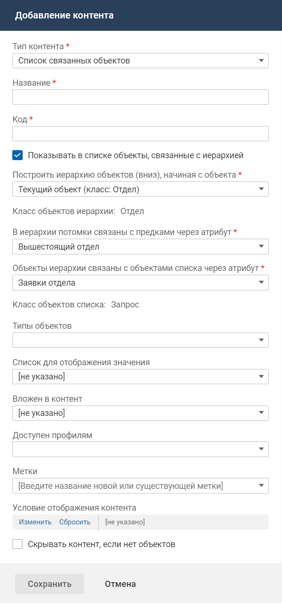

# Контент "Список связанных объектов"

- [Добавление контента](./card-related-list#add)
- [Настройка действий в контенте](./card-related-list#act)

#### Добавление контента {#add}

#### Описание контента

Контент "Список связанных объектов" предназначен для отображения на карточке объекта информации о наборе связанных с ним объектов.

Сам список объектов размещается на отдельном экране, а на карточке объекта будет отображаться кнопка для перехода на экран со списком.

В меню действий списка объекта в мобильном приложении можно разместить кнопку добавления объектов.

#### Место настройки в интерфейсе

Меню навигации "Настройка системы" → настройка "Мобильное приложение" → вкладка "Карточки объектов" → страница настройки карточки объекта в мобильном приложении → блок "Настройка интерфейса карточки".

#### Выполнение настройки

Чтобы разместить контент на карточке объекта, в блоке "Настройка интерфейса карточки" нажмите **Добавить контент**. На форме добавления контента заполните параметры контента и нажмите **Сохранить**.

Поля на форме добавления контента:

- **Тип контента** — "Список связанных объектов".
- **Название** — название контента, используемое в мобильном приложении.
- **Код** — уникальный идентификатор контента, без учета регистра. Значение заполняется автоматически (транслитерация названия контента при переводе фокуса с поля "Название"), код можно изменить.

    Код может содержать только символы латинского алфавита, цифры и знаки тире.
- **Показывать в списке объекты, связанные с иерархией**:
    - флажок снят (по умолчанию) — в списке связанных объектов будут отображаться объекты, связанные с текущим по прямой связи;
    - флажок установлен — в списке связанных объектов будут отображаться объекты, связанные с текущим по прямой и обратной связи.
- **Атрибут** (отображается, если снят флажок "Показывать в списке объекты, связанные с иерархией") — ссылочный атрибут, определяющий класс, объекты которого будут отображаться в списке. Глубина цепочки связей в дереве выбора ограничена 4 уровнями. На первом уровне расположены атрибуты связи текущего класса объектов.

    Если карточка объекта настроена для класса объектов, то в качестве атрибута связи первого уровня могут выступать только атрибуты, определенные в классе.

    Если карточка объекта настроена для конкретных типов, то в качестве атрибута связи первого уровня могут выступать только атрибуты, определенные во всех указанных типах.
- **Построить иерархию объектов (вниз), начиная с объекта** (отображается, если установлен флажок "Показывать в списке объекты, связанные с иерархией") — объект, который будет являться корневым в иерархии, а также класс объектов в рамках которого будет строиться иерархическая структура.

    Возможные значения:
    - элемент "Текущий объект (класс: "Название класса текущего объекта")" — текущий объект сам будет являться корнем иерархии;
    - любой ссылочный атрибут текущего класса или класса, связанного с данным.
- **Класс объектов иерархии** — информационное поле, в котором указывается класс объекта, на который указывает ссылочный атрибут. В рамках данного класса будет выстраиваться иерархическая структура.
- **В иерархии потомки связаны с предками через атрибут** — атрибут связи, на основе которого строится иерархическая структура объектов.

    Возможные значения:
    - атрибут с кодом parent — если он определен в классе объектов иерархии, то используется как значение по умолчанию;
    - любой атрибут, определенный в классе объектов иерархии, с параметрами атрибута: тип "Ссылка на бизнес-объект", невычислимый, атрибут должен ссылаться на класс объектов иерархии.
- **Объекты иерархии связаны с объектами списка через атрибут** — класс, объекты которого будут отображаться в списке.

    Возможные значения:
    - элемент "Объект иерархии (класс: "Название класса объекта иерархии")" — в списке будут отображаться объекты класса, в рамках которого строится иерархия;
    - любой ссылочный атрибут класса объектов иерархии или класса, связанного с данным.
- **Класс объектов списка** — информационное поле, в котором указывается класс объекта, на который указывает ссылочный атрибут. Объекты данного класса будут отображаться в списке.
- **Типы объектов** — типы для отображения и добавления в контенте. Возможные значения: типы выбранного класса. Если не выбран ни один тип, то в списке могут добавляться и отображаться объекты всех типов выбранного класса.
- **Список для отображения значения** — список, настройки которого (атрибуты, выводимые в список, фильтрация и сортировка) будут использоваться при отображении списка на отдельном экране.

    Для выбора доступны списки, настроенные для мобильного приложения, и значение "[не указано]" (по умолчанию).

    Если выбрано "[не указано]", то в списке отображаются только названия.
- **Вложен в контент** — выберите контент типа "Группа списков", в котором будет размещен данный список.
- **Доступен профилям** — профиль доступа, обладатель которого может видеть данный контент. Если не выбран ни один профиль, то ограничения видимости контента нет.
- **Метки** — выберите одну или несколько меток, определяющих процессы, в которых используется данный контент. Контент, помеченный выключенной меткой, не отображается.
- **Условие отображения контента** — настройте условия отображения контента. Условием отображения контента является определенное значение атрибута (нескольких атрибутов) объекта, на карточке которого расположен контент, или связанного с ним объекта.
- **Скрывать контент, если нет объектов**:
    - флажок установлен — контент не отображается, если в списке нет объектов;
    - флажок снят (значение по умолчанию) — контент всегда отображается.

    

#### Результат настройки

Контент отобразится в блоке "Настройка интерфейса карточки".

С контентом доступны следующие действия. Иконка вызова меню управления контентом отображается при наведении курсора на область контента.

- Переместить вниз или вверх.
- Редактировать свойства контента.
- Настроить действия.
- Удалить контент с карточки.

### Настройка действий в контенте {#act}

В меню действий списка объекта в мобильном приложении можно разместить кнопку добавления объектов.

#### Место настройки в интерфейсе

Меню навигации "Настройка системы" → настройка "Мобильное приложение" → вкладка "Карточки объектов" → страница настройки карточки объекта в мобильном приложении.

На странице настройки карточки объекта в мобильном приложении в блоке "Настройка интерфейса карточки" разверните меню управления контентом и нажмите "Настроить действия". Иконка вызова меню управления контентом отображается при наведении курсора на область контента.

Откроется форма "Настройка действий".

#### Выполнение настройки

Чтобы добавить кнопку добавления объектов в списке, выполните следующие действия:

1. На форме "Настройка действий" нажмите **Добавить действие**.

    
2. На форме добавления элемента заполните поля:
    - **Название** — укажите название кнопки добавления.
    - **Действие** — выберите "Добавить объект".
    - **Форма добавления** (отображается после выбора действия) — выберите код формы добавления, которая будет открываться при нажатии на кнопку. По умолчанию "[не указано]".

        Для выбора доступны коды форм добавления, которые настроены для класса объектов списка. Если список настроен для типов, то также доступны коды форм добавления, которые настроены для всех указанных типов одновременно.

        Если выбрано значение "[не указано]", то при нажатии на кнопку действие выполняться не будет.
    - **Передавать геопозицию устройства**:
        - флажок снят (по умолчанию) — геопозиция не передается;
        - флажок установлен — при добавлении объекта в систему будет передаваться текущее местоположение мобильного устройства, с которого выполняется действие.

            Текущее местоположение устройства хранится в переменной контекста geo, которая может использоваться в скриптах действия по событию и кастомизации оповещения.

            Условие выполнения настройки. У мобильного приложения должен быть доступ к текущему местоположению устройства. Для работы геосервисов необходимо предоставлять разрешение на передачу точной геопозиции.
3. Нажмите **Сохранить**.

#### Результат настройки

На форме настройки действий отображается действие "Добавить объект".

В мобильном приложении в меню действий списка будет отображаться кнопка добавления объектов.
