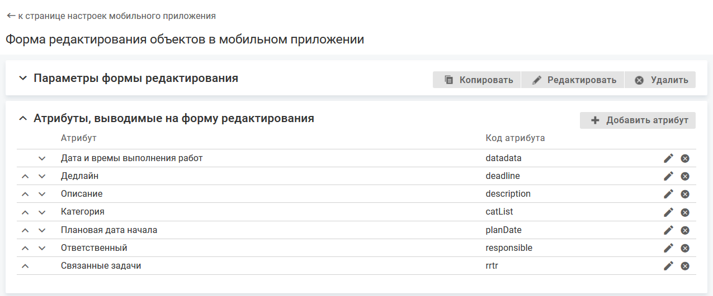

- [Добавление атрибута для отображения на форме редактирования](./edit-form-attributes#add)
- [Настройка порядка отображения атрибутов на форме редактирования](./edit-form-attributes#order)
- [Удаление атрибута с формы редактирования](./edit-form-attributes#dell)

### Добавление атрибута для отображения на форме редактирования {#add}

#### Описание настройки

На форме редактирования объекта отображается определенный набор атрибутов.

Набор атрибутов настраивается для каждой формы отдельно.

#### Место настройки в интерфейсе

Меню навигации "Настройка системы" → настройка "Мобильное приложение" → вкладка "Формы редактирования объектов" → страница настройки формы редактирования → блок "Атрибуты, выводимые на форму редактирования".

#### Выполнение настройки

В блоке "Атрибуты, выводимые на форму редактирования" нажмите кнопку **Добавить атрибут**, заполните поля на форме редактирования атрибута и нажмите **Сохранить**.

Поля на форме редактирования атрибута:

- **Атрибут** — атрибут, который будет отображаться на форме редактирования в мобильном приложении.

    Атрибуты, доступные для выбора, определяются значением параметра "Типы" для формы редактирования в мобильном приложении:
    - Типы объекта указаны — на форму редактирования можно вывести редактируемые атрибуты, созданные в классе (параметр "Класс") и в выбранных типах, и атрибут "Тип объекта" (metaClass).
    - Типы объектов не выбраны — на форму редактирования  можно вывести все редактируемые атрибуты, созданные в классе (параметр "Класс") и всех его типах, и атрибут "Тип объекта" (metaClass).

    Для запросов на форму редактирования можно вывести атрибуты "Контрагент" (client) и "Соглашение/Услуга" (agreementService).

#### Результат настройки

Добавленные атрибуты отображаются в блоке "Атрибуты, выводимые на форму редактирования".

При редактировании формы редактирования (изменение значения параметра "Типы") на форме редактирования могут оказаться атрибуты, определенные в типах объектов, для которых недоступна форма редактирования в мобильном приложении. Такие атрибуты выделяются цветом. Также на странице настройки формы отображается информационное сообщение: "Атрибуты с кодом [] не будут отображаться в мобильном приложении, так как они определены в рамках недоступных типов".

В мобильном приложении на форме редактирования объекта будет отображаться указанный набор атрибутов.

<note type="info">

При заполнении значения атрибута типа "Временной интервал" доступны только единицы измерения, заданные при настройке атрибута в веб-интерфейсе (параметр "Единицы измерения, доступные при редактировании").

</note>

### Настройка порядка отображения атрибутов на форме редактирования {#order}

#### Описание настройки

Порядок отображения атрибутов в блоке "Атрибуты, выводимые на форму редактирования" определяет порядок отображения атрибутов на форме редактирования.

#### Место настройки в интерфейсе

Меню навигации "Настройка системы" → настройка "Мобильное приложение" → вкладка "Формы редактирования объектов" → страница настройки формы редактирования → блок "Атрибуты, выводимые на форму редактирования".

#### Выполнение настройки

В блоке "Атрибуты, выводимые на форму редактирования" укажите порядок отображения атрибутов с помощью инструмента Drag and drop или стрелок {width=15 height=10} и {width=17 height=10} в строке атрибута.

### Удаление атрибута с формы редактирования {#dell}

#### Место настройки в интерфейсе

Меню навигации "Настройка системы" → настройка "Мобильное приложение" → вкладка "Формы редактирования объектов" → страница настройки формы редактирования → блок "Атрибуты, выводимые на форму редактирования".

#### Выполнение настройки

В блоке "Атрибуты, выводимые на форму редактирования" нажмите иконку удаления {width=19 height=18} в строке атрибута.

Удаленный атрибут не будет отображаться в блоке "Атрибуты, выводимые на форму редактирования".
