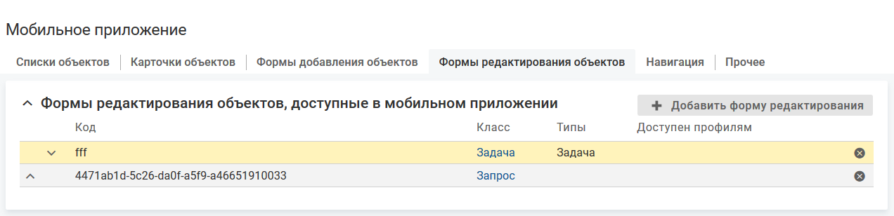

# Добавление формы редактирования объектов

- [Добавление карточки объекта в мобильное приложение](./edit-form-create#add)
- [Подбор карточки для отображения](./edit-form-create#order)

### Добавление формы редактирования в мобильное приложение {#add}

#### Описание настройки

В мобильном приложении можно создать новую форму редактирования объектов.

Для класса/типа объектов могут быть созданы одна или несколько форм редактирования.

#### Место настройки в интерфейсе

Меню навигации "Настройка системы" → настройка "Мобильное приложение" → вкладка "Формы редактирования объектов".

#### Выполнение настройки

Чтобы добавить форму редактирования объекта, на вкладке "Формы редактирования объектов" нажмите кнопку **Добавить форму редактирования**, заполните поля на форме добавления и нажмите **Сохранить**.

Поля на форме "Добавление формы редактирования":

- **Код** — уникальный код формы редактирования.
- **Класс** — класс объектов, для которого будет доступна форма редактирования в мобильном приложении.
- **Типы**:

    Поле заполнено. Выбранными являются типы, рядом с названиями которых установлен флажок. Выбор типа не распространяется на вложенные типы:
    - форма добавления в мобильном приложении будут доступна для выбранных типов класса, указанного в параметре "Класс";
    - на форму добавления можно вывести атрибуты, созданные в классе, указанном в параметре "Класс", и в выбранных типах, см. [Атрибуты на форме редактирования](./edit-form-attributes).

    Поле не заполнено:
    - форма добавления в мобильном приложении будут доступна для всех типов класса, указанного в параметре "Класс".;
    - на форму добавления  в мобильном приложении можно вывести все атрибуты, созданные в классе, указанном в параметре "Класс", и всех его типах, см. [Атрибуты на форме редактирования](./edit-form-attributes).

    Для выбора доступны все типы объектов класса, указанного в параметре "Класс".
- **Доступна профилям** — профиль, обладатель которого может работать с формой редактирования в мобильном приложении.

    Если не выбран ни один профиль, то ограничения видимости формы нет.

    Для выбора доступны общие профили и относительные профили класса, указанного в параметре "Класс".
- **Метки** — одна или несколько меток, определяющих процессы, в которых используется данная форма.

<note type="info">

При редактировании атрибута типа "Временной интервал" доступны только единицы измерения, заданные при настройке атрибута в веб-интерфейсе (параметр "Единицы измерения, доступные при редактировании").

</note>

### Подбор формы редактирования для отображения {#order}

#### Описание настройки

При настройке действия "Редактировать" в меню действий с объектом  или в контенте может быть выбрана конкретная форма редактирования, которая будет открываться при выполнении действия в мобильном приложении.

Если при настройке действия форма не выбрана, то в мобильном приложении открывается первая по списку форма редактирования для объекта определенного класса/типа.

#### Место настройки в интерфейсе

Меню навигации "Настройка системы" → настройка "Мобильное приложение" → вкладка "Формы редактирования объектов".

#### Выполнение действия

В списке определите порядок подбора форм редактирования с помощью инструмента Drag and drop или стрелок  и  в строке списка.

Пример. На вкладке "Формы редактирования объектов" сверху вниз отображаются форма редактирования для класса "Задача", а потом форма редактирования для типа "Поручение" (класса "Задача"). При редактировании задачи в мобильном приложении будет открываться форма редактирования объектов для класса "Задача".
