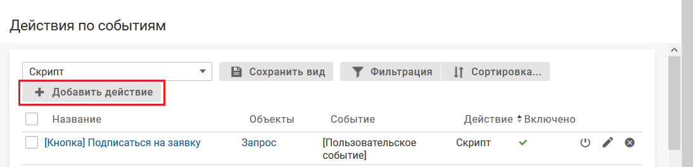

- [Описание процесса](./notifications-3#description)
- [Действий по событию "Уведомление в мобильном приложении"](./notifications-3#dps)
- [Скрипт кастомизации уведомления в мобильном приложении](./notifications-3#script)

### Описание процесса {#description}

Уведомление в мобильном приложении (уведомление) — отправка настроенного сообщения в мобильном приложении определенному списку адресатов при наступлении заданных событий с объектами системы любого класса или типа. Уведомления предназначены для оперативного оповещения сотрудников о наступлении определенных событий.

Для мобильного приложения должно быть выдано разрешение на отправку уведомлений.

#### Получение и отправка

Уведомление в мобильном приложении — это отдельное персонализированное пуш-сообщение, внешний вид которого определяется его шаблоном. При наступлении события, на которое настроен шаблон уведомления, в системе создаются экземпляры уведомлений.

<note type="info">

Алгоритм выполнения уведомления: Наступление инициирующего события → Проверка выполнения условий действия по событию → Формирование списка получателей → Выполнение скрипта кастомизации → Создание уведомления → Выполнение действия по событию. Действие по событию выполняется один раз.

</note>

Пользователь получает уведомления по всем своим аккаунтам, которые добавлены в мобильное приложение, из которых пользователь явно не выходил. При нажатии на уведомление пользователь переходит в аккаунт, в рамках которого было получено сообщение:

Уведомление не отправляется архивному сотруднику и заблокированному сотруднику.

Режим Silent Mode влияет на отправку уведомлений в мобильном приложении.

Возможна отправка уведомления скриптовыми методами.

#### Отображение уведомления

Уведомление может отображаться:

- на мобильном устройстве;
- в интерфейсе мобильного приложения в виде:
    - списка уведомлений (если настроен список объектов служебного класса "Уведомление в мобильном приложении");
    - карточки уведомления (если настроена карточка объекта служебного класса "Уведомление в мобильном приложении").

#### Шаблон уведомления

Настройка уведомления заключается в настройке шаблона уведомления, определяющего внешний вид уведомлений в мобильном приложении.

Шаблон уведомления настраивается как отдельный тип действий по событию "Уведомление в мобильном приложении".

#### Наследование

Действие по событиям, настроенное для класса/типа объектов, наследуется во все вложенные в него типы.

#### Служебный класс "Уведомление в мобильном приложении"

Экземпляры уведомления хранятся в системе как объекты служебного класса "Уведомление в мобильном приложении".

Атрибуты объекта "Уведомление в мобильном приложении":

- "Получатель" — получатель уведомления.
- "Текст" — текст уведомления в формате RTF.
- "Дата отправки" — дата и время срабатывания действия типа "Уведомление в мобильном приложении", в рамках которого было инициировано создание данного экземпляра уведомления.
- "Дата прочтения" — дата и время перехода объекта в статус "Прочитано" (readByUser).
- "Заголовок" — значение параметров "Формат заголовка уведомления" и "Тема" шаблона уведомления в мобильном приложении, по которому сформирован экземпляр уведомления.

    Значение по длине превышающее 255 символов обрезается до 252 символов и в конце строки добавляется многоточие ("...").

<note type="info">

В служебном классе "Уведомление в мобильном приложении" создание пользовательских атрибутов не рекомендуется.

</note>

#### Время хранения экземпляров уведомления

Время хранения экземпляров уведомления (прочитанных и непрочитанных) настраивается в конфигурационном файле [dbaccess.properties](../../how-to-configure/dbaccess-properties). Удаление экземпляров уведомлений запускается один раз в сутки.

| Событие | Код события | Описание | Комментарий |
| --- | --- | --- | --- |
| Отправка Push уведомления в мобильном приложении | pushMobileSendSuccessful | Отправлено уведомление в мобильном приложении (%тип объекта% - %название уведомления%). Проинформированы: %список ФИО% | Отправлено уведомление. В поле senderTitle указывается eventActionProcessor |
| Ошибка Push уведомления в мобильном приложении | pushMobileSendFailed | Уведомление в мобильном приложении (%тип объекта% - %название уведомления%) не отправлено, так как %причина% | Возможные причины, по которым уведомление не было отправлено: превышен максимальный размер скрипта, используемого в уведомлении; синтаксические ошибки (языка groovy) в теме и тексте уведомления |
| Ошибка Push уведомления в мобильном приложении (проблемы с сервисом GCM) | pushMobileSendFailedPartially | Уведомление в мобильном приложении (%тип объекта% - %название уведомления%) не отправлено следующим сотрудникам: %список ФИО сотрудников-получателей%, так как возникла ошибка на стороне сервиса GCM | Уведомление не отправлено, так как возникла ошибка на стороне сервера GCM. Список ФИО сотрудников-получателей - разделенные запятой ФИО сотрудников-получателей уведомления, упорядоченные в лексикографическом порядке |

### Уведомление в мобильном приложении {#dps}

#### Место настройки в интерфейсе

Меню навигации "Настройка системы" → "Действия по событиям".

#### Выполнение настройки

Чтобы настроить действие по событию:

1. На вкладке "Действия по событиям" нажмите **Добавить действие**.

    
2. На форме добавления действия по событиям заполните поля:
    - **Название** — название шаблона уведомления, используемое в системе.
    - **Код** — уникальный код действия по событию. Значение заполняется автоматически (транслитерация названия действия по событию при переводе фокуса с поля "Название"), код можно изменить.
    - **Описание** — дополнительная информация о шаблоне уведомления и его назначении.
    - **Объекты** —  классы/типы объектов, относительно которых совершается событие.

        При установке флажка у класса или типа флажки проставляются у всех вложенных типов. Флажки вложенных типов доступны для редактирования.

        При снятии флажка у класса или типа флажки снимаются у всех вложенных типов. Если снять флажок хотя бы у одного вложенного типа, то снимается флажок у класса, флажок у родительского типа сохраняется.
    - **Метки** — одна или несколько меток, определяющих процессы, в которых используется данное действие по событию.
    - **Событие** — событие, при наступлении которого будет выполняться действие.

        Перечень доступных событий зависит от выбранного класса/типа объектов.

        Для определенных событий на форме добавления и редактирования могут отображаться дополнительные поля.

        В поле "Выполнять действие при изменении атрибутов" указываются атрибуты, при изменении значения которых (хотя бы одного) выполняется действие по событию.
    - **Действие** — действие: "Уведомление в мобильном приложении". После выбора действия на форме отображаются дополнительные поля.
    - **Атрибуты, передаваемые в контекст** — атрибуты, которые будут использоваться при выполнении действия по событию.

        В поле рекомендуется указывать адрес электронной почты (email) или атрибуты, используемые для вычисления ролей, указанных в параметре "Кому" для действия по событию.

        Если поле не заполнено, то в очередь выполнения действия по событию передается весь объект.

        Поле доступно для всех событий, кроме событий "Редактирование комментария" и "Упоминание в рамках выбранных объектов".
3. Заполните поля с параметрами действия типа "Уведомление в мобильном приложении":
    - **Кому: Сотрудники** — уведомляемые сотрудники.

        Сотрудники выбираются из разделов дерева:
        - "Компания" — иерархический список отделов и вложенных сотрудников.

            Если выбран отдел, то в список получателей будут добавлены все неархивные сотрудники отдела на момент выполнения действия по событию.
        - "Команды" — список команд и вложенных сотрудников.

            Если выбрана команда, то в список получателей будут добавлены все неархивные участники команды на момент выполнения действия по событию.
        - "Роли" — список абсолютных и относительных ролей, сгруппированных по классам, которые указаны в параметре "Объекты". В списке отображаются системные роли и пользовательские роли, предназначенные для определения списка пользователей.

        Роли, список сотрудников-участников команды или отдела вычисляются на момент выполнения действия по событию, а не на момент постановки его в очередь.

        Если сотрудник оказывается в списке получателей несколько раз (например, является участником разных команд/отделов и команды/ролей), то дубли из общего списка получателей исключаются.
    - **Исключить автора действия из списка получателей**:
        - Флажок установлен (по умолчанию) — автор действия не получает уведомление.
        - Флажок снят — автор действия получает уведомление.
    - **Формат заголовка уведомления** — формат заголовка уведомления. Заголовок уведомления отображается в блоке уведомления на экране мобильного устройства, а также может быть добавлен на карточку уведомления или в список уведомлений в мобильном приложении.

        Для выбора доступны варианты: "значение по умолчанию", "значение по умолчанию + Тема", "Тема".

        Заголовок по умолчанию для всех уведомлений настраивается при редактировании параметра "Название системы" на вкладке "Прочее", см. [Настройка названия системы](../other/other-settings#03).
    - **Тема** — тема уведомления, которая будет отображаться в заголовке уведомления, если выбран формат заголовка "значение по умолчанию + Тема" или "Тема".

        В теме допустимо использование глобальных переменных.
    - **Текст уведомления** — введите содержание уведомления.

        В тексте допустимо использование переменных, определенных в скрипте кастомизации уведомления.
    - **В формате HTML**:
        - Флажок установлен (по умолчанию) — уведомление отправляется в формате HTML.
        - Флажок снят — уведомление отправляется в виде простого текста (в формате text\plain).

        При отправке уведомления в формате HTML желательно все атрибуты типа "Строка" или "Текст" перед вставкой в текст уведомления явно преобразовать в "Текст в формате RTF" (метод utils.asRTF).

        При отправке уведомления в формате text\plain желательно все атрибуты типа "Текст в формате RTF" перед вставкой в текст уведомления явно преобразовать в обычный текстовый формат (метод utils.asText).
    - **Скрипт** — содержание скрипта кастомизации уведомления. С помощью скрипта кастомизации можно выполнить настройки, не вынесенные в отдельные параметры уведомления, например, добавить ссылку для перехода на карточку объекта при нажатии на уведомлении.
4. Нажмите **Сохранить**.

#### Результат настройки

Новое действие отобразится в списке действий по событиям.

Для уведомления можно настроить условия, при которых должно производиться уведомление.

Уведомление создается в состоянии "выключено". Для использования уведомления его необходимо включить. Затем уведомление можно исключить из работы путем отключения и снова включить при необходимости его дальнейшего использования. Текущее состояние уведомления отображается в параметре "Включено", зеленая галочка {width=18 height=18} означает включено.

### Скрипт кастомизации уведомления в мобильном приложении {#script}

#### Описание скрипта

Скрипт кастомизации уточняет параметры отправки уведомления или само отправляемое уведомление.

#### Место настройки скрипта

- Форма добавления действия по событию (для уведомления).
- Форма редактирования 	действия по событию (для уведомления).

#### Когда выполняется скрипт

Скрипт выполняется после проверки условий действия по событию, перед выполнением отправки уведомления.

#### Результат выполнения скрипта

Нет возвращаемого значения.

Некоторые значения можно вложить в ассоциативный массив для последующего использования в теле уведомления. Пример: push.scriptParams['param'] = 123.

#### Переменные и их значения

Глобальные переменные:

- user — пользователь, инициализировавший событие. Является объектом класса "Сотрудник" (employee).

    Если событие инициализировал суперпользователь, 
    					то user=null.

    Если событие инициализировано скриптом (скриптовое действие по событию, скрипт на вход в статус), то переменная user берется из контекста инициировавшего его скрипта.

    Пример: пользователь выполнил изменение атрибута → произошло изменение статуса объекта (действие по событию) → произошло изменение ответственного (действие на вход в статус) →
    				 произошло оповещение (действие по событию) .Во всех скриптах этой цепочки переменная user должна содержать сотрудника, выполнившего первоначальное изменение 
    				атрибута.

    Если скрипт инициирует цепочку действий, в рамках которых выполняются скрипты различных категорий, отличных от скрипта действия по событию, то значение переменной user может потеряться, т.к. в user передается значение текущего аутентифицированного пользователя. Чтобы сохранить значение переменной user, необходимо передавать значение user из первого скрипта во все последующие скрипты цепочки действий.

    Пример цепочки: пользователь изменяет статус объекта → инициируется событие "Смена статуса" → выполняется редактирование объекта (скрипт действия при входе в статус редактирует переменную subject через utils.edit) → инициируется событие "Изменение объекта" → отправляется оповещение (скрипт действия по событию "Изменение объекта"). Если в данной цепочке в переменную utils.edit не передать значение user, то в скрипте действия по событию user=null.

    Пример: Передача значения переменной user в следующий скрипт цепочки действий редактировании объекта.

    def serviceCall = utils.get('serviceCall$3801');

    utils.edit(serviceCall, ['title' : 'qwerty', '@user' : user]);
- ip — ip-адрес рабочего места пользователя user. Если действие выполняется автоматически системой (а не пользователем), то переменная не определяется.
- appVersion — версия приложения.
- api — используется для обращения к методам api, например api.utils, api.ldap, api.timing.
- modules — используется для обращения к скриптовому модулю и конкретному методу, определенному в нем, с помощью конструкции: modules.{код модуля}.{имя метода}({параметры метода}...);
- logger — используется для отладки скриптов и позволяет вывести в лог на указанный уровень переданную строку.
- utils — синоним api.utils.

Переменные контекста:

- subject — текущий объект, над которым производится действие.
- oldSubject — объект до выполнения события. При использовании переменной значение атрибутов типа "Обратная ссылка" всегда будет равно null.
- currentSubject — объект, над которым производится действие. В переменной currentSubject хранятся значения атрибутов объекта на момент обработки действия по событию. Переменная currentSubject недоступна для пользовательских действий по событию.
- comment — текст комментария, заполненный на форме смены статуса или форме смены ответственного.
- isCommentPrivate — признак приватности комментария, заполненного на форме смены статуса или форме смены ответственного:
    - true — комментарий, заполненный при смене ответственного или при смене статуса, приватный;
    - false — комментарий не приватный.
- commentObject — объект комментария, созданного в текущем бизнес-процессе.

    Если комментарий не был создан, имеет значение null.

    Если было создано несколько комментариев, берется последний созданный комментарий.
- pushMobile — текущее уведомление, для которого выполняется настройка.
    - scriptParams['param'] — задает значения для каждой переменной, которая будет использоваться в тексте уведомления.
    - pushMobile.toEmployee — список сотрудников-получателей уведомления. Используется для добавления сотрудника в список получателей уведомления.

        Поле pushMobile.toEmployee всегда будет пустым списком в момент начала выполнения скрипта. Данное поле необходимо заполнять в самом скрипте.
    - pushMobile.toRemoveEmployee — используется для исключения сотрудника из списка получателей уведомления.
- pushMobile.link — ссылка для перехода  на карточку объекта при нажатии на уведомлении.

    С версии 4.7 возможен переход на конкретный комментарий в списке комментариев, на конкретный файл в списке файлов, на конкретный объект в списке объектов.
- params — значения параметров действия по событию, заполняемых в интерфейсе на форме выполнения пользовательского действия по событию.

    До версии 4.7 переменная params могла использоваться в скриптах для любых целей. С версии 4.7 и старше скрипты с переменной params работают по указанной системной логике (обращение к параметрами на форме), другая логика переменной игнорируется.

    Чтобы использовать другую логику переменной params, необходимо заменить в существующих скриптах название своей переменной params на какое-то другое.
- mention — параметры упоминания объекта (атрибута, в котором использовались упоминания).

    Переменная доступна для действия по событию "Упоминание в рамках выбранных объектов".
    - mention.changedAttribute — измененный атрибут типа "Текст в формате RTF". Если упоминание добавлено в рамках комментария, то содержит text;
    - mention.newMentions — список идентификаторов новых упоминаний;
    - mention.untouchedMentions — список идентификаторов неизмененных упоминаний;
    - mention.removedMentions — список идентификаторов удаленных упоминаний.
- mentions — список атрибутов, в которых использовались упоминания, в формате:

    mentions == [код_атрибута_1: mention, код_атрибута_2:mention...]

    Переменная доступна в скриптах кастомизации для действий по событию "Добавление комментария", "Редактирование комментария", "Добавление объекта", "Редактирование объекта".
    - mentions.attrCode.changedAttribute — измененный атрибут типа "Текст в формате RTF". Если упоминание добавлено в рамках комментария, то содержит text;
    - mentions.attrCode.newMentions — список идентификаторов новых упоминаний;
    - mentions.attrCode.untouchedMentions — список идентификаторов неизмененных упоминаний;
    - mentions.attrCode.removedMentions — список идентификаторов удаленных упоминаний.

    Пример использования:

    notification.scriptParams['param1']  = mentions.attrCode.changedAttribute;

    notification.scriptParams['param2']  = mentions.attrCode.newMentions;

    notification.scriptParams['param3']  = mentions.attrCode.untouchedMentions;

    notification.scriptParams['param4']  = mentions.attrCode.removedMentions;

    К упоминанию атрибута можно обращаться также как элементу массива:

    notification.scriptParams['param1'] = mentions[attrCode].changedAttribute;

    notification.scriptParams['param2'] = mentions[attrCode].newMentions;

    notification.scriptParams['param3'] = mentions[attrCode].untouchedMentions;

    notification.scriptParams['param4'] = mentions[attrCode].removedMentions;
- lang — локаль текущего уведомления, для которого выполняется настройка.
- sourceObject, в данном скрипте sourceObject = null.

    Для событий "Добавление комментария" и "Редактирование комментария" в качестве sourceObject передается объект комментария.

    Для события "Добавление объекта" в качестве sourceObject передается ссылка на созданный объект.
- changedAttributes — список кодов атрибутов, значения которых изменились при редактировании объекта.

    Вычислимые атрибуты не попадают в контекстную переменную changedAttributes, так как значения вычислимых атрибутов (в том числе атрибута типа "Атрибут связанного объекта") вычисляются при отображении, не хранятся в базе данных и не редактируются в интерфейсе оператора.

    При редактировании атрибута типа "Обратная ссылка" на форме редактирования объекта, атрибут попадает в список измененных атрибутов. При изменении атрибута типа "Обратная ссылка" также изменяется объект, на который ведет прямая ссылка.

    При отправке уведомления асинхронно переменная changedAttributes содержит атрибуты, которые были изменены при возникновении события, и атрибуты, которые были изменены при выполнении синхронного действия по тому же событию.

#### Особенности скрипта

- Текст уведомления через pushMobile изменять не допускается.
- Скрипт кастомизации уведомления доступен, если действие по событию "Уведомление в мобильном приложении".
- Сначала выполняется скрипт, затем генерируется текст уведомления.
- Если включена локализация, то при выполнении скрипта вместо одного оповещения формируется несколько экземпляром оповещений — по одному на каждый язык. Скрипт кастомизации выполняется отдельно для каждого оповещения на каждом языке, в той локали, которая используется в формируемом оповещении.

#### Примеры скрипта

1. Добавление одного сотрудника в список получателей уведомления:

```groovy
pushMobile.toEmployee << empl
```

2. Удаление сотрудника из получателей уведомления:

```groovy
pushMobile.toRemoveEmployee << empl
```

3. Ссылка для перехода на карточку объекта по клику на уведомлении:

```groovy
pushMobile.link << api.web.open(subject)
```

4. Ссылка для позиционирования на объекте subject в списке объектов с UUID "f9eceb6e-1549-0b63-0001-00001417f2b7":

```groovy
pushMobile.link <<api.web.openObjectInList('f9eceb6e-1549-0b63-0001-00001417f2b7', subject.UUID)
```

5. Ссылка для позиционирования на комментарии commentUUID в списке комментариев в объекте subject:

```groovy
pushMobile.link << api.web.openCommentInList(subject.UUID, "commentUUID")
```

6. Ссылка для позиционирования на файле fileUUID в списке файлов в объекте subject:

```groovy
pushMobile.link << api.web.openFileInList(subject.UUID, "fileUUID")
```
