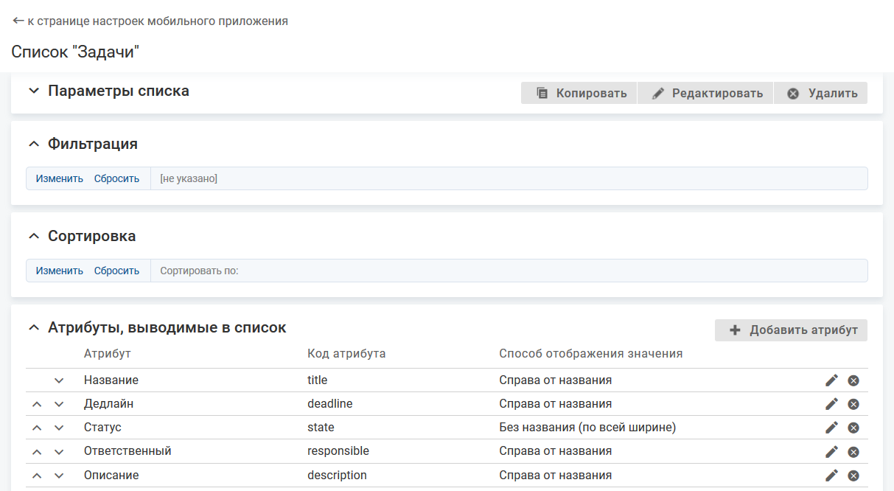
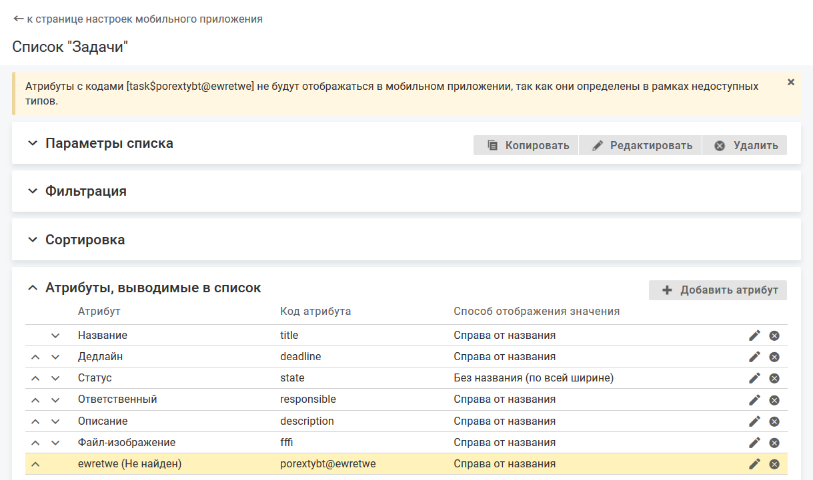

# Атрибуты в списке

- [Добавление атрибута для отображения в списке объектов](./list-attributes#add)
- [Настройка порядка отображения атрибутов в списке](./list-attributes#order)
- [Удаление атрибута из списка](./list-attributes#dell)

### Добавление атрибута для отображения в списке объектов {#add}

#### Описание настройки

В списке объектов отображается определенный набор атрибутов объекта.

Набор атрибутов настраивается для каждого списка отдельно. По умолчанию набор атрибутов для списка пуст.

#### Место настройки в интерфейсе

Меню навигации "Настройка системы" → настройка "Мобильное приложение" → вкладка "Списки объектов" → страница настройки списка объектов → блок "Атрибуты, выводимые в список".

#### Выполнение настройки

В блоке "Атрибуты, выводимые в списке" нажмите кнопку **Добавить атрибут**, заполните поля на форме добавления атрибута и нажмите **Сохранить**.

Поля на форме добавления атрибута:

- **Атрибут** — атрибут, который будет отображаться в списке объектов.

    Атрибуты, доступные для выбора, определяются значением параметра "Типы" для списка объектов.
    - Типы объекта указаны — в список объектов можно вывести атрибуты, созданные в классе, для которого настраивается список, и в указанных типах.
    - Типы объектов не выбраны — в список объектов можно вывести все атрибуты, созданные в классе, для которого настраивается список, и во всех его типах.
- **Способ отображения значения** — выберите способ отображения значения атрибута относительно его названия: справа от названия, без названия (по всей ширине) или под названием (по всей ширине).

#### Результат настройки

В веб-интерфейсе добавленные атрибуты отображаются в блоке "Атрибуты, выводимые в список".

При редактировании списка (изменение значения параметра "Типы") среди атрибутов, выведенных в список, могут оказаться атрибуты, определенные в типах, которые недоступны в данном списке объектов. Такие атрибуты выделяются цветом. Также на странице настройки списка отображается информационное сообщение: "Атрибуты с кодом [] не будут отображаться в мобильном приложении, так как они определены в рамках недоступных типов".

В мобильном приложении в списке для каждого объекта будет отображаться набор атрибутов, определенный при настройке списка, с учетом следующих правил:

- Атрибут, у которого не определено значение, не отображается.
- Все атрибуты типа "Дата" и "Дата/время" отображаются в часовом поясе, установленном для пользователя в системе.

    Если часовой пояс пользователя не указан, то используется часовой пояс, указанный в мобильном устройстве. Загрузка часового пояса пользователя производится один раз за сеанс при входе в мобильное приложение.

    Время может быть показано с секундами и миллисекундами, если их отображение настроено для атрибута "Дата/время".

### Настройка порядка отображения атрибутов в списке {#order}

#### Описание настройки

Порядок отображения атрибутов в блоке "Атрибуты, выводимые в список" определяет порядок отображения атрибутов объекта в списке объектов.

#### Место настройки в интерфейсе

Меню навигации "Настройка системы" → настройка "Мобильное приложение" → вкладка "Списки объектов" → страница настройки списка объектов → блок "Атрибуты, выводимые в список".

#### Выполнение настройки

Чтобы указать порядок отображения атрибутов, в блоке "Атрибуты, выводимые в списке" определите порядок отображения атрибутов с помощью инструмента Drag and drop или стрелок  и  в строке атрибута.

### Удаление атрибута из списка {#dell}

#### Место настройки в интерфейсе

Меню навигации "Настройка системы" → настройка "Мобильное приложение" → вкладка "Списки объектов" → страница настройки списка объектов → блок "Атрибуты, выводимые в список".

#### Выполнение настройки

В блоке "Атрибуты, выводимые в список" нажмите иконку удаления  в строке атрибута.

Удаленный атрибут перестанет отображаться в блоке "Атрибуты, выводимые в список".
