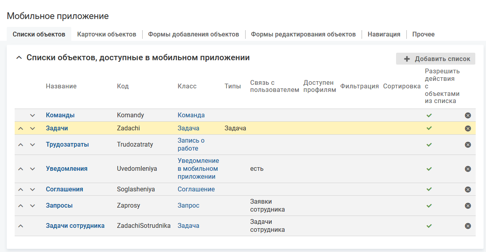
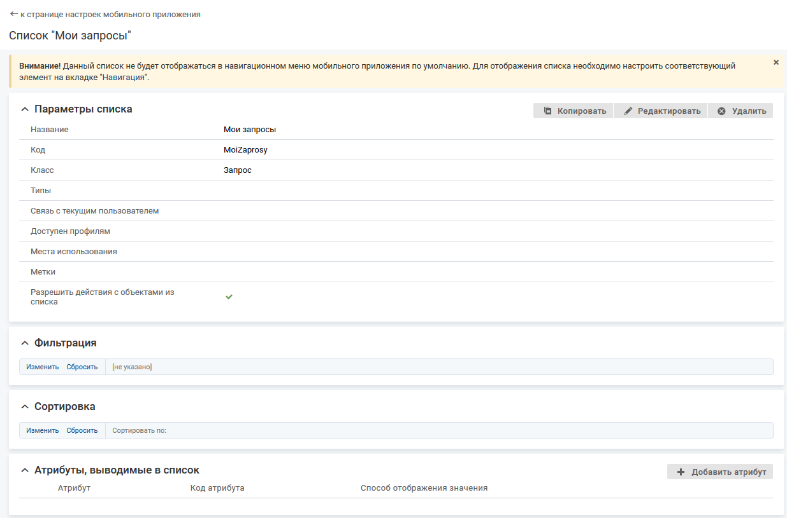

# Добавление списка

### Описание настройки

В мобильном приложении можно отображать два варианта списка объектов:

- список объектов определенного класса/типа;
- список объектов определенного класса/типа, связанный через атрибут (цепочку атрибутов) с текущим пользователем.

### Место настройки в интерфейсе

Меню навигации "Настройка системы" → настройка "Мобильное приложение" → вкладка "Списки объектов".

### Выполнение настройки

Чтобы добавить список объектов, на вкладке "Списки объектов" нажмите **Добавить список**, заполните поля формы добавления и нажмите **Сохранить**.

#### Поля на форме добавления, если флажок "Список связан с текущим пользователем" снят:

- **Список связан с текущим пользователем** — флажок снят (по умолчанию). В мобильном приложении будет размещен список объектов определенного класса/типа.
- **Название** — введите название списка, которое будет отображаться в меню "Доступные списки" и на верхней панели экрана списка.
- **Код** — введите уникальный код списка. Значение заполняется автоматически (транслитерация названия списка при переводе фокуса с поля "Название"), код можно изменить.
- **Класс** — выберите класс объектов для отображения в списке.
- **Типы** — выберите типы объектов для отображения в списке.

    Для выбора доступны все типы объектов класса, указанного в параметре "Класс".

    Поле заполнено. Выбранными являются типы, рядом с названиями которых установлен флажок. Выбор типа не распространяется на вложенные типы:
    - в списке отображаются объекты указанных типов;
    - в список можно вывести атрибуты, созданные в классе, указанном в параметре "Класс", и в выбранных типах.

    Поле не заполнено:
    - в списке отображаются объекты всех типов класса, указанного в параметре "Класс";
    - в список объектов в мобильном приложении можно вывести все атрибуты, созданные в классе, указанном в параметре "Класс", и всех его типах.
- **Доступен профилям** — выберите профиль, обладатель которого может видеть список объектов в мобильном приложении. Если не выбран ни один профиль, то ограничения видимости списка нет.

    Для выбора доступны общие профили и относительные профили класса "Сотрудник" (employee).
- **Метки** — выберите одну или несколько меток, определяющих процессы, в которых используется данный список.
- **Разрешить действия с объектами из списка**:
    - флажок установлен — рядом с элементом списка отображается иконка вызова меню действий с объектом. Набор действий определяется настройкой меню действий в карточке объекта.
    - флажок снят — действия с объектами в списке не доступны.

#### Поля на форме добавления, если флажок "Список связан с текущим пользователем" установлен:

- **Список связан с текущим пользователем** — флажок установлен, на форме отображается поле "Связь с текущим пользователем". В мобильном приложении будет размещен список объектов определенного класса/типа, связанный через атрибут (цепочку атрибутов) с текущим пользователем.

    Для просмотра списка пользователь должен относится к типу класса "Сотрудник" (employee), в котором присутствует ссылочный атрибут, по которому построен список.
- Пользователь должен относится к типу класса "Сотрудник" (employee), в котором присутствует ссылочный атрибут, по которому построен список (параметр "Связь с текущим пользователем" на форме добавления списка).
- **Связь с текущим пользователем** — выберите ссылочный атрибут, определяющий класс объектов для отображения в списке.

    Глубина цепочки связей в дереве выбора ограничена 4 уровнями.

    На первом уровне расположены атрибуты связи класса "Сотрудник" (employee) и его типов.

    Для ссылочных атрибутов, определенных в классе, отображается "Название атрибута".

    Для ссылочных атрибутов, определенных в типе, отображается "Название атрибута (тип: "Название типа")".
- **Название** — введите название списка, которое будет отображаться в меню "Доступные списки" и на верхней панели экрана списка.
- **Код** — введите уникальный код списка. Значение заполняется автоматически (транслитерация названия списка при переводе фокуса с поля "Название"), код можно изменить.
- **Класс** — информационное поле, в котором отображается класс объектов, на который указывает ссылочный атрибут, выбранный в параметре "Связь с текущим пользователем".
- **Типы** — выберите типы объектов для отображения в списке.

    Для выбора доступны все типы объектов класса, указанного в параметре "Класс".

    Поле заполнено. Выбранными являются типы, рядом с названиями которых установлен флажок. Выбор типа не распространяется на вложенные типы:
    - в списке отображаются объекты указанных типов;
    - в список можно вывести атрибуты, созданные в классе, указанном в параметре "Класс", и в выбранных типах

    Поле не заполнено:
    - в списке отображаются объекты всех типов класса, указанного в параметре "Класс";
    - в список объектов в мобильном приложении можно вывести все атрибуты, созданные в классе, указанном в параметре "Класс", и всех его типах
- **Доступен профилям** — выберите профиль, обладатель которого может видеть список объектов в мобильном приложении. Если не выбран ни один профиль, то ограничения видимости списка нет.

    Для выбора доступны общие профили и относительные профили класса "Сотрудник" (employee).
- **Метки** — выберите одну или несколько меток, определяющих процессы, в которых используется данный список.
- **Разрешить действия с объектами из списка**:
    - флажок установлен — рядом с элементом списка отображается иконка вызова меню действий с объектом. Набор действий определяется настройкой меню действий в карточке объекта.
    - флажок снят — действия с объектами в списке не доступны.

### Результат настройки

На экране отобразится страница настройки списка объектов.

### Последующие настройки

На странице списка объектов доступны следующие настройки:

- [Параметры списка](./list-parameters)
- [Фильтрация списка](./list-filter)
- [Сортировка списка](./list-sort)
- [Атрибуты в списке](./list-attributes)

### Связанные настройки

Для отображения списка в меню мобильного приложения необходимо настроить соответствующий элемент на вкладке "Навигация".

На странице настройки списка выводится информационное сообщение о том, что для отображения списка в меню мобильного приложения необходимо настроить соответствующий элемент на вкладке "Навигация". Слово "Навигация" в информационном сообщении является ссылкой на вкладку "Навигация" на странице настройки мобильного приложения. Описание добавления элементов меню приводится в разделе [Добавление элементов меню.](../navigation-3/navigation-items-create)

Также переход к списку объектов можно настроить, разместив на карточке список связанных/вложенных объектов. Список объектов можно использовать для просмотра значений ссылочных атрибутов.

Также переход к списку возможен по ссылке в пуш-уведомлении. В уведомлении должна быть настроена ссылка на карточку объекта в конкретном списке.
