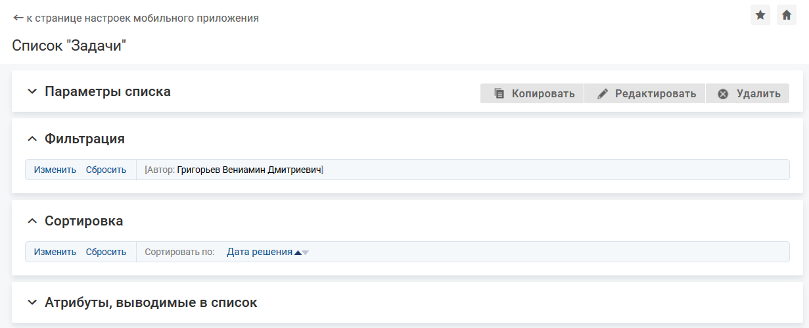

### Описание настройки

Фильтрация настраивается для каждого списка отдельно.

Фильтрация позволяет отображать в списке не все объекты выбранного класса/типов, а только объекты с заданными характеристиками. Например, фильтрация по определенным статусам позволит отобразить список активных запросов.

<note type="info">

Для списка объектов, построенного по вычислимому атрибуту типа "Набор ссылок на бизнес-объекты", фильтрация и сортировка не настраиваются. Поля сортировки и поиска под подстроке в мобильном приложении не отображаются.

</note>

### Место настройки в интерфейсе

Меню навигации "Настройка системы" → настройка "Мобильное приложение" → вкладка "Списки объектов" → страница настройки списка объектов в мобильном приложении → блок "Фильтрация".

В блоке "Фильтрация" отображается [не указано], если фильтры не настроены, и текущие условия фильтрации, если фильтры настроены.

### Выполнение настройки

Чтобы настроить критерии фильтрации списка, выполните следующие действия:

1. На странице настройки списка объектов в блоке "Фильтрация" нажмите ссылку "Изменить" .
2. На форме "Настройка фильтрации списка":
    - Задайте условия фильтрации для атрибута: выберите атрибут, по которому будет проводиться фильтрация списка, выберите критерий фильтрации и установите значение фильтра.

        Набор критериев, внешний вид поля выбора или ввода значения фильтра зависят от типа атрибута.
    - Настройте фильтрации по нескольким полям, объединенным условиями И и/или ИЛИ.
        - ИЛИ — в списке отображаются объекты, удовлетворяющие одному из условий, объединенных по ИЛИ. Оператором ИЛИ можно объединить два или более условий фильтрации по атрибутам.
        - И — в списке отображаются объекты, одновременно соответствующие условиям фильтрации, объединенным по И. Оператором И можно объединить два или более условий фильтрации по атрибутам и/или наборы условий, объединенных по ИЛИ.

        Чтобы добавить условие И или ИЛИ нажмите соответствующую кнопку под строкой критерия фильтрации (блоком критериев фильтрации).

        Чтобы удалить условие, нажмите иконку удаления {width=18 height=18} в строке/блоке условия. При удалении условия по ИЛИ удаляется строка условий фильтрации. При удалении условия по И удаляется весь блок условий фильтрации, включая все условия по ИЛИ внутри данного блока.
3. Чтобы сохранить настройки фильтрации нажмите **Сохранить**.

### Результат настройки

Настройки фильтрации отобразятся в блоке "Фильтрация" и будут применяться для списка объектов в мобильном приложении.

При нажатии ссылки "сбросить" в блоке "Фильтрация" все условия фильтрации удаляются, список объектов будет отображаться полностью.
