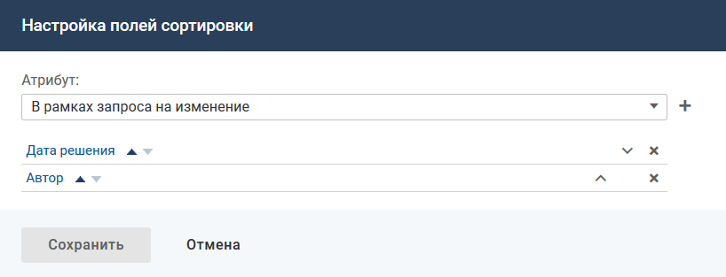

# Сортировка списка

### Описание настройки

Сортировка — это отображение списка объектов в заданном порядке.

<note type="info">

Для списка объектов, построенного по вычислимому атрибуту типа "Набор ссылок на бизнес-объекты", фильтрация и сортировка не настраиваются. Поля сортировки и поиска под подстроке в мобильном приложении не отображаются.

</note>

### Место настройки в интерфейсе

Меню навигации "Настройка системы" → настройка "Мобильное приложение" → вкладка "Списки объектов".

Сортировка настраивается для каждого списка отдельно на странице настройки списка объектов в блоке "Сортировка".

В блоке "Сортировка" отображается [не указано], если поля для сортировки не настроены, или набор атрибутов, определяющих сортировку списка.

### Выполнение настройки

Чтобы настроить сортировку списка, выполните следующие действия:

1. На странице настройки списка объектов нажмите ссылку "Изменить" в блоке "Сортировка".
2. На форме "Настройка полей сортировки" добавьте атрибуты, по которым будет проводиться сортировка, и установите порядок сортировки.

    
3. Чтобы сохранить настройки полей для сортировки нажмите **Сохранить**. Набор атрибутов, определяющих сортировку списка, отобразится в блоке "Сортировка".

### Результат настройки

Настройки атрибутов для сортировки отобразятся в блоке "Сортировка" и будут применяться для списка объектов в мобильном приложении.

При нажатии ссылки "сбросить" в блоке "Сортировка" все поля для сортировки удаляются, список объектов будет сортироваться по первому столбцу.
