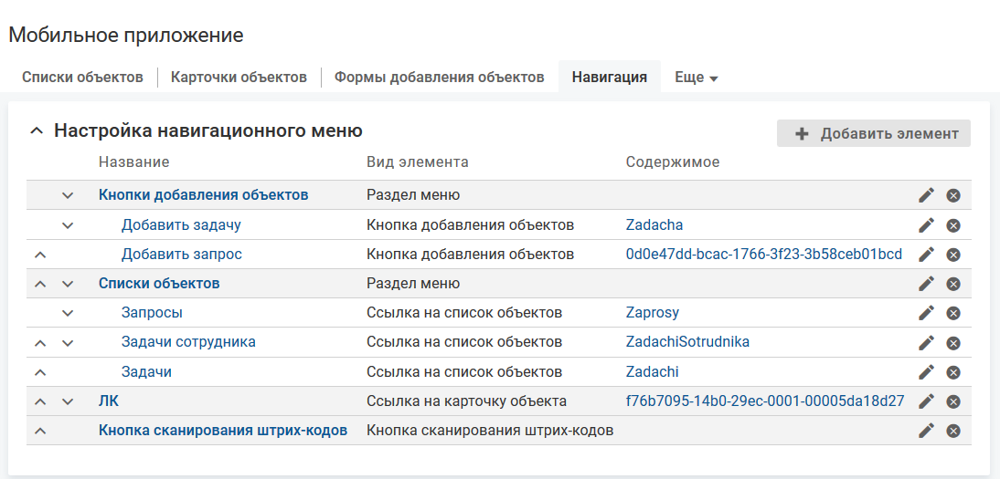

# Настройка элементов меню

- [Добавление элемента меню "Раздел меню"](./navigation-items-create#add)
- [Добавление элемента меню "Кнопка добавления объектов"](./navigation-items-create#add1)
- [Добавление элемента меню "Ссылка на карточку объекта"](./navigation-items-create#add2)
- [Добавление элемента меню "Ссылка на список объектов"](./navigation-items-create#add3)
- [Добавление элемента меню "Кнопка сканирования штрих-кодов"](./navigation-items-create#add4)
- [Добавление элемента меню "Встроенное приложение"](./navigation-items-create#add5)
- [Управление порядком расположения элементов меню](./navigation-items-create#order)

### Добавление элемента меню "Раздел меню" {#add}

#### Описание настройки

В меню мобильного приложения можно добавить разделы.

#### Место настройки в интерфейсе

Раздел "Настройка системы" → настройка "Мобильное приложение" → вкладка "Навигация".

#### Выполнение настройки

Элемент "Раздел меню" предназначен для группировки других элементов меню. При нажатии на раздел меню раскрывается список с вложенными элементами меню. Может быть создано неограниченное количество разделов.

Чтобы добавить элемент меню, нажмите кнопку **Добавить элемент**, на форме "Добавление элемента меню" заполните поля и нажмите **Сохранить**.

Поля на форме добавления элемента:

- **Название** — название раздела меню.
- **Вложен в раздел** — возможные значения:
    - [не указано] — раздел будет отображаться на верхнем уровне меню;
    - раздел, в который будет вложен раздел.
- **Вид элемента**: "Раздел меню".
- **Метки** — выберите одну или несколько меток, которые влияют на отображение в верхнем меню ссылки на форму добавления объекта данного класса/типа.

    Элемент меню, помеченный выключенной меткой, не отображается.

### Добавление элемента меню "Кнопка добавления объектов" {#add1}

#### Описание настройки

В меню мобильного приложения можно добавить кнопки добавления объектов.

#### Место настройки в интерфейсе

Раздел "Настройка системы" → настройка "Мобильное приложение" → вкладка "Навигация".

#### Выполнение настройки

При нажатии на кнопку открывается форма добавления объектов.

Чтобы добавить элемент меню, нажмите кнопку **Добавить элемент**, на форме "Добавление элемента меню" заполните поля и нажмите **Сохранить**.

Поля на форме добавления элемента:

- **Название** — название элемента меню.
- **Вложен в раздел** — возможные значения:
    - [не указано] — кнопка будет отображаться на верхнем уровне меню;
    - раздел, в который будет вложена кнопка.
- **Вид элемента**: "Кнопка добавления объектов".
- **Содержимое** — форма добавления, которая будет открываться при нажатии на кнопку. Для выбора доступны формы добавления для мобильного приложения.

    Настройка форм добавления для мобильного приложения описана в разделе [Формы добавления объектов](../add-form).
- **Метки** — выберите одну или несколько меток, которые влияют на отображение в верхнем меню ссылки на форму добавления объекта данного класса/типа.

    Элемент меню, помеченный выключенной меткой, не отображается.

<note type="info">

Видимость кнопки в меню определяется параметром "Доступна профилям", который установлен для связанной формы добавления.

</note>

### Добавление элемента меню "Ссылка на карточку объекта" {#add2}

#### Описание настройки

В меню мобильного приложения можно добавить ссылки на карточки объектов.

#### Место настройки в интерфейсе

Раздел "Настройка системы" → настройка "Мобильное приложение" → вкладка "Навигация".

#### Выполнение настройки

Элемент меню "Ссылка на карточку объекта" является ссылкой на карточку объекта в мобильном приложении.

Чтобы добавить элемент меню, нажмите кнопку **Добавить элемент**, на форме "Добавление элемента меню" заполните поля и нажмите **Сохранить**.

Поля на форме добавления элемента:

- **Название** — название элемента меню.
- **Вложен в раздел** — возможные значения:
    - [не указано] — ссылка будет отображаться на верхнем уровне меню;
    - раздел, в который будет вложена ссылка.
- **Вид элемента**: "Ссылка на карточку объекта".
- **Содержимое** — выберите карточку объекта, которая будет открываться по данной ссылке.

    Для выбора доступны карточки объектов: "Сотрудник" (employee), "Отдел" (ou) и "Компания" (root) для мобильного приложения.

    Настройка карточек объектов для мобильного приложения описана в разделе [Карточки объектов](../cards).
- **Метки** — выберите одну или несколько меток, которые влияют на отображение в верхнем меню ссылки на форму добавления объекта данного класса/типа.

    Элемент меню, помеченный выключенной меткой, не отображается.

### Добавление элемента меню "Ссылка на список объектов" {#add3}

#### Описание настройки

В меню мобильного приложения можно добавить ссылки на список объектов.

#### Место настройки в интерфейсе

Раздел "Настройка системы" → настройка "Мобильное приложение" → вкладка "Навигация".

#### Выполнение настройки

Элемент меню "Ссылка на список объектов" является ссылкой на список объектов в мобильном приложении.

Чтобы добавить элемент меню, нажмите кнопку **Добавить элемент**, на форме "Добавление элемента меню" заполните поля и нажмите **Сохранить**.

Поля на форме добавления элемента:

- **Название** — название элемента меню.
- **Вложен в раздел** — возможные значения:
    - [не указано] — ссылка будет отображаться на верхнем уровне меню;
    - раздел, в который будет вложена ссылка.
- **Вид элемента** — выберите "Ссылка на список объектов".
- **Содержимое** — список объектов, который будет открываться по данной ссылке. Для выбора доступны списки объектов для мобильного приложения.

    Настройка списков объектов для мобильного приложения описана в разделе [Списки объектов](../lists).
- **Метки** — выберите одну или несколько меток, которые влияют на отображение в верхнем меню ссылки на форму добавления объекта данного класса/типа.

    Элемент меню, помеченный выключенной меткой, не отображается.

### Добавление элемента меню "Кнопка сканирования штрих-кодов" {#add4}

#### Описание настройки

В меню мобильного приложения можно добавить кнопку сканирования штрих-кодов/

#### Место настройки в интерфейсе

Раздел "Настройка системы" → настройка "Мобильное приложение" → вкладка "Навигация".

#### Выполнение настройки

При нажатии на кнопку сканирования штрих-кодов в мобильном приложении открывается встроенный сканер для распознавания и обработки штрих-кода или QR-кода со ссылкой.

Кнопка будет отображаться в меню для всех пользователей, если не настроено ограничение видимости кнопки сканирования штрих-кода для некоторых пользователей по их профилям, см. подробнее [Доступность сканера в навигационном меню](../other/scanner-3#01).

Чтобы добавить элемент меню, нажмите кнопку **Добавить элемент**, на форме "Добавление элемента меню" заполните поля и нажмите **Сохранить**.

Поля на форме добавления элемента:

- **Название** — название элемента меню.
- **Вложен в раздел** — возможные значения:
    - [не указано] — кнопка будет отображаться на верхнем уровне меню;
    - раздел, в который будет вложена кнопка.
- **Вид элемента**: "Кнопка сканирования штрих-кодов".
- **Метки** — выберите одну или несколько меток, которые влияют на отображение в верхнем меню ссылки на форму добавления объекта данного класса/типа.

    Элемент меню, помеченный выключенной меткой, не отображается.

### Добавление элемента меню "Встроенное приложение" {#add5}

#### Описание настройки

В меню мобильного приложения можно добавить ссылки на встроенные приложения.

#### Место настройки в интерфейсе

Раздел "Настройка системы" → настройка "Мобильное приложение" → вкладка "Навигация".

#### Выполнение настройки

Элемент меню "Встроенное приложение" позволяет открывать встроенное приложение из меню в мобильном приложении. Приложение размещается и открывается в контенте типа "Встроенное приложение". Подробное описание настройки контента приводится в разделе [Контент "Встроенное приложение"](../cards/card-view/card-embedded-app).

Для работы встроенных приложений, открытых из меню, используются методы JS API. .

<note type="info">

Работа со встроенными приложениями в мобильном приложении доступна только при использовании JWT-аутентификации. Описание JWT-аутентификации приведено в разделе [Способы аутентификации в МК](../../how-to-configure/authentification).

</note>

Чтобы добавить элемент меню, нажмите кнопку **Добавить элемент**, на форме "Добавление элемента меню" заполните поля и нажмите **Сохранить**.

Поля на форме добавления элемента:

- **Название** — название элемента меню.
- **Вложен в раздел** — возможные значения:
    - [не указано] — ссылка на встроенное приложение будет отображаться на верхнем уровне меню;
    - раздел, в который будет вложена ссылка.
- **Вид элемента**: "Встроенное приложение".
- **Код контента со встроенным приложением** — уникальный идентификатор контента без учета регистра. Значение заполняется автоматически (транслитерация названия контента при переводе фокуса с поля "Название"), код можно изменить.

    Код может содержать только символы латинского алфавита, цифры и знаки тире.
- **Приложение** — встроенное приложение, которое будет открываться при нажатии на элемент меню.

    Для выбора доступны все приложения, добавленные в систему.

    Выключенные приложения отображаются серым цветом. Если выбрано выключенное приложение, то элемент в меню не отображается.

    Для встроенных приложений, открываемых из навигационного меню мобильного приложения, нельзя задать дополнительные параметры. Если у приложения есть дополнительные параметры, оно будет использоваться со значениями параметров по умолчанию.
- **Объект, с которым работает приложение** (обязательный) — объект системы, с которым будет работать встроенное приложение, открытое при нажатии на элемент меню. Приложение будет работать так же, как приложение, размещенное на карточке выбранного объекта.

    Если выбранный объект имеет значение null, то элемент в меню не отображается.

    Возможные значения:
    - Текущий пользователь.
    - Объект, связанный с текущим пользователем — дополнительные параметры:
        - **Тип сотрудника** — если тип выбран, то в параметре "Атрибут связи с объектом работы приложения" список доступных атрибутов будет ограничен атрибутами сотрудника выбранного типа.

            Значение параметра рекомендуется выбирать при большом количестве атрибутов типа "Ссылка на бизнес-объекта" в классе "Сотрудник" (employee) и его типах.

            Параметр не ограничивает тип сотрудников, которым будет доступен настраиваемый элемент меню.
        - **Атрибут связи с объектом работы приложения** — атрибут, связывающий текущего пользователя с объектом для работы встроенного приложения.

            Если атрибут имеет значение null, то элемент в меню не отображается.

            Если атрибут отсутствует в типе сотрудника, то для пользователя с таким типом сотрудника элемент в меню не отображается.
    - Компания.

    Для пользователя элемент отображается в меню, если ему выдано право на действие "Просмотр карточки объекта" в классе/типе выбранного объекта.

    Для суперпользователя, не ассоциированного с лицензированным пользователем, элемент отображается в меню, только при выборе значения "Компания".
- **Профили** — выберите профили, обладатель которых будет видеть данный элемент меню. Для выбора доступны профили, содержащие абсолютные роли.

    Если не выбран ни один профиль, то ограничения видимости элемента меню нет.
- **Метки** — выберите одну или несколько меток, которые влияют на отображение в верхнем меню ссылки на форму добавления объекта данного класса/типа.

    Элемент меню, помеченный выключенной меткой, не отображается.

#### Результат настройки

Новый элемент меню отобразится на вкладке "Навигация".

Настраиваемая часть меню мобильного приложения будет содержать добавленные элементы.

### Управление порядком расположения элементов меню {#order}

#### Описание настройки

Очередность разделов меню сверху вниз соответствует их расположению в меню мобильного приложения.

Очередность вложенных элементов меню сверху вниз соответствует их расположению сверху вниз в развернутом разделе меню.

Если элемент типа "Ссылка на карточку объекта", "Ссылка на список объектов", "Встроенное приложение" расположен первым, то определяет экран, который открывается в результате входа в мобильное приложение.

<note type="info">

Вложенный элемент меню можно перемещать только в рамках своего раздела.

</note>

#### Место настройки в интерфейсе

Раздел "Настройка системы" → настройка "Мобильное приложение" → вкладка "Навигация".

#### Выполнение настройки

Настройте порядок расположения элементов верхнего меню с помощью перемещения Drag and drop разделов и элементов в рамках одного раздела или стрелок  и  в строке раздела или элемента.
