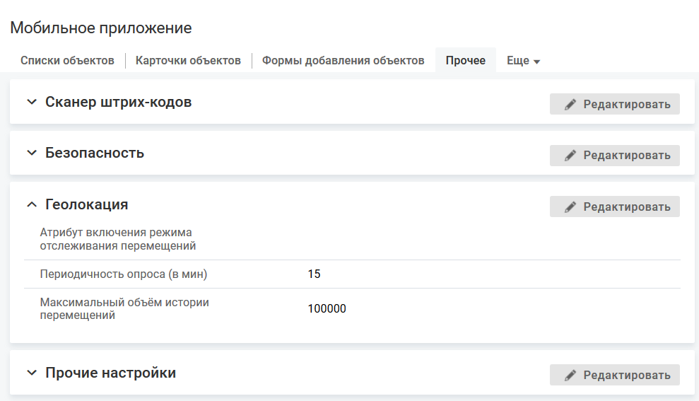

# Геолокация

### Описание

Режим отслеживания перемещений — это режим работы, в котором мобильное приложение с заданной периодичностью собирает данные о текущем местоположении мобильного устройства пользователя и сохраняет их на сервере.

В системе можно настроить частоту, с которой будет запрашиваться и передаваться местоположение устройства для сохранения на сервере, максимальное число хранимых объектов истории перемещений.

Изменение параметров в блоке "Геолокация" сохраняется в логе действий технолога.

<note type="info">

ВП "Карта" использует режим отслеживания перемещений для определения местоположения объекта (сотрудника) и отображения соответствующей метки на карте. 
Данные об изменении местоположения сотрудников-пользователей мобильного приложения накапливаются в системе, независимо от использования ВП "Карта".

</note>

### Условие выполнения настройки

- В классе "Сотрудник" (employee) создан специальный логический атрибут, например, "Отслеживать перемещение".
- У мобильного приложения должно быть разрешение на определение локации и геопозиции.

### Место настройки в интерфейсе

Меню навигации "Настройка системы" → настройка "Мобильное приложение" → вкладка "Прочее" → блок "Геолокация".

### Выполнение настройки

В блоке "Геолокация" нажмите кнопку **Редактировать**, на форме редактирования укажите значения полей и нажмите **Сохранить**.

Параметры блока "Геолокация":

- **Атрибут включения режима отслеживания перемещений**.

    Для выбора доступны логические атрибуты класса "Сотрудник" (employee). Рекомендуется выбирать специально созданный атрибут "Отслеживать перемещение".
- **Периодичность опроса (в мин)** — частота, с которой будет запрашиваться и передаваться местоположение устройства для сохранения на сервере.

    Чем реже выполняется опрос мобильного устройства, тем лучше в целях экономии заряда аккумулятора.

    По умолчанию 15 минут.

    Возможные значения от 1 до 1440 минут (24 часа).
- **Максимальный объем истории перемещений** — максимальное число хранимых объектов класса "История перемещений".

    Параметр ограничивает количество записей истории перемещений и предназначен для уменьшения места, занимаемого объектами геопозиции в базе данных. После достижения максимального количества объектов при добавлении каждой новой записи будет удаляться самая старая запись.

    По умолчанию 1000.

    Возможные значения от 1 до 1 000 000.

### Результат настройки

Заданные параметры запрашиваются при каждой успешной аутентификации.

Указанные настройки используются для хранения данных об изменении местоположения сотрудников-пользователей мобильного приложения.

Режим отслеживания перемещений для конкретного сотрудника можно включить или выключить, установив соответствующее значение логического атрибута "Отслеживать перемещение". По умолчанию режим отслеживания перемещений включен (логический атрибут = true).

Атрибут включения режима отслеживания перемещений можно разместить на карточке объекта в веб-интерфейсе или в мобильном приложении.

Пользователь мобильного приложения может остановить сбор данных о местоположении в любой момент, выполнив одно из следующих действий:

- установить значение атрибута включения режима отслеживания перемещений = "Нет";
- запретить доступ приложения к местоположению мобильного устройства;
- отключить службу геолокации на мобильном устройстве;
- закрыть мобильное приложение (для iOS).

### Связанные настройки

- Сбор геопозиции при выполнении какого-то действия с объектом.

    Механизм работает независимо от настройки Режима отслеживания перемещений в блоке "Прочее".

    Условие выполнения: у мобильного приложения есть разрешение на передачу геопозиции.

    Текущее местоположение устройства хранится в переменной контекста geo, которая может использоваться в скриптах действия по событию и кастомизации оповещения.

    Сбор геопозиции может выполнятся:
    - при создании объекта
        - [Создание формы добавления объектов](../add-form/add-form-create)
    - при быстрой смене статуса объекта
        - [Добавление карточки](../cards/card-create)
    - при выполнении действия с объектом (кроме системных действий "Поделиться" и "Обновить")
        - [Добавление элемента меню действий с объектом](../cards/card-actions)
    - при выполнении действия в контенте карточки объекта
        - [Контент "Параметры объекта"](../cards/card-view/card-obj-parameters)
        - [Контент "Список связанных объектов"](../cards/card-view/card-related-list)
        - [Контент "Список вложенных объектов"](../cards/card-view/card-nested-list)
- Мобильное приложение может передавать данные о текущем местоположении мобильного устройства пользователя по запросу сервера.

    Механизм работает независимо от настройки Режима отслеживания перемещений в блоке "Прочее".

    Условие выполнения: у мобильного приложения есть разрешение на передачу геопозиции и уведомления.

    Запрос сервера формируется API-методом api.location.getMobileLocation, см. [Скриптовые методы](../from-web/scripts)..

    Сбор геопозиции выполняется в любой момент времени, когда сработает скрипт.
