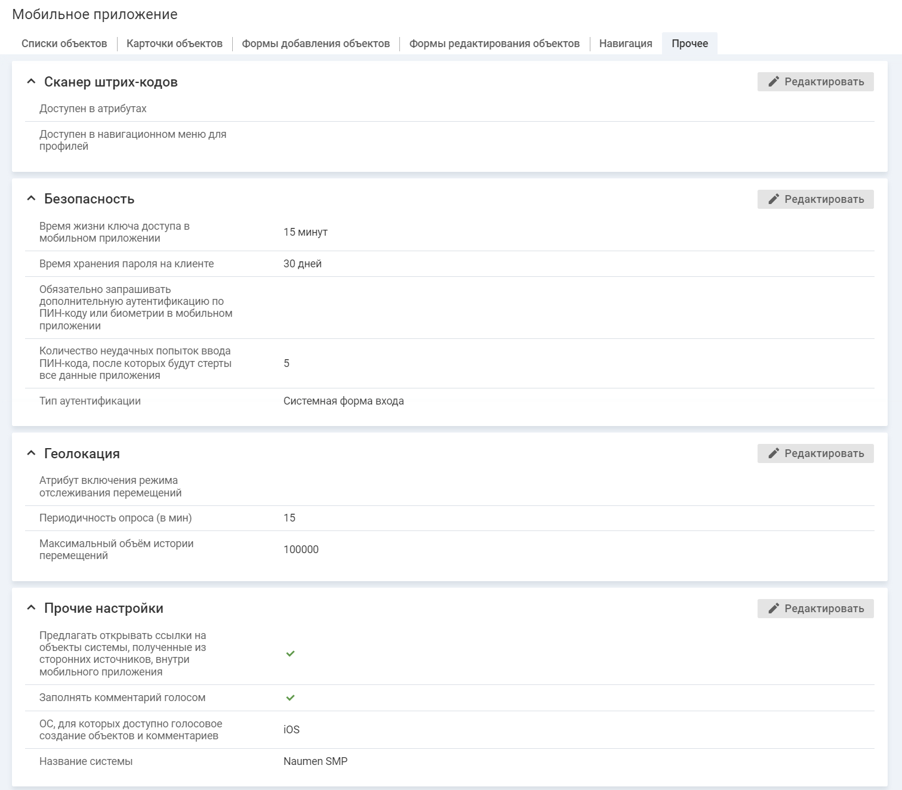

- [Настройка перехода по ссылкам](./other-settings#01)
- [Настройка голосового создания объектов и комментариев](./other-settings#02)
- [Настройка названия системы](./other-settings#03)

### Настройка перехода по ссылкам {#01}

В блоке "Прочие настройки" можно выбрать способ открытия ссылки на приложение SMP, вызываемой из сторонних источников.

#### Место настройки в интерфейсе

Меню навигации "Настройка системы" → настройка "Мобильное приложение" → вкладка "Прочее".

#### Выполнение настройки

Чтобы выполнить настройки, в блоке "Прочие настройки" нажмите кнопку **Редактировать**, на форме редактирования заполните поле "Предлагать открывать ссылки на объекты системы, полученные из сторонних источников, внутри мобильного приложения" и нажмите **Сохранить**.

Поля на форме редактирования:

- **Предлагать открывать ссылки на объекты системы, полученные из сторонних источников, внутри мобильного приложения**:
    - флажок включен — при переходе по ссылке на приложение, размещенной в сторонних программах (почтовый клиент, мессенджеры), доступен выбор способа открытия ссылки: в мобильном приложении или в браузере;
        - [Переход по ссылкам. iOS](../../how-to-use/links)
        - [Переход по ссылкам. Android](../../how-to-use-2/links-2)
    - флажок отключен — все ссылки всегда открываются через браузер.

### Настройка голосового создания объектов и комментариев {#02}

В блоке "Прочие настройки" можно указать следующие настройки голосового создания объектов и комментариев:

- Выбрать ОС, для которой будет доступно использование голосовых сервисов: iOS и/или Android.
- Включить/отключить голосовое создание комментариев.

<note type="info">

Для голосового создания комментариев необходимо включить доступ к микрофону и голосовому вводу на мобильном устройстве.

</note>

#### Место настройки в интерфейсе

Меню навигации "Настройка системы" → настройка "Мобильное приложение" → вкладка "Прочее".

#### Выполнение настройки

Чтобы выполнить настройки, в блоке "Прочие настройки" нажмите кнопку **Редактировать**, на форме редактирования заполните поля "Заполнять комментарий голосом", "ОС, для которых доступно голосовое создание объектов и комментариев" и нажмите **Сохранить**.

Поля на форме редактирования:

- **Заполнять комментарий голосом**:
    - флажок включен (по умолчанию) — заполнение комментария голосом включено, на экране "Комментарии" отображается иконка **микрофон**.

        Для голосового создания комментариев необходимо включить доступ к микрофону и голосовому вводу на мобильном устройстве.
    - флажок отключен — заполнение комментария голосом выключено, иконка **микрофон** не отображается.
- **ОС, для которых доступно голосовое создание объектов и комментариев**.

    Если выбрано значение iOS и/или Android, то на соответствующем клиенте доступны голосовые сервисы (добавление объектов и комментариев).

    Если значение не выбрано, то на соответствующем клиенте голосовые сервисы не доступны. По умолчанию выбрано "iOS".

Возможность голосового создания объектов определяется для каждого класса объектов отдельно при настройке формы добавления объектов данного класса.

### Настройка названия системы {#03}

Название системы используется как значение заголовка уведомлений в мобильном приложении по умолчанию.

Уведомление в мобильном приложении (уведомление) — это отправка настроенного сообщения в мобильном приложении определенному списку адресатов при наступлении заданных событий с объектами системы любого класса или типа. Уведомления предназначены для оперативного оповещения сотрудников о наступлении определенных событий.

Подробное описание приводится в разделе [Уведомления](../from-web/notifications-3).

#### Место настройки в интерфейсе

Меню навигации "Настройка системы" → настройка "Мобильное приложение" → вкладка "Прочее".

#### Выполнение настройки

Чтобы выполнить настройки, в блоке "Прочие настройки" нажмите кнопку **Редактировать**, на форме редактирования заполните поле "Название системы" и нажмите **Сохранить**.
