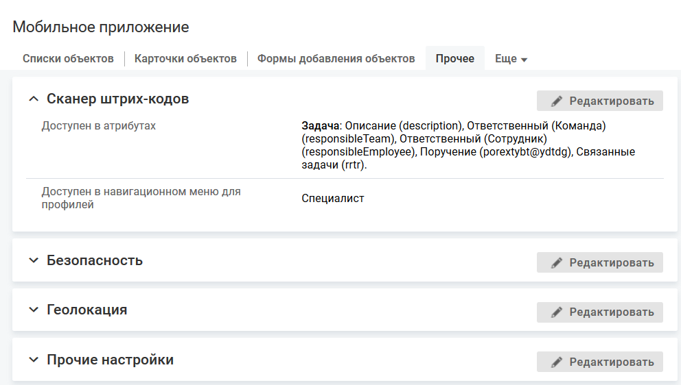

- [Доступность сканера в атрибутах](./scanner-3#02)
- [Доступность сканера в навигационном меню](./scanner-3#01)

## Доступность сканера в атрибутах {#02}

Сканер штрих-кодов в мобильном приложении может быть вызван на формах для заполнения значения атрибута.

#### Место настройки в интерфейсе

Меню навигации "Настройка системы" → настройка "Мобильное приложение" → вкладка "Прочее".

#### Выполнение настройки

Чтобы выбрать атрибуты, для заполнения значения которых будет доступен сканер, в блоке "Сканер штрих-кодов" нажмите кнопку **Редактировать**, на форме редактирования выберите атрибуты в поле "Доступные атрибуты" и нажмите **Сохранить**.

Для выбора доступны атрибуты типов "Строка", "Текст", "Текст в формате RTF", "Ссылка на бизнес-объект", "Набор ссылок на БО", "Обратная ссылка".

Поле выбора представляет собой дерево классов, для каждого класса отображается набор атрибутов указанных типов. Флажок, установленный рядом с названием класса, означает выбор всех существующих атрибутов класса.

При добавлении нового атрибута объекта его надо будет вручную добавить в настройках сканера.

#### Результат настройки

Иконка вызова сканера будет отображаться рядом с полем ввода выбранного атрибута и на отдельном экране редактирования (если он предусмотрен).

## Доступность сканера в навигационном меню {#01}

Сканер штрих-кодов может быть вызван в навигационном меню для перехода по штрих-коду или QR-коду со ссылкой, например, на карточку объекта или форму добавления/редактирования объектов в мобильном приложении с предзаполненными полями.

#### Условие выполнения настройки

В навигационном меню мобильного приложения размещен элемент с кнопкой вызова сканера штрих-кодов, см. подробнее в разделе [Кнопка сканирования штрих-кодов](../navigation-3/navigation-items-create).

Кнопка будет отображаться в меню для всех пользователей, если не настроено ограничение видимости кнопки сканирования штрих-кода для некоторых пользователей по их профилям.

#### Место настройки в интерфейсе

Меню навигации "Настройка системы" → настройка "Мобильное приложение" → вкладка "Прочее".

#### Выполнение настройки

Чтобы выбрать профили, обладателям которых будет видна кнопка сканирования штрих-кодов в меню мобильного приложения, в блоке "Сканер штрих-кодов" нажмите кнопку **Редактировать**, на форме редактирования выберите профили в поле "Доступен в навигационном меню для профилей" и нажмите **Сохранить**.

Для выбора доступны абсолютные профили и относительные профили класса "Сотрудник" (employee).

<note type="info">

Типы поддерживаемых штрих-кодов: 
Линейные форматы: Codabar, Code 39, Code 93, Code 128, EAN-8, EAN-13, ITF, UPC-A, UPC-E. 
2D-форматы: Aztec, Data Matrix, PDF417, QR Code.

</note>

<note type="info">

QR-код может формироваться с помощью методов API, см. [Скриптовые методы](../from-web/scripts).

</note>

<note type="info">

Также мобильное приложение поддерживает все Bluetooth сканеры штрих-кодов, работающие в режиме HID mode на операционной системе Android/IOS. Перевод сканера в режим HID mode осуществляется согласно инструкции пользователя устройства. В этом режиме сопряжение сканера с беспроводным устройством выполняется операционной системой мобильного устройства при настройке Bluetooth. 
HID (Human Interface Device)- это протокол, который используется обычной клавиатурой и мышью. В режиме HID proxy устройство считает, что он взаимодействует с клавиатурой или мышью.

</note>
