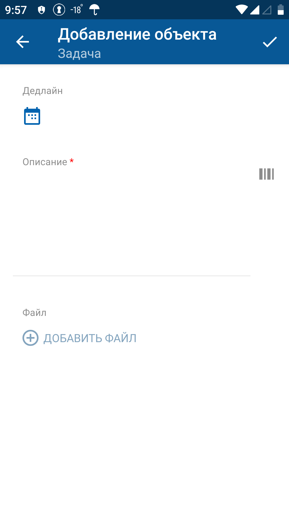
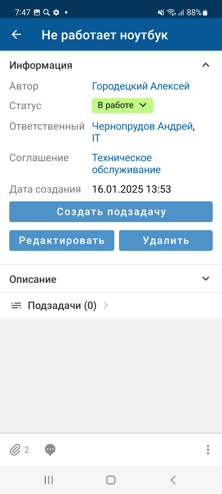
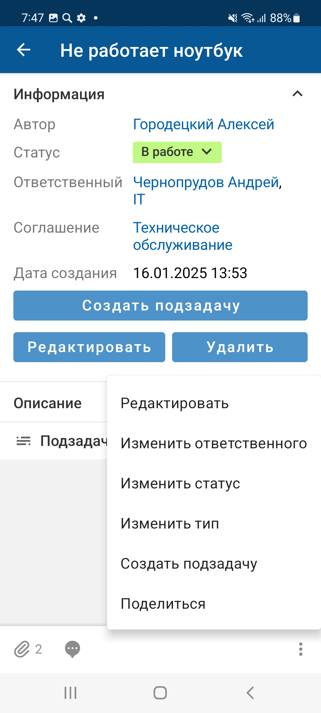
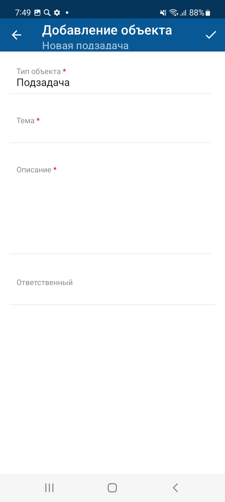
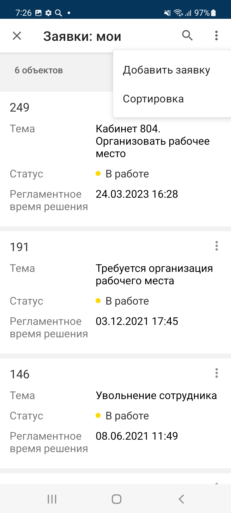

[Для iOS](../../how-to-use/actions/add)

- [В меню приложения](./add-2#01)
- [Голосовое создание](./add-2#02)
- [На экране карточки объекта](./add-2#03)
- [В списке связанных / вложенных объектов](./add-2#04)

## В меню приложения {#01}

#### Описание

Добавление объекта доступно в онлайн-режиме.

Возможность добавления объекта зависит от настройки приложения и прав доступа текущего пользователя.

#### Место в интерфейсе

Меню мобильного приложения "Кнопки добавления объектов".

#### Выполнение действия

1. В меню мобильного приложения "Кнопки добавления объектов" нажмите пункт добавления объекта.

    {width=143 height=300}
2. На экране добавления заполните значения атрибутов объекта. Набор атрибутов зависит от настройки мобильного приложения.

    Для ввода значения отдельного атрибута нажмите на поле атрибута и укажите его значение, подробнее смотри в разделе [Типы атрибутов на формах действий. Android](./attributes-types-2).

    На экране добавления может отображаться поле выбора типа. Выбор типа осуществляется на отдельном экране. Выбранный тип определяет набор полей на экране добавления объекта.
3. Нажмите {width=23 height=18} на верхней панели справа.

    {width=169 height=300}

#### Результат действия

На экране отобразится карточка созданного объекта.

## Голосовое создание {#02}

#### Описание

Добавление объекта голосом доступно в онлайн и офлайн-режиме.

Возможность добавления объекта зависит от настройки приложения и прав доступа текущего пользователя.

#### Место в интерфейсе

Меню мобильного приложения "Добавить". Действие инициируется при нажатии иконки **микрофон** рядом с пунктом добавления объекта.

Экран добавления объекта. Действие инициируется при нажатии кнопки **Создать голосом**.

#### Выполнение действия

1. Нажмите иконку **микрофон** или  кнопку **Создать голосом**.
2. Откроется экран записи голоса.

    Нажмите иконку **Начать запись**, произнесите фразу, например, описание задачи, и нажмите иконку **Остановить запись**.

    После остановки записи голоса, можно продолжить запись, прослушать запись, удалить запись или создать карточку объекта.
3. Нажмите **Добавить объект**.

#### Результат действия

На экране отобразится карточка созданного объекта. Аудио сообщение прикреплено к объекту и отображается в списке файлов.

Особенности офлайн-режима:

- После добавления объекта голосом, он помещается в очередь синхронизации. На экране отображается сообщение: "Объект добавлен в очередь синхронизации и будет отправлен при появлении доступа к серверу".
- Для объектов, добавленных голосом, в очереди синхронизации в дополнение к основным параметрам хранятся: код формы, с которой производилось добавление, текст транскрипции и аудио-файл.

Подробное описание офлайн-режима приведено в разделе [Офлайн-режим. Android](../offline-2).

## На экране карточки объекта {#03}

#### Описание

Добавление объекта доступно в онлайн-режиме.

Возможность добавления объекта зависит от настройки приложения и прав доступа текущего пользователя.

#### Место в интерфейсе

Экран карточки объекта. Действие инициируется в меню действий с объектом или при нажатии кнопки, иконки, ссылки.

#### Выполнение действия

1. Нажмите **Добавить объект** (Создать подзадачу).

    {width=135 height=300} {width=135 height=300}
2. На экране добавления заполните значения атрибутов объекта. Набор атрибутов зависит от настройки мобильного приложения.

    Для ввода значения отдельного атрибута нажмите на поле атрибута и укажите его значение, подробнее смотри в разделе [Типы атрибутов на формах действий. Android](./attributes-types-2).

    На экране добавления может отображаться поле выбора типа. Выбор типа осуществляется на отдельном экране. Выбранный тип определяет набор полей на экране добавления объекта.
3. Нажмите {width=23 height=18} на верхней панели справа.

    {width=135 height=300}

## В списке связанных / вложенных объектов {#04}

#### Описание

Добавление объекта доступно в онлайн-режиме.

Возможность добавления объекта зависит от настройки приложения и прав доступа текущего пользователя.

#### Место в интерфейсе

*Добавление объектов в списке будет доступно с версии SMP 4.20*

Экран карточки объекта → экран списка связанных / вложенных объектов. Действие инициируется в меню действий.

#### Выполнение действия

1. На экране списка объектов нажмите иконку {width=18 height=18} на верхней панели справа и в меню действий выберите "Добавить объект"

    {width=135 height=300}
2. На экране добавления заполните значения атрибутов объекта. Набор атрибутов зависит от настройки мобильного приложения.

    Для ввода значения отдельного атрибута нажмите на поле атрибута и укажите его значение, подробнее смотри в разделе [Типы атрибутов на формах действий. Android](./attributes-types-2).

    На экране добавления может отображаться поле выбора типа. Выбор типа осуществляется на отдельном экране. Выбранный тип определяет набор полей на экране добавления объекта.
3. Нажмите {width=23 height=18} на верхней панели справа.

    {width=135 height=300}

#### Результат действия

После добавления открывается экран карточки нового объекта.

При возврате на предыдущий экран отображается список объектов, в котором уже присутствует созданный объект.
