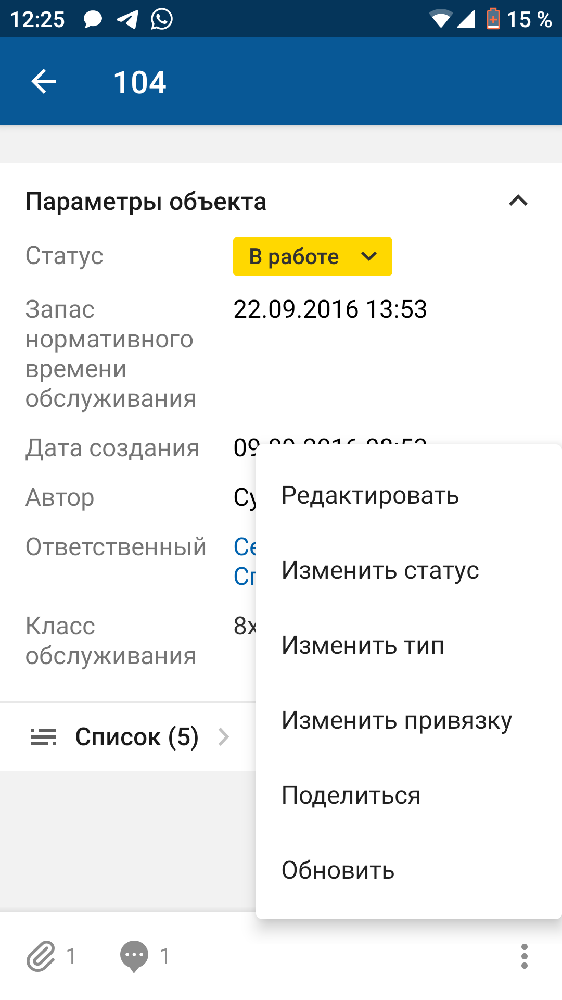
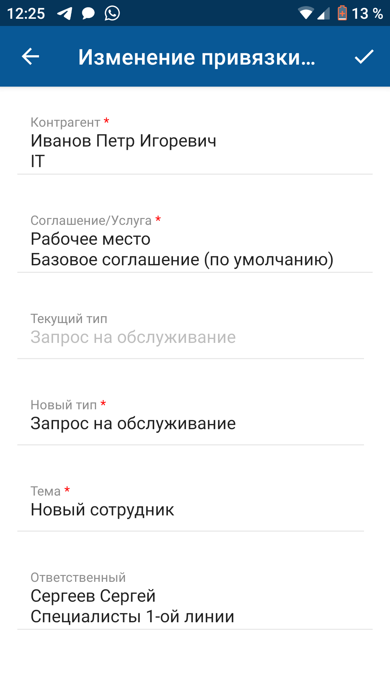

[Для iOS](../../how-to-use/actions/change-association)

### Описание

Смена привязки доступна в онлайн-режиме.

Возможность действия зависит от настройки приложения и прав доступа текущего пользователя.

### Место в интерфейсе

Экран списка объектов. Действие инициируется в меню действий с объектом.

Экран карточки объекта. Действие инициируется в меню действий с объектом или при нажатии кнопки, иконки, ссылки.

### Выполнение действия

Нажмите **Изменить привязку**.

{width=169 height=300}

{width=147 height=300}

На экране "Изменение привязки" заполните значения полей и нажмите {width=23 height=18} на верхней панели.

- Для ввода значения отдельного атрибута нажмите на поле атрибута и укажите его значение, подробнее смотри в разделе [Типы атрибутов на формах действий. Android](./attributes-types-2).

    {width=169 height=300}
- Для заполнения комментария нажмите на поле комментария и на отдельном экране заполните текст комментария.

    Укажите приватность (если у пользователя есть права).

    Добавьте упоминание — нажмите иконку {width=18 height=18}, затем в меню выберите вид упоминания в списке. Если настроено одно упоминание, то выбор пропускается. На отдельном экране выберите объекты для упоминания и сохраните выбор. Упоминание отобразится в тексте.

    Иконка {width=18 height=18} отображается, если:
    - мобильное устройство имеет доступ в интернет;
    - в мобильном приложении настроено правило упоминаний;
    - пользователь может добавлять упоминания и не имеет ограничений, наложенных контекстными переменными в упоминаниях.

### Результат действия

Привязка запроса изменена.

Если при смене привязки были заполнены атрибуты или добавлен комментарий, изменения сохраняются и отображаются на экране карточки объекта.

Добавленный комментарий отображается также на экране "Комментарии ()", подробнее смотри в разделе [Просмотр комментариев. Android](../comments-2/comment-view-2).
