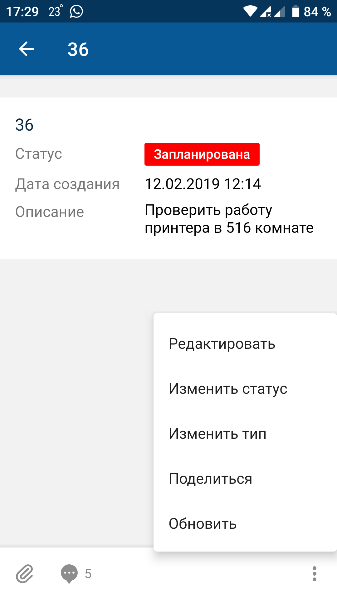
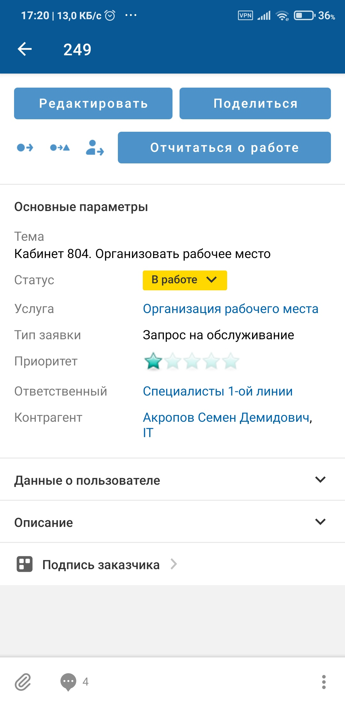

# Сменить тип. Android

[Для iOS](../../how-to-use/actions/change-type)

### Описание

Смена типа доступна в онлайн-режиме.

Возможность действия зависит от настройки приложения и прав доступа текущего пользователя.

### Место в интерфейсе

Экран списка объектов. Действие инициируется в меню действий с объектом.

Экран карточки объекта. Действие инициируется в меню действий с объектом или при нажатии кнопки, иконки, ссылки.

### Выполнение действия

Нажмите **Изменить тип**.

 

На экране "Изменение типа" заполните значения полей и нажмите  на верхней панели.

- В поле "Новый тип" выберите целевой тип объекта. Для заполнения значения используется [Список выбора](./attributes-types-2).

    
- После выбора целевого типа на экране "Изменение типа" могут отображаться поля атрибутов, которые необходимо заполнить для перехода в целевой тип.

    Для ввода значения отдельного атрибута нажмите на поле атрибута и укажите его значение, подробнее смотри в разделе [Типы атрибутов на формах действий. Android](./attributes-types-2).

    Особенности заполнения поля "Ответственный" смотри в разделе [Сменить ответственного. Android](./change-assignee-2).

    
- Для заполнения комментария нажмите на поле комментария и на отдельном экране заполните текст комментария.

    Укажите приватность (если у пользователя есть права).

    Добавьте упоминание — нажмите иконку , затем в меню выберите вид упоминания в списке. Если настроено одно упоминание, то выбор пропускается. На отдельном экране выберите объекты для упоминания и сохраните выбор. Упоминание отобразится в тексте.

    Иконка  отображается, если:
    - мобильное устройство имеет доступ в интернет;
    - в мобильном приложении настроено правило упоминаний;
    - пользователь может добавлять упоминания и не имеет ограничений, наложенных контекстными переменными в упоминаниях.

### Результат действия

Тип объекта изменен.

Если при смене типа были заполнены атрибуты или добавлен комментарий, изменения сохраняются и отображаются на экране карточки объекта.

Добавленный комментарий отображается также на экране "Комментарии ()", подробнее смотри в разделе [Просмотр комментариев. Android](../comments-2/comment-view-2).
