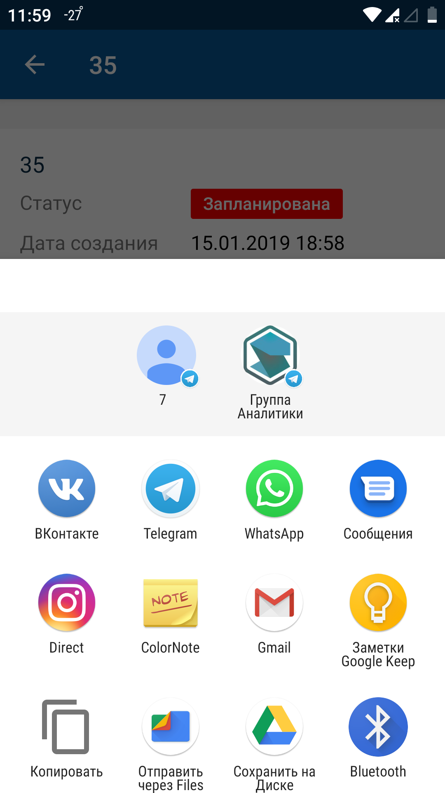

# Поделиться ссылкой. Android

[Для iOS](../../how-to-use/actions/share-link)

### Описание

Поделиться ссылкой на карточку объекта можно в онлайн и офлайн-режиме.

В мобильном приложении можно поделиться ссылкой на карточку объекта через другие каналы связи: мессенджеры, почтовые клиенты или просто открыть ссылку в браузере.

Возможность выполнения действия зависит от настройки мобильного приложения.

### Место в интерфейсе

Экран списка объектов. Действие инициируется в меню действий с объектом.

Экран карточки объекта. Действие инициируется в меню действий с объектом или при нажатии кнопки, иконки, ссылки.

### Выполнение действия

Нажмите **Поделиться** и выберите адресата и канал связи с помощью стандартного системного виджета.

### Результат действия

Ссылка на карточку объекта передана адресату или открыта в выбранном приложении.

Особенности офлайн-режима:

- Для выполнения действия в офлайн-режиме карточка объекта должна быть сохранена в кеше приложения.
- При отсутствии подключения к серверу отправка ссылки будет выполнена после восстановления соединения.

Подробное описание офлайн-режима приведено в разделе [Офлайн-режим. Android](../offline-2).
