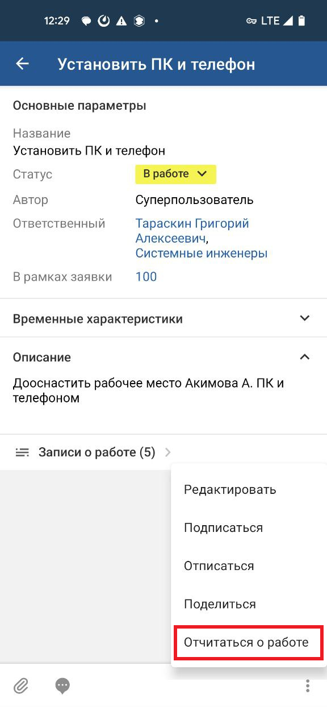
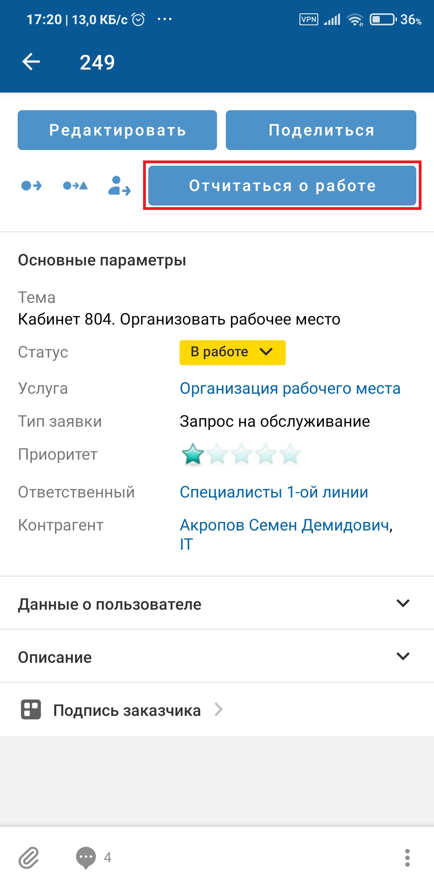
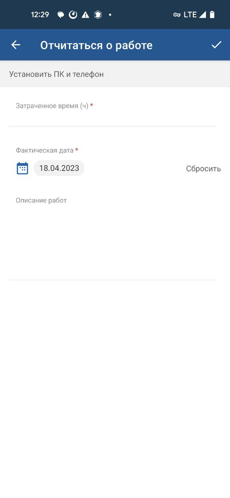

# Пользовательское действие. Android

[Для iOS](../../how-to-use/actions/user-action)

### Описание

Пользовательское действие — произвольное действие с объектом, которое определяется при настройке системы и инициируется при нажатии на специально созданный элемент управления.

Возможность выполнения действия зависит от настройки приложения и прав доступа текущего пользователя.

Пользовательское действие может быть двух видов:

- без заполнения параметров — доступно в онлайн и офлайн режимах;
- с заполнением параметров — доступно в онлайн-режиме, а также в расширенном офлайн режиме.

### Место в интерфейсе

Экран списка объектов. Действие инициируется в меню действий с объектом.

Экран карточки объекта. Действие инициируется в меню действий с объектом или при нажатии кнопки, иконки, ссылки.

### Выполнение действия

Нажмите элемент управления, инициирующий действие с объектом.

 

Если действие с объектом выполняется без редактирования параметров, то оно выполняется сразу после нажатия элемента управления.

Если при выполнении действия необходимо заполнить значения параметров, то откроется экран редактирования. Заполните поля и нажмите галочку  на верхней панели.

- Для ввода значения отдельного параметра нажмите на поле и укажите его значение, подробнее смотри в разделе [Типы атрибутов на формах действий. iOS](../../how-to-use/actions/attributes-types).

    

    Помимо полей ввода, на экране редактирования могут отображаться нередактируемые параметры, которые имеют особенности отображения в мобильном приложении:
    - Значение параметра отображается под названием атрибута и по всей ширине формы.
    - В строковых и текстовых параметрах гиперссылки не выделяются цветом, переход по ним не поддерживается.
    - Параметр типа "Текст в формате RTF" отображается с сохранением форматирования. Изображения JPG, JPEG, GIF, PNG, вставленные в текст RTF, можно просматривать на экране предпросмотра. 
    - Не отображаются гиперссылки, файлы и параметры с пустым значением.
- Для заполнения комментария нажмите на поле комментария и на отдельном экране заполните текст комментария.

    Укажите приватность (если у пользователя есть права).

    Добавьте упоминание — нажмите иконку , затем в меню выберите вид упоминания в списке. Если настроено одно упоминание, то выбор пропускается. На отдельном экране выберите объекты для упоминания и сохраните выбор. Упоминание отобразится в тексте.

    Иконка  отображается, если:
    - мобильное устройство имеет доступ в интернет;
    - в мобильном приложении настроено правило упоминаний;
    - пользователь может добавлять упоминания и не имеет ограничений, наложенных контекстными переменными в упоминаниях.

### Результат действия

Действие с объектом будет выполнено.

Добавленный комментарий отображается также на экране "Комментарии ()", подробнее смотри в разделе [Просмотр комментариев. Android](../comments-2/comment-view-2).

Особенности офлайн-режима: При выполнении пользовательского действия в офлайн-режиме действие помещается в очередь синхронизации. На экране отображается сообщение: "Действие добавлено в очередь синхронизации и будет выполнено при появлении доступа к серверу".

В расширенном офлайн-режиме для действий с заполнением параметров  доступно редактирование атрибутов следующих типов: "Вещественное число", "Временной интервал", "Гиперссылка", "Дата", "Дата/время", "Логический", "Строка", "Текст", "Текст в формате RTF", "Целое число".

Не поддерживается редактирование атрибутов типа "Ссылка на бизнес-объект", "Набор ссылок на бизнес-объект", "Агрегирующий", "Элемент Справочника", "Набор Элементов Справочника, "Набор типов класса".

Подробное описание офлайн-режима приведено в разделе [Офлайн-режим. Android](../offline-2).
