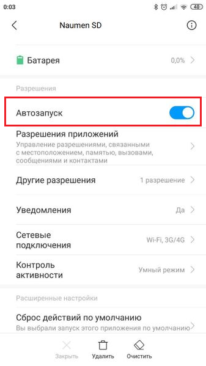
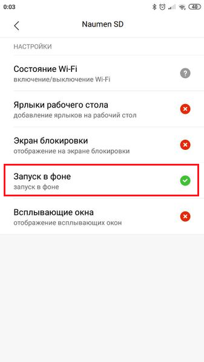
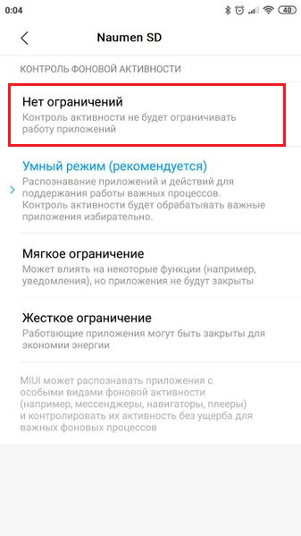
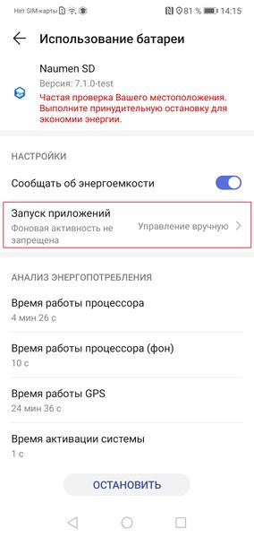
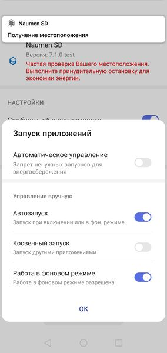
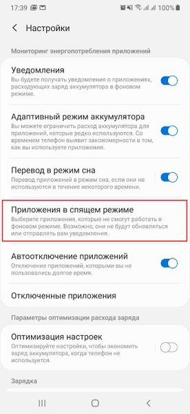

### Описание

Приложение должно быть запущено в фоновом режиме для стабильного получения данных службы геолокации устройства.

### Место настройки

Мобильное устройство → "Настройки" → "Приложения".

### Выполнение настройки

- Настройка разрешений на устройстве Xiaomi MIUI
    - Xiaomi MIUI 11, Android 9
        - Автозапуск

            Перейдите "Разрешения" → "Автозапуск". Найдите в списке приложение "Naumen SMP" или добавьте его в список.
        - Работа в фоновом режиме

            Перейдите в "Приложения". Выберите в списке приложение "Naumen SMP".

            Перейдите "Разрешения" → "Контроль активности" →"Контроль фоновой активности" и выберите вариант "Нет ограничений" (контроль активности не будет ограничивать работу приложений).
    - Xiaomi MIUI 10.2, Android 7
        - Автозапуск

            Перейдите в "Приложения". Выберите в списке приложение "Naumen SMP".

            Перейдите "Разрешения"и установите переключатель "Автозапуск" в положение включен (On).

            {width=169 height=300}
        - Работа в фоновом режиме (вариант 1)

            Перейдите в "Приложения". Выберите в списке приложение "Naumen SMP".

            Перейдите "Разрешения" → "Другие разрешения" и включите настройку "Запуск в фоне".

            {width=169 height=300}
        - Работа в фоновом режиме (вариант 2)

            Перейдите "Питание и производительность" → "Контроль активности". Выберите в списке приложение "Naumen SMP".

            Перейдите в разделе "Контроль фоновой активности" и выберите вариант "Нет ограничений" (контроль активности не будет ограничивать работу приложений).

            {width=169 height=300}

            В разделе "Местоположение в фоне" выберите "Разрешить".
    - Xiaomi MIUI 8.1, Android 7
        - Автозапуск

            Перейдите "Разрешения" → "Автозапуск". Найдите в списке приложение "Naumen SMP" и установите переключатель в положение включен (On).
        - Работа в фоновом режиме (вариант 1)

            Перейдите в "Приложения". Выберите в списке приложение "Naumen SMP".

            Перейдите "Разрешения" → "Другие разрешения" и включите настройку "Запуск в фоне".
        - Работа в фоновом режиме (вариант 2)

            Перейдите "Батарея и производительность" → "Расход заряда батареи приложениями" → "Экономия энергии в фоне". Выберите в списке приложение "Naumen SMP".

            Перейдите в "Контроль фоновой активности" и выберите вариант "Нет ограничений".

            Перейдите в "Местоположение в фоне" и выберите "Разрешить".
- Настройка разрешений на устройстве Huawei, Android 9

    Перейдите "Приложения" → "Все приложения". Выберите в списке приложение "Naumen SMP".

    Выберите "Использование батареи" → "Запуск приложений".

    {width=142 height=300}

    Выключите тогл "Автоматическое управление".

    Включите тоглы "Автозапуск" и "Работа в фоновом режиме".

    {width=142 height=300}

    EMUI 9 (кастомизация Android) содержит системное приложение PowerGenie на устройстве Huawei, которое по истечении 60 минут закрывает все фоновые приложения, не входящие в его "белый список". Пользовательские приложения нельзя добавить в "белый список". Чтобы добавить необходимые разрешения, необходимо удалить PowerGenie с устройства (системное приложение полностью удаляется только с помощью ADB (Android Debug Bridge)).
- Настройка разрешений на устройстве Samsung
    - Samsung, Android 9

        Перейдите "Настройки" → "Обслуживание устройства" → "Батарея" → меню "Настройки" → "Приложения в спящем режиме" (Приложения, которые не смогут работать в фоновом режиме. Возможно они не будут обновляться или отправлять вам уведомления).

        {width=138 height=300}

        Удалите приложение "Naumen SMP" из списка "Приложений в спящем режиме".
    - Samsung, Android ниже 8

        Меню "Специальный доступ" → "Оптимизировать использование батареи". Найдите приложение "Naumen SMP" в списке и убедитесь, что оно не выбрано.
