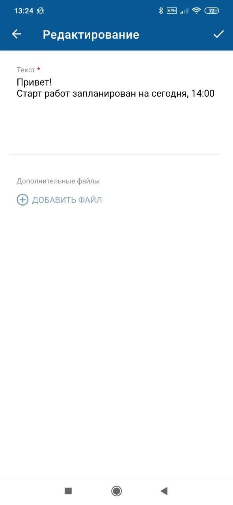
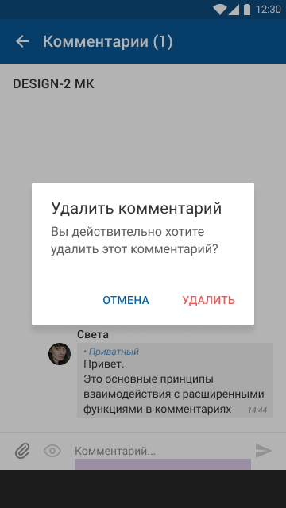

[Для iOS](../../how-to-use/comments/comment-actions)

Меню действий с комментарием вызывается при нажатии на комментарий и скрывается при нажатии мимо области меню действий.

- [Подробнее](./comment-actions-2#detail)
- [Редактирование](./comment-actions-2#edit)
- [Удаление](./comment-actions-2#del)

### Подробнее {#detail}

Только в меню на экране "Комментарии ()".

Нажмите "Подробнее" для перехода на карточку комментария.

### Редактирование {#edit}

Редактирование комментария доступно в онлайн режиме.

Возможность редактирования комментария зависит от прав доступа текущего пользователя.

#### Место в интерфейсе

Меню на экране "Комментарии ()" и экране отдельного комментария.

Список действий с комментарием кешируется. Если действия с комментарием лежат в кеше, то они будут показаны и в офлайн-режиме.

#### Выполнение действия

1. Разверните меню действий с комментарием и выберите **Редактировать**.

    {width=169 height=300}
2. На экране "Редактирование" измените значения атрибутов комментария.

    Для ввода значения отдельного атрибута нажмите на поле атрибута и укажите его значение, см. [Типы атрибутов на формах действий. Android.](../actions-2/attributes-types-2)

    {width=139 height=300}
3. Нажмите {width=23 height=18} на верхней панели экрана "Редактирование".

    При выходе с экрана редактирования комментария без нажатия {width=23 height=18} внесенные изменения не сохраняются.

### Удаление {#del}

Удаление комментария доступно в онлайн режиме.

Возможность удаления комментария зависит от прав доступа текущего пользователя.

#### Место в интерфейсе

Меню на экране "Комментарии ()" и экране отдельного комментария.

Список действий с комментарием кешируется. Если действия с комментарием лежат в кеше, то они будут показаны и в офлайн-режиме.

#### Выполнение действия

Разверните меню действий с комментарием и выберите **Удалить**.

{width=169 height=300}

Подтвердите удаление.

{width=169 height=300}

#### Результат действия

Комментарий будет удален.
