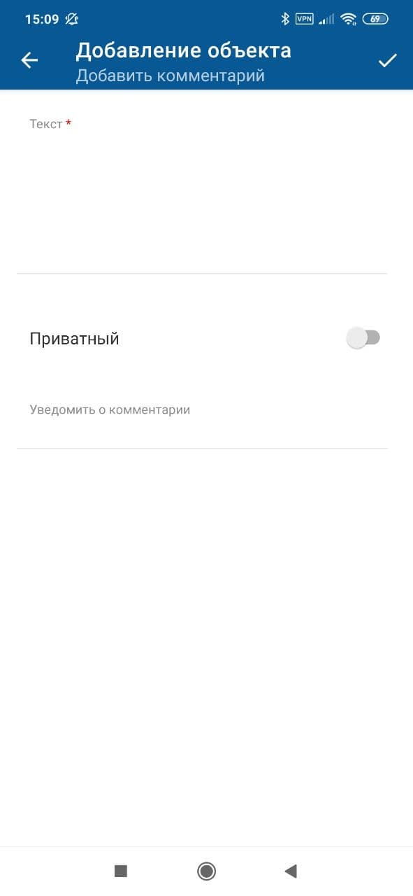

[Для iOS](../../how-to-use/comments/comment-add-ext)

### Описание

Расширенное добавление комментария доступно только в онлайн-режиме.

Возможность добавления комментариев зависит от прав доступа текущего пользователя.

### Место в интерфейсе

Экран "Комментарии ()" → экран добавления комментария.

### Выполнение действия

1. Откройте экран "Комментарии ()" и нажмите иконку {width=18 height=18} на нижней панели экрана.

    

    Откроется экран добавления комментария.

    Если на экране "Комментарии" уже был введен текст комментария, были прикреплены изображения или изменена настройка приватности, то эти данные будут перенесены на экран добавления комментария.

    {width=139 height=300}
2. Заполните поля на экране:
    - **Текст** — при вводе текста комментария выполняется переход на экран редактирования, на котором доступно:
        - Добавление упоминания — нажмите иконку упоминания {width=18 height=18}, затем в меню выберите вид упоминания в списке. Если настроено одно упоминание, то выбор пропускается. На отдельном экране выберите объекты для упоминания и сохраните выбор. Упоминание отобразится в тексте.

            Иконка {width=18 height=18} отображается, если:
            - мобильное устройство имеет доступ в интернет;
            - в мобильном приложении настроено правило упоминаний;
            - пользователь может добавлять упоминания и не имеет ограничений, наложенных контекстными переменными в упоминаниях.
        - Прикрепление файлов.
    - **Приватный** — чтобы отметить комментарий как приватный, включите тогл.
    - Поля атрибутов — для ввода значения отдельного атрибута нажмите на поле атрибута и укажите его значение. Подробнее смотри в разделе [Типы атрибутов на формах действий. Android](../actions-2/attributes-types-2)
3. Чтобы опубликовать комментарий нажмите {width=23 height=18} на верхней панели экрана справа.

    При выходе с экрана добавления комментария без нажатия {width=23 height=18} текст комментария и другие введенные данные не сохраняются.

### Результат действия

Новый комментарий отобразится на экране "Комментарии ()". Приватные комментарии отмечены надписью "Приватный".
