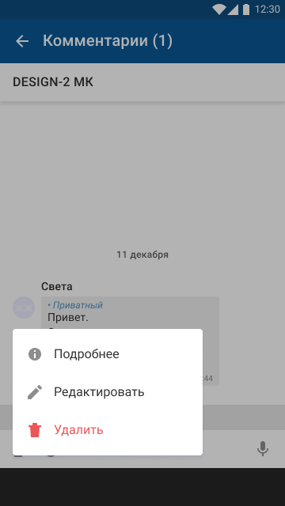
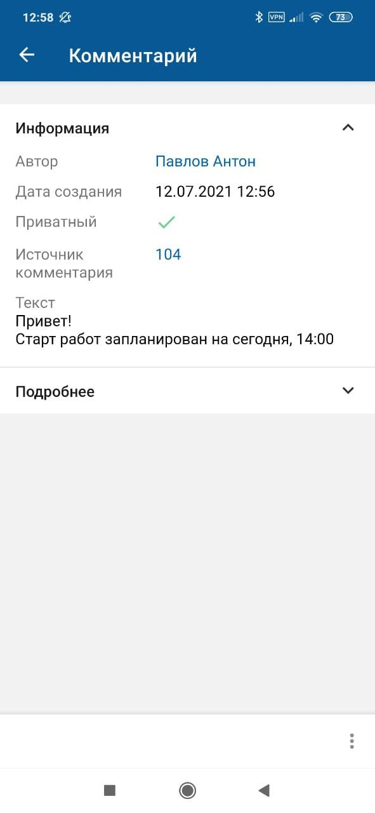

[Для iOS](../../how-to-use/comments/comment-view)

- [Экран "Комментарии ()"](./comment-view-2#1)
- [Экран комментария](./comment-view-2#2)

### Экран "Комментарии ()" {#1}

Просмотр комментариев доступен в онлайн и офлайн-режиме.

Возможность просмотра комментариев зависит от прав доступа текущего пользователя.

#### Переход на экран

Откройте экран карточки объекта и на нижней панели нажмите иконку {width=16 height=18}.

#### Содержание экрана

В названии экрана "Комментарии ()" в скобках указывается общее количество комментариев. Если к объекту не добавлено ни одного комментария, то отображается картинка "Комментарии отсутствуют".

Экран "Комментарии ()" может отображаться в портретном режиме и в ландшафтном режиме.

Список комментариев:

- В списке отображаются комментарии, добавленные в мобильном приложении (на экране "Комментарии ()", на формах смены статуса, смены ответственного, смена типа и привязки) и в веб-интерфейсе.
- Комментарии отсортированы по дате. Внизу расположены более свежие комментарии, а вверху — старые. Комментарии разбиты по группам по дате добавления комментария.
- Автор комментария и иконка автора отображаются для первого сообщения в группе сообщений от другого пользователя внутри одной даты. Если у текущего пользователя нет права на просмотр автора комментария, то отображается псевдоним автора (по умолчанию "Сотрудник").

Для каждого комментария отображается:

- Отметка о приватности;
- Текст комментария — отображается с учетом переноса строк, с сохранением заданных стилей.

    Контактные данные (телефонные номера и электронные адреса) распознаются в тексте как ссылки. При нажатии на ссылку запускается соответствующая системная функция операционной системы устройства.

    В тексте доступно копирование части комментария — по длительному нажатию на место в тексте комментария появляется ползунок для выделения текста.
- Дата и время отправки, с учетом часового пояса.
- Все изображения, вставленные в комментарий, отображаются в конце сообщения отдельным блоком. Максимум выводится три превью. Если картинок больше трех, то третья картинка затемняется, а на фоне пишется сколько еще картинок не выведено с учетом текущей картинки.

#### Навигация на экране

- Иконка возврата к предыдущему экрану.
- Название объекта, для которого открыт список комментариев, является ссылкой на экран карточки объекта.
- Иконка автора комментария является ссылкой на экран карточки автора комментария.

    Переход на карточку автора комментария выполняется, если автор комментария не является суперпользователем и в мобильном приложении настроена карточка сотрудника (автора комментария), а у текущего пользователя есть право на просмотр карточки сотрудника.
- Иконка {width=18 height=18} на нижней панели экрана является ссылкой для перехода к экрану добавления комментария. Иконка недоступна для нажатия, пока грузится хотя бы одно изображение, прикрепленное к комментарию.
- При нажатии на комментарий открывается [Меню действий с комментарием. Android](./comment-actions-2).

Меню действий с комментарием скрывается при нажатии на любую область, кроме области меню.

{width=169 height=300}

Список действий с комментарием кешируется. Если действия с комментарием лежат в кеше, то они будут показаны и в офлайн режиме.

## Экран комментария {#2}

Просмотр комментариев доступен в онлайн и офлайн-режиме. В офлайн-режиме можно перейти на экран комментария, если он был сохранен в кеше приложения.

Возможность просмотра комментариев зависит от прав доступа текущего пользователя.

#### Переход на экран

На экране "Комментарии ()" раскройте меню действий и выберите пункт "Подробнее".

#### Содержание экрана

- Блок "Информация" с атрибутами "Автор", "Дата создания", "Приватный", "Источник комментария" и "Текст".

    Изображения, прикрепленные к комментарию, отображаются в тексте комментария.
- Блок "Подробнее" с дополнительными параметрами комментария.

Блоки "Информация" и "Подробнее" могут отображаться в свернутом и развернутом виде.

{width=139 height=300}

#### Навигация на экране

- Иконка возврата к предыдущему экрану.
- При нажатии иконки меню {width=12 height=18} на нижней панели открывается [Меню действий с комментарием. Android](./comment-actions-2).
