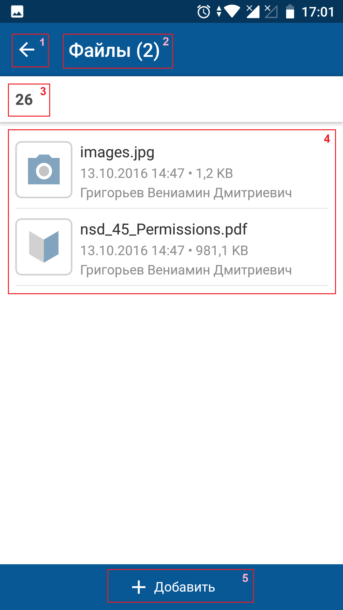
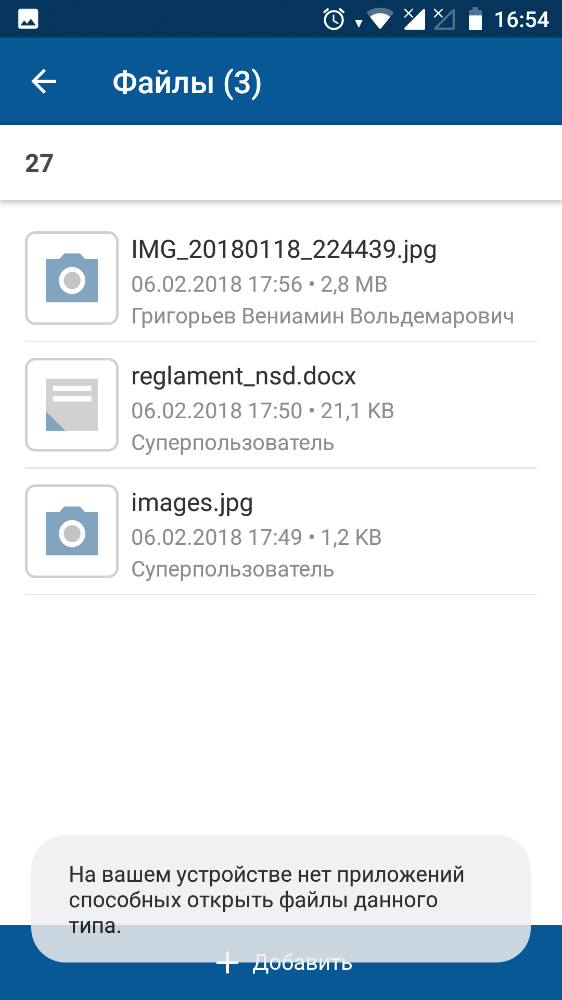
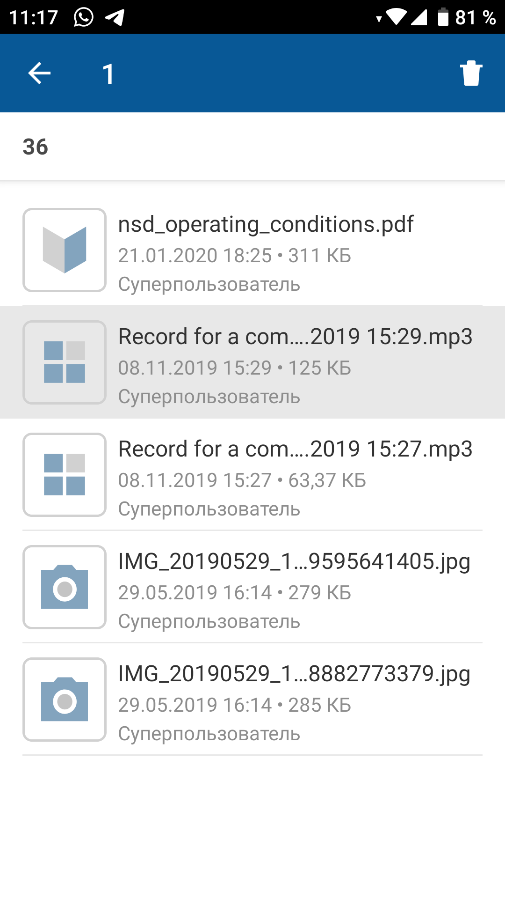

# Файлы. Android

[Для iOS](../how-to-use/files)

- [Просмотр прикрепленных файлов](./files-2#01)
- [Прикрепление файлов](./files-2#02)
- [Удаление файлов](./files-2#04)

## Просмотр прикрепленных файлов {#01}

Возможность просмотра файлов зависит от прав текущего пользователя и наличия соответствующих разрешений для мобильного приложения.

### Экран "Файлы"

#### Переход на экран

Откройте экран карточки объекта и на нижней панели нажмите "Файлы ()".

#### Содержание экрана

В названии экрана "Файлы ()" в скобках указывается общее количество файлов.

На экране отображаются файлы, добавленные в мобильном приложении (на экране "Файлы ()" и в веб-интерфейсе в списке файлов.

Файлы разделены горизонтальной линией. Для каждого файла отображается иконка с расширением файла, название, дата и время добавления, размер, автор файла.

#### Навигация на экране

- Иконка возврата на карточку объекта, с которой был открыт экран.
- Название объекта, для которого открыт список файлов, является ссылкой на экран карточки объекта.

### Приложение для просмотра файла

Чтобы просмотреть содержание файла, нажмите на название или изображение файла. Выполнится загрузка файла на мобильное устройство. Файл открывается в приложении для просмотра файла.

Если загрузка файла занимает длительное время, то на время загрузки файла на экране отображается форма с прогресс-баром и кнопкой отмены загрузки. Также для отмены загрузки файла можно нажать на экран вне области формы.

Если на мобильном устройстве найдено несколько приложений для просмотра файла, то открывается стандартное меню для выбора приложения, с помощью которого будет открыт и показан файл. Файл открывается в выбранном приложении.

Если просмотр файла невозможен, на экране отображается сообщение "На вашем устройстве нет приложений, способных открыть файлы данного типа".

## Прикрепление файлов {#02}

Прикрепление файла к объекту доступно в онлайн и офлайн-режиме.

Возможность прикрепление файлов к объекту зависит от прав текущего пользователя и наличия соответствующих разрешений для мобильного приложения.

#### Место в интерфейсе

Экран "Файлы ()".

#### Выполнение действия

1. На экране "Файлы ()" нажмите **Добавить**.
2. Укажите источник добавления файла.

    Возможные источники добавления файла:
    - "Сделать фото" — для добавления нового фото.
    - "Сделать видео" — для добавления нового видео.
    - "Загрузить изображение" — для добавления изображения из библиотеки.
    - "Загрузить файл" — для добавления любого типа файлов с помощью стандартного менеджера файлов.

    В списке источников могут отображаться другие программы и приложения, позволяющие работать с файлами на мобильном устройстве.
3. Выберите файл или несколько файлов, если выбранный источник поддерживает множественный выбор и загрузку файлов.

#### Результат действия

Выполнится загрузка файла на сервер, на время загрузки файла вместо иконки с расширением отображается прогресс-бар. Новый файл отобразится на экране в верху списка файлов.

<note type="info">

Размер загружаемых изображений уменьшается, если в настройках приложения включен параметр "[Сжимать отправляемые изображения](../how-to-use/navigation/settings/app-settings#02)".

</note>

Каждый файл проверяется на соответствие наложенным ограничениям на загрузку файлов, которые установлены конфигурационном файле [dbaccess.properties](../how-to-configure/dbaccess-properties). Если время загрузки файла произошла ошибка, то на экране отображается сообщение об ошибке. На серой заглушке вместо расширения файла отображаются элементы управления для запуска повторной попытки загрузки файла или отмены загрузки файла .

Для отмены загрузки перейдите на другой экран до окончания процесса загрузки или нажмите на крестик в центре прогресс-бара .

Особенности офлайн-режима:

- Для добавления файла в офлайн-режиме карточка объекта должна быть сохранена в кеше приложения.
- После добавления файла действие помещается в очередь синхронизации. На экране отображается сообщение: "Файл добавлен в очередь синхронизации и будет отправлен при появлении доступа к серверу".
- Время добавления файла будет соответствовать дате и времени синхронизации с сервером.

Подробное описание офлайн-режима приведено в разделе [Офлайн-режим. Android](./offline-2).

## Удаление файлов {#04}

Удаление файла доступно в онлайн и офлайн режимах.

Возможность добавления файлов к объекту и удаления файлов зависит от прав текущего пользователя и наличия соответствующих разрешений для мобильного приложения.

#### Место в интерфейсе

Экран "Файлы ()".

#### Выполнение действия

Для перехода в режим выбора файлов нажмите и удерживайте один из элементов списка файлов. Элемент отмечается как выбранный, на месте заголовка экрана отображается счетчик количества выбранных файлов, справа вверху отображается иконка "Корзина" (**Добавить** скрывается).

Для выбора файлов при уже включенном режиме выполните короткое нажатие на строку с файлом. Выбрать для удаления можно только уже загруженный файл.

Чтобы удалить выбранные файлы, нажмите иконку **Корзина**.

Если у пользователя нет прав на удаление каких-то из выбранных файлов, то такие файлы выделяются фоном и на экране отображается сообщение об ошибке.

Выход из режима выбора файлов выполняется при нажатии на иконку "Назад" на верхней панели экрана, при нажатии на системную кнопку **Назад**, при снятии отметок выбора со всех файлов и после выполнения удаления.

#### Результат действия

Файл будет удален.

Особенности офлайн-режима:

- Для удаления файла в офлайн-режиме карточка объекта должна быть сохранена в кеше приложения.
- После выбора файлов для удаления, для каждого файла создается отдельное действие в очереди синхронизации. На экране отображается сообщение: "Действие добавлено в очередь синхронизации и будет выполнено при появлении доступа к серверу". Удаляемые элементы визуально остаются в списке.
- Если разрыв соединения с сервером произошел в момент удаления файлов, то действия удаления оставшихся файлов помещаются в очередь синхронизации. На экране отображается сообщение: "Часть файлов не была удалена. Действие будет выполнено при появлении доступа к серверу."

    После возобновлении доступа к серверу выполняется удаление файла, если у пользователя есть права на удаление выбранного файла или удаляемый файл уже был удален (пока пользователь был офлайн).

Подробное описание офлайн-режима приведено в разделе [Офлайн-режим. Android](./offline-2).
