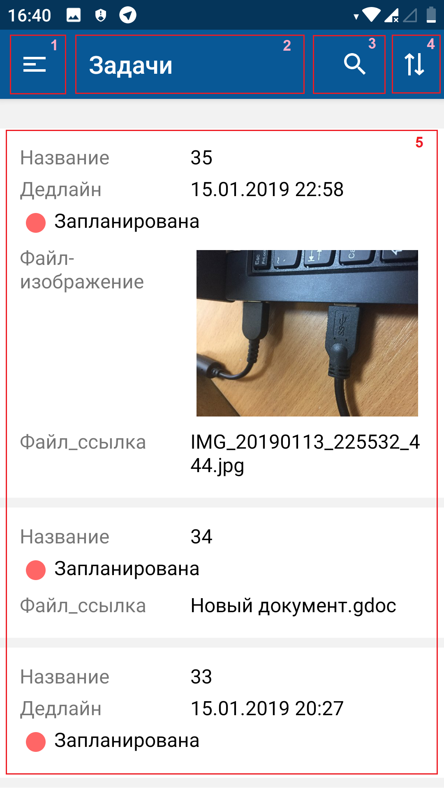
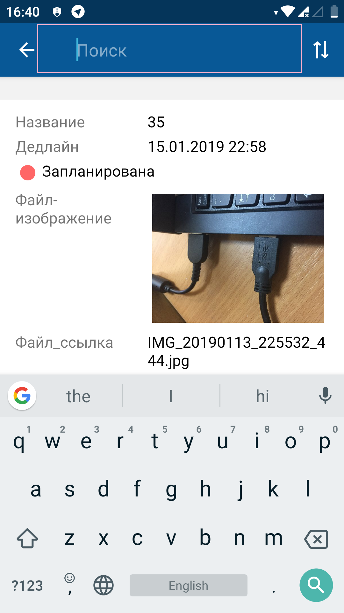
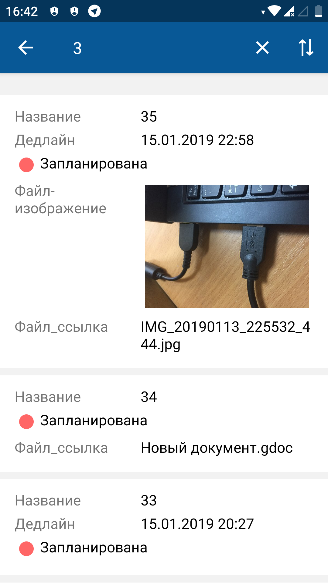
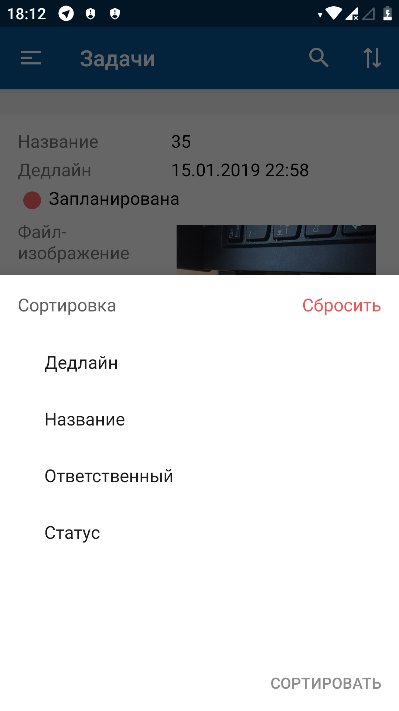
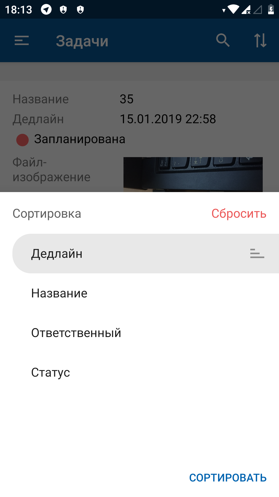
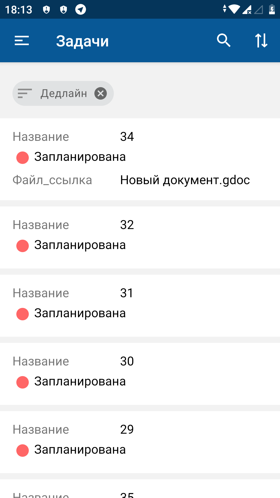

# Список объектов. Android

[Для iOS](../how-to-use/list)

### Описание

Список объектов — инструмент работы с большим количеством однотипных объектов. В списке объектов отображаются объекты одного класса. Список отображается на экране списка объектов.

### Переход на экран

Меню мобильного приложения → Название списка объектов

### Содержание экрана

На экране списка объектов отображаются:

- Название списка.
- Список объектов. Каждый объект отображается как отдельный элемент списка.

    Если в списке нет ни одного объекта, на экране отображается сообщение "Объекты отсутствуют".

### Инструменты отображения списка

#### Поиск по подстроке. Фильтрация списка объектов

Поиск выполняется по значениям атрибутов, выведенных в список объектов.

Поисковый запрос может содержаться в начале, в середине или в конце значения атрибута.

<note type="info">

Фильтрация списка возможна только по атрибутам, выведенным в список объектов.

</note>

<note type="info">

Поиск не проводится по значениям атрибутов типа "Дата", "Дата/время", "Временной интервал", "Вещественное число", "Логический", "Счетчик времени", а также по значениям атрибутов с кодом "UUID" и вычислимых атрибутов.

</note>

Выполнение действия: Нажмите иконку "лупа" и введите поисковый запрос (критерий фильтрации списка), поле ввода отобразится на верхней панели вместо названия списка.

После ввода поискового запроса нажмите иконку поиска "лупа" справа внизу экрана.

Чтобы сбросить поисковый запрос, нажмите "крестик" справа в поле поиска.

Чтобы вернуться в полный список, нажмите иконку "стрелка влево" слева от поля поиска.

#### Сортировка списка объектов

Сортировка списка объектов позволяет выводить в список объекты в заданном порядке.

Сортировка списка в мобильном приложении дополняет сортировку, установленную при настройке списка, и имеет больший приоритет.

<note type="info">

Сортировка производится только по одному атрибуту.

</note>

Выполнение действия:

1. Нажмите иконку . На экране отобразится форма настройки сортировки со списком атрибутов.

    
2. Нажмите на название атрибута, выбранный атрибут выделиться серым фоном.

    В строке атрибута отобразится иконка настройки направления сортировки .

    Направление сортировки меняется при нажатии на название атрибута, по которому отсортирован список. Индикатор направления сортировки изменяется , сортировка выполняется в обратном порядке.

    Чтобы сбросить сортировку списка, нажмите **Сбросить** в правом верхнем углу формы.

    
3. Нажмите **Сортировать**.

Форма настройки сортировки закроется, атрибут для сортировки списка отобразится на экране списка над элементами списка. Список объектов будет отсортирован по выбранному атрибуту в заданном порядке.

Чтобы сбросить сортировку списка, нажмите крестик рядом с атрибутом, по которому отсортирован список.

### Навигация на экране

- Иконка вызова меню приложения (на верхней панели слева).
- Иконка вызова меню действий с объектом (рядом с элементом списка).
- При нажатии на элемент списка открывается экран карточки объекта.

### Меню действий с объектом

Меню действий с объектом на экране списка совпадает с меню действий с объектом на экране карточки этого объекта. Набор доступных действий зависит от прав текущего пользователя.

Если у пользователя нет прав ни на одно действие с объектом, отображается сообщение "Нет доступных действий".

Для инициации действия с объектом нажмите иконку вызова меню действий с объектом (рядом с элементом списка) и выберите пункт меню.

Описание действий с объектом в мобильном приложении см. в разделе [Действия. Android](./actions-2).
