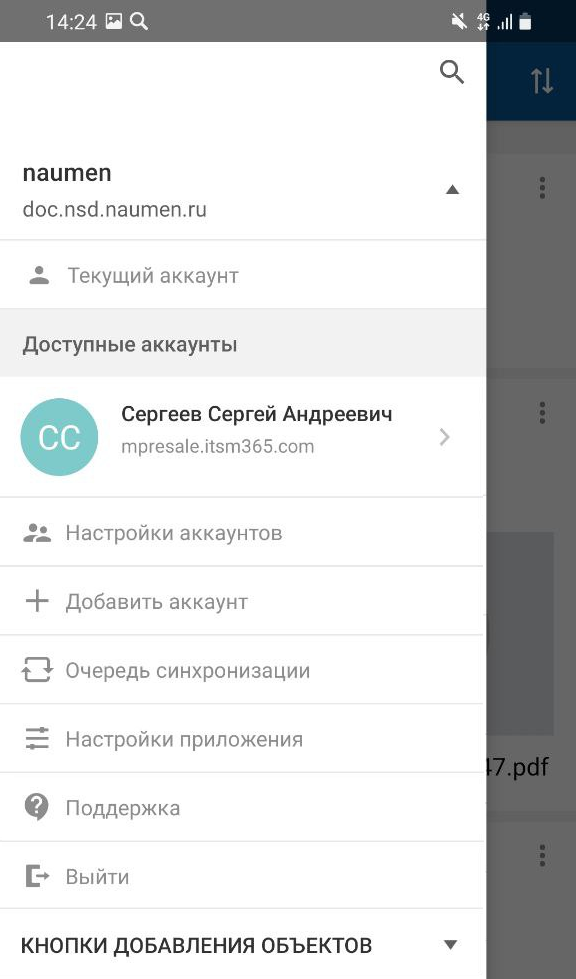
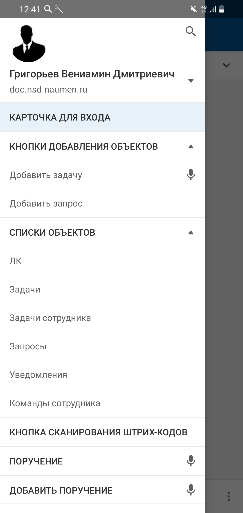

[Для iOS](../../how-to-use/navigation/menu)

### Переход к меню приложения

Меню открывается с левого края экрана:

- при нажатии на иконку вызова меню на верхней панели;
- жестом "слева-направо" от левого края экрана со списков объектов, с карточки объекта и экранов с комментариями и файлами.

Меню закрывается:

- при нажатии на область справа от меню;
- при выборе элемента меню;
- перетягиванием области справа от меню справа-налево;
- при нажатии кнопки **Назад** мобильного устройства.

#### Содержание меню

Меню мобильного приложения содержит постоянную и настраиваемую часть.

#### Постоянная часть меню

Меню мобильного приложения содержит постоянную и настраиваемую часть.

В постоянной части меню (свернутый вид) отображается:

- Информация о текущем аккаунте пользователя: картинка и имя пользователя, адрес сервера.
- Иконка поиска.

{width=177 height=300}

В постоянной части меню (развернутый вид) отображается:

- Информация о текущем аккаунте пользователя: картинка и имя пользователя, адрес сервера.
- Иконка поиска.
- Разделы управления аккаунтом.
- Раздел "Очередь синхронизации".
- Раздел "Настройки приложения".
- Раздел "Поддержка".
- Кнопка **Выйти**.

#### Настраиваемая часть меню

Настраиваемая часть меню может содержать:

- Кнопки добавления объектов.
- Ссылки на список объектов.
- Ссылки на карточку объекта.
- Кнопка сканирования штрих-кодов.
- Ссылки на встроенные приложения — при нажатии на ссылку открывается экран с развернутым встроенным приложением.
- Разделы для группировки других элементов меню — при нажатии на раздел меню раскрывается список с вложенными элементами меню.

{width=143 height=300}
