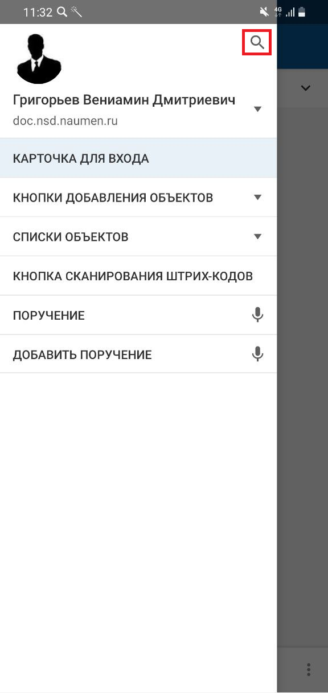
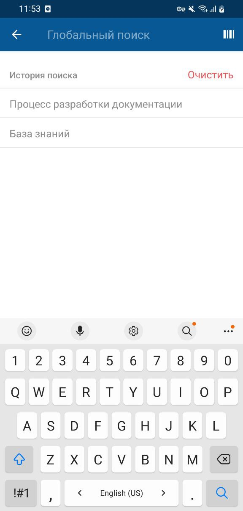
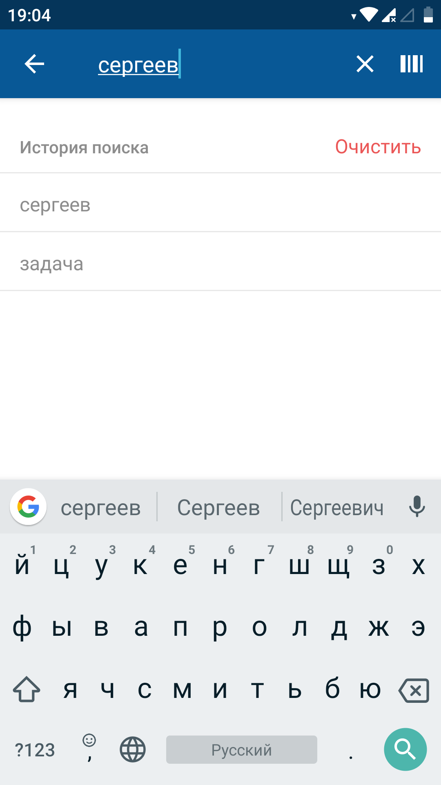
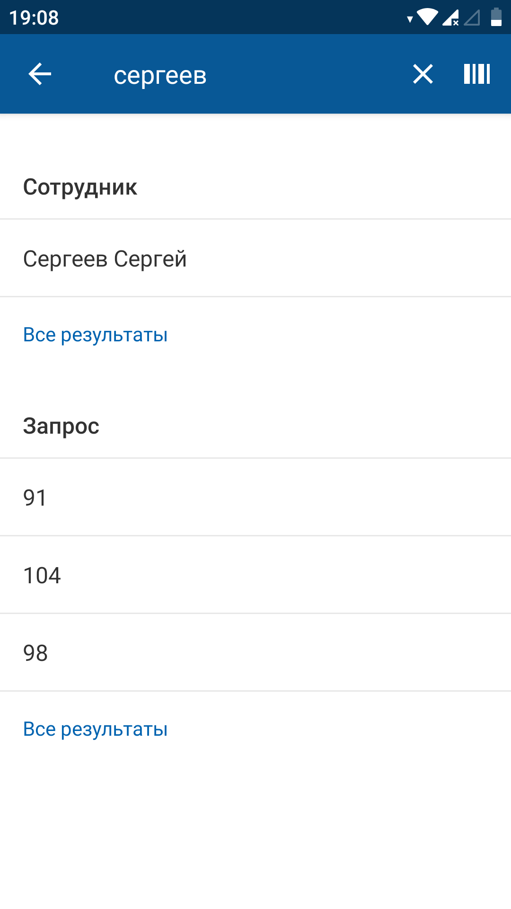
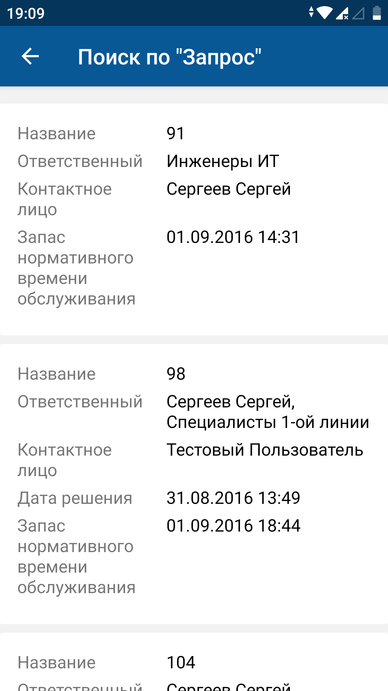

[Для iOS](../../how-to-use/navigation/search)

### Описание

Поиск объектов в мобильном приложении выполняется по значению атрибутов объекта (поисковый запрос) или по штрих-коду/QR-коду.

Для использования сканера штрих-кодов необходимо разрешение на использование камеры. Разрешение запрашивается при первом обращении к сканеру штрих-кодов.

Особенности поиска в мобильном приложении:

- Поиск выполняется только по объектам, для которых настроены карточки в мобильном приложении.
- Архивные объекты в поиске не участвуют и не учитываются при отображении результатов поиска.

### Место в интерфейсе

Меню приложения.

### Выполнение действия

#### Поиск по поисковому запросу

1. В меню приложения нажмите иконку поиска "лупа".

    Откроется экран поиска. Курсор на экране автоматически устанавливается в поле ввода поискового запроса.

    {width=142 height=300}

    {width=143 height=300}
2. Введите поисковый запрос при помощи стандартных виджетов ввода текста Android или выберите поисковый запрос из истории поисковых запросов. В истории отображается 10 последних поисковых запросов, общих для всего приложения.

    Поисковый запрос — слово или символ(ы), с которых начинается значение атрибута искомого объекта.

    {width=169 height=300}
3. Нажмите иконку поиска "лупа" справа внизу экрана.

#### Поиск по коду

1. В меню приложения нажмите иконку поиска "лупа".

    {width=142 height=300}
2. На экране поиска нажмите иконку вызова сканера штрих-кода на верхней панели справа. Откроется экран сканера штрих-кода.

    {width=143 height=300}
3. Наведите на код камеру мобильного устройства. Распознанное значение вставляется в поисковую строку и автоматически запускается поиск по распознанному значению.

### Результаты поиска

- Объектов не найдено

    Если не найдено объектов, удовлетворяющих условиям поиска, то на экран выводится сообщение "Нет совпадений".
- Найден один объект

    Если в результате поиска найден только один объект, то открывается экран карточки найденного объекта.
- Найдено несколько объектов (более 100 объектов)

    Если в результате поиска найдено более 100 объектов, то отображается экран результатов поиска со списком найденных объектов, в конце списка выводится сообщение "Найдено более 100 объектов. В результатах поиска отображаются первые 100. Уточните параметры поиска".
- Найдено несколько объектов (меньше либо равно 100)

    Если в результате поиска найдены несколько объектов (меньше либо равно 100), то отображается экран результатов поиска со списком найденных объектов, сгруппированных по классам.

    На экране результатов поиска по классам можно вызвать сканер и провести поиск по штрих-коду / QR-коду.

    Порядок отображения результатов по классам и максимальное количество объектов каждого класса в результатах поиска определяется при настройке веб-интерфейса.

    {width=169 height=300}

    Чтобы просмотреть список результатов поиска по отдельному классу, на экране результатов поиска перейдите по ссылке "Все результаты" внизу блока с результатами поиска по отдельному классу. Отобразится экран результатов поиска по конкретному классу.

    {width=169 height=300}
