[Для iOS](../../../how-to-use/navigation/settings/app-settings)

- [Просмотр версии мобильного приложения](./app-settings-2#01)
- [Настройка отправки изображений](./app-settings-2#02)
- [Настройка доступа к местоположению устройства](./app-settings-2#03)
- [Настройка дополнительной аутентификации в мобильном приложении](./app-settings-2#04)
- [Просмотр дополнительных сертификатов](./app-settings-2#05)
- [Добавление сертификата TLS](./app-settings-2#06)

### Просмотр версии мобильного приложения {#01}

#### Место в интерфейсе

Меню мобильного приложения "Настройки приложения" → экран "Настройки".

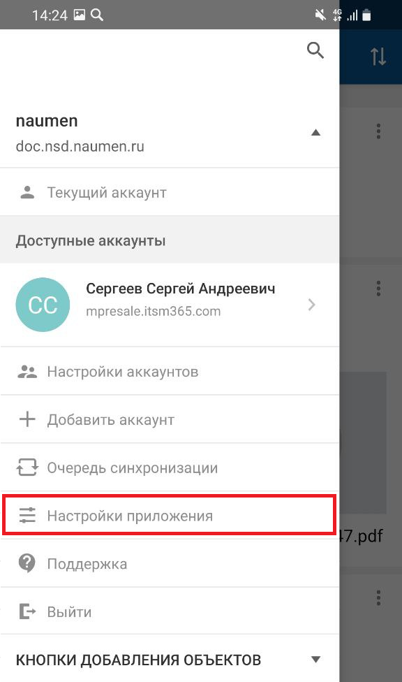{width=177 height=300}

#### Выполнение настройки

В блоке "Об этом приложении" отображается:

- Версия мобильного приложения.
- Ссылка "Что нового" — по ссылке выполняется переход к обзору новых возможностей приложения.

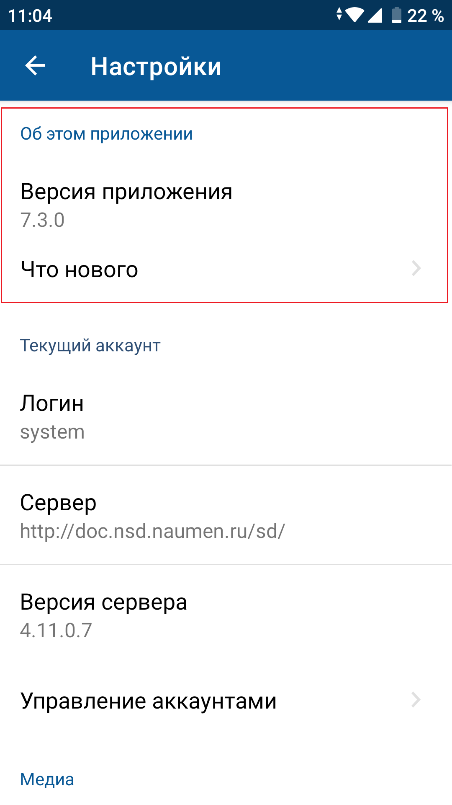{width=169 height=300}

### Настройка отправки изображений {#02}

#### Место в интерфейсе

Меню мобильного приложения "Настройки приложения" → экран "Настройки".

#### Выполнение настройки

В блоке "Медиа" установите положение тогла "Сжимать отправляемые изображения":

- тогл включен — все изображения, снятые через приложение или добавленные из галереи, будут сжиматься при отправке;
- тогл выключен — изображения отправляются в полном размере.

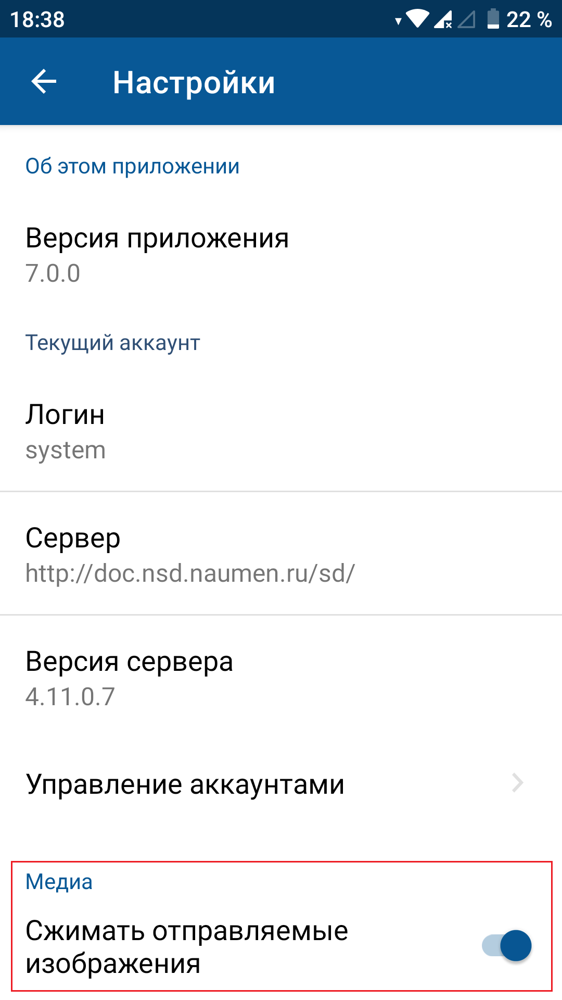{width=169 height=300}

### Настройка доступа к местоположению устройства {#03}

Если в системе для сотрудника включен режим отслеживания перемещений, то для корректной работы сервиса сбора данных о местоположении необходимо разрешение на получение доступа к местоположению мобильного устройства.

<note type="info">

Начиная с версий Andriod 12 предоставляется выбор приблизительной или точной геопозиции. Для корректной работы геосервисов необходимо разрешить передачу точной геопозиции.

</note>

#### Место в интерфейсе

Меню мобильного приложения "Настройки приложения" → экран "Настройки".

#### Выполнение настройки

В блоке "Безопасность" установите положение тогла "Доступ к местоположению":

- тогл включен — мобильное приложение может отслеживать местоположение устройства в фоновом режиме и добавлять текущее местоположение к объектам системы (только при использовании или всегда), см. подробнее [Фоновый режим. Android](../../background).

    Во время сбора данных в списке уведомлений будет отображаться запущенный сервис Naumen.
- тогл выключен — у мобильного приложения нет доступа к местоположению мобильного устройства.

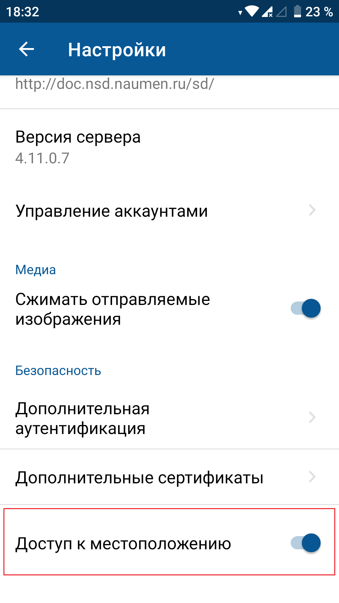{width=169 height=300}

### Настройка дополнительной аутентификации в мобильном приложении {#04}

#### Описание

Механизм дополнительной аутентификации используется для предотвращения несанкционированного доступа к данным внутри приложения при завладении телефоном другим лицом.

Механизм запускается каждый раз при обращении к приложению после блокировки экрана телефона или выгрузки приложения из оперативной памяти устройства. Дополнительная аутентификация может выполняться через ручной ввод ПИН-кода или с помощью биометрических механизмов.

Пользователь настраивает ПИН-код и биометрические параметры для дополнительной аутентификации самостоятельно в мобильном приложении.

Обязательность дополнительной аутентификации в приложении указывается в настройках мобильного приложения в веб-интерфейсе. Для настройки используется параметр "Обязательно запрашивать дополнительную аутентификацию по ПИН-коду или биометрии в мобильном приложении", подробное описание приведено в разделе [Безопасность](../../../how-to-setup/other/security).

#### Место в интерфейсе

Меню мобильного приложения "Настройки приложения" → экран "Настройки" → в блоке "Безопасность" переход по ссылке "Дополнительная аутентификация" → экран "Дополнительная аутентификация".

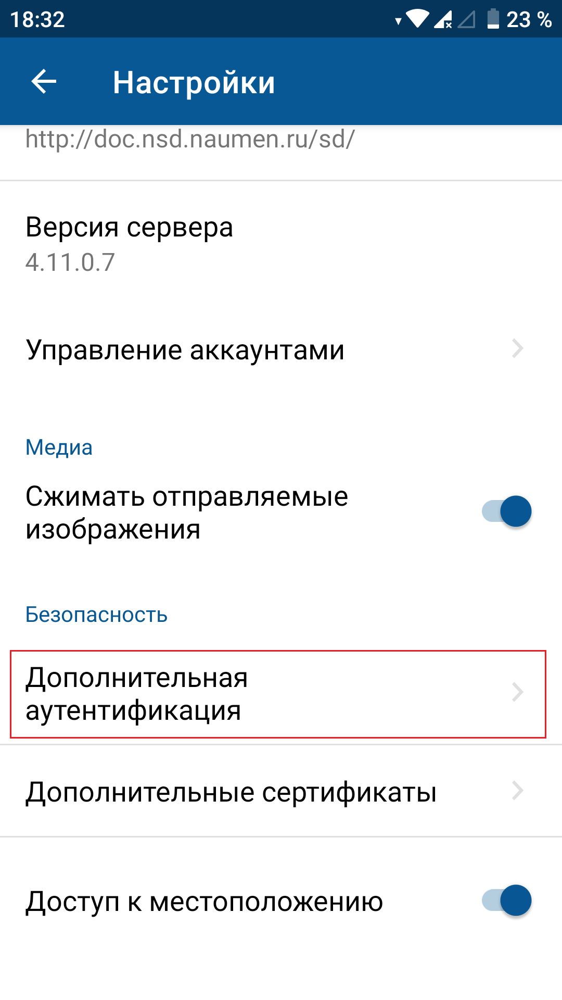{width=169 height=300}

#### Выполнение настройки

- Настройка использования ПИН-кода для входа в мобильное приложение

    Включите тогл "Вход по ПИН-коду".

    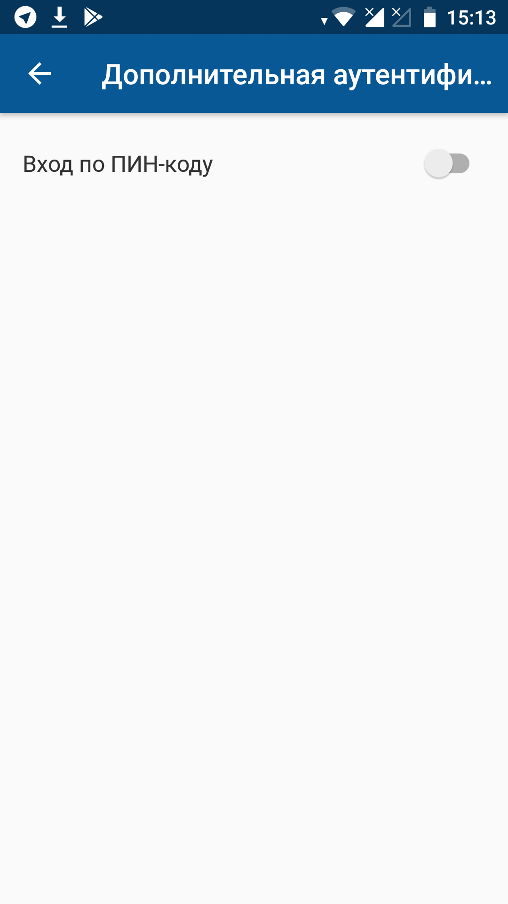{width=169 height=300}

    Введите ПИН-код, затем введите ПИН-код повторно.

    ПИН-код для входа в приложение будет установлен.
- Редактирование ПИН-кода

    Нажмите "Изменить ПИН-код".

    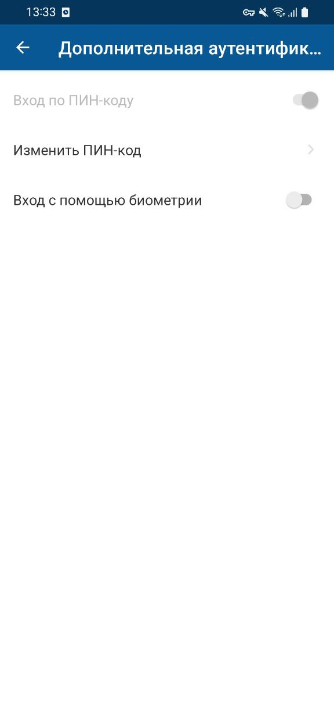{width=143 height=300}

    Введите текущий ПИН-код. Введите новый ПИН-код, а затем введите новый ПИН-код повторно.

    ПИН-код для входа в приложение будет изменен.
- Настройка аутентификации с помощью биометрических механизмов

    Параметры входа через биометрию отображаются при включенном параметре "Вход по ПИН-коду".

    Набор отображаемых параметров зависит от наличия соответствующей возможности у мобильного устройства. Если устройство поддерживает биометрические механизмы аутентификации, но они не соответствуют стандартам безопасности, необходимым для работы мобильного приложения, то настройка входа с помощью биометрии невозможна.

    Поддерживаемые биометрические механизмы:
    - Вход по отпечатку пальца — для входа необходимо приложить палец к сенсору на мобильном устройстве.
    - Вход через распознавание лица — для входа необходимо поднести камеру мобильного устройства к лицу.

    Для подтверждения используются биометрические данные, сохраненные в хранилище на мобильном устройстве. Отдельное хранилище внутри приложения не предусмотрено.

### Просмотр дополнительных сертификатов {#05}

#### Место в интерфейсе

Меню мобильного приложения "Настройки приложения" → экран "Настройки" → в блоке "Безопасность" переход по ссылке "Дополнительные сертификаты" → экран "Дополнительные сертификаты".

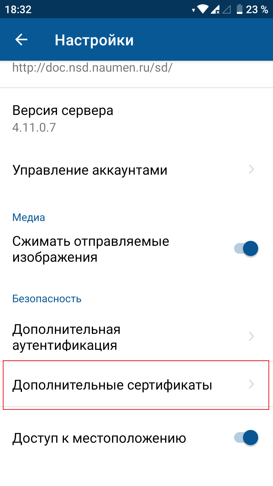{width=169 height=300}

#### Выполнение настройки

- Просмотр списка дополнительных сертификатов

    На экране "Дополнительные сертификаты" отображается:
    - Список установленных дополнительных сертификатов. Каждый сертификат отображается как отдельный элемент списка. Для каждого сертификата отображается название и адрес сервера.
    - Пояснение к добавлению сертификата.
    - Кнопка Смотреть инструкцию.

    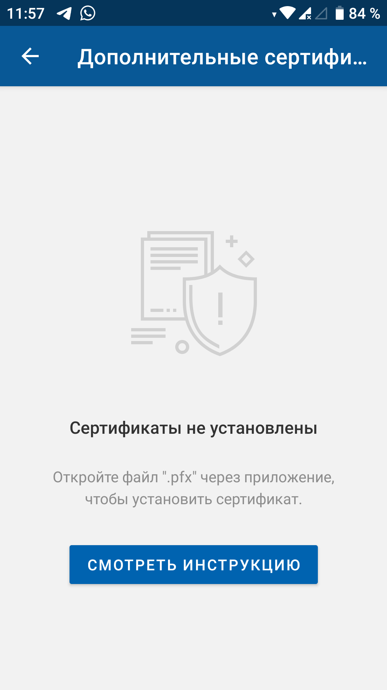{width=169 height=300}
- Просмотр сертификата

    Чтобы просмотреть сертификат, нажмите на его название в списке.

    На экране сертификата отображается:
    - Название сертификата.
    - Блок с параметры сертификата и их значения. Каждый параметр отображается с новой строки. Значение редактируемых полей отображается черным цветом, нередактируемых — серым.

        Параметры сертификата:
        - "Название" — название сертификата в списке установленных сертификатов. По умолчанию заполнено названием файла с сертификатом без расширения.
        - "Адрес сервера" — адрес сервера, для которого предназначен сертификат.
        - "Сертификат" — название файла с сертификатом, с указанием расширения.
        - "Пароль" — пароль доступа к сертификату.

    Навигация и элементы управления на экране сертификата:
    - Иконка возврата к предыдущему экрану;
    - Иконка сохранения изменений на карточке сертификата;
    - Иконка "Удалить сертификат" справа внизу экрана.

    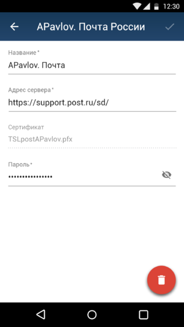{width=169 height=300}
- Удаление сертификата TLS

    Чтобы перейти на экран сертификата, нажмите на его название в списке.

    На карточке сертификата нажмите иконку **Удалить сертификат** и подтвердите действие.

### Добавление сертификата TLS {#06}

#### Описание действия

Установка сертификата TLS необходима, если на сервере настроена TLS-аутентификация, в ином случае установка не требуется

Для аутентификации пользователя в каждом приложении на базе платформы SMP добавляется отдельный сертификат TLS.

Сертификат — это набор данных, определяющих какую-либо сущность (пользователя или устройство) в привязке к открытому ключу ключевой пары открытый/секретный ключ. Обычный сертификат содержит информацию о сущности и указывает цели, с которыми может использоваться сертификат, а также расположение дополнительной информации о месте выпуска сертификата. Сертификат подписан цифровой подписью выпустившего его центра сертификации (СА).

Перед добавлением нового сертификата TLS необходимо:

- удалить старый сертификат, если он есть, см. [Удаление сертификата TLS](./app-settings-2);
- получить новый сертификат TLS для доменного имени, на котором размещается приложение.

Доменный сертификат — это внутренний документ, который подтверждает владение доменным именем определенной организацией или физическим лицом на протяжении определенного промежутка времени (выдается в вашей компании).

#### Место выполнения настройки

Мобильное устройство.

#### Выполнение настройки

Чтобы добавить сертификат TLS:

1. Нажмите на название файла с сертификатом (.pfx).
2. На форме "Открыть ..." выберите приложение "Naumen SD".

    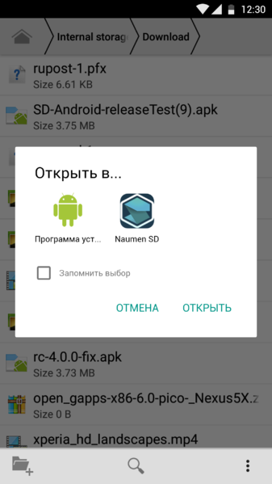{width=169 height=300}
3. На экране "Установить сертификат" заполните все поля:
    - **Название** — название сертификата в списке установленных сертификатов. По умолчанию заполнено названием файла с сертификатом.
    - **Адрес сервера** — адрес сервера с приложением, для которого предназначен сертификат. В адресе сервера обязательно указывается схема (http, https и т.д.).
    - **Сертификат** — название и расширение файла с сертификатом.
    - **Пароль** — пароль доступа к сертификату.

    Чтобы перейти в режим редактирования конкретного параметра, нажмите на поле параметра.
4. На экране "Установить сертификат" сохраните изменения.

    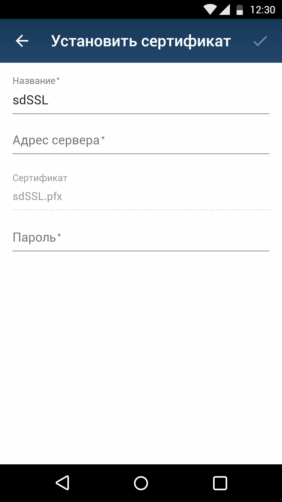{width=169 height=300}
