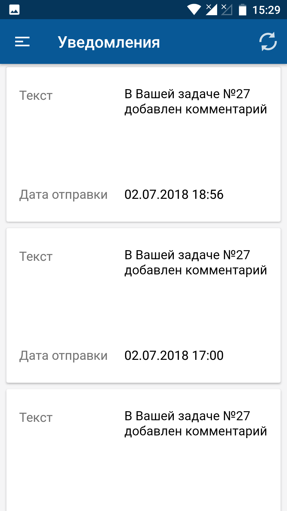
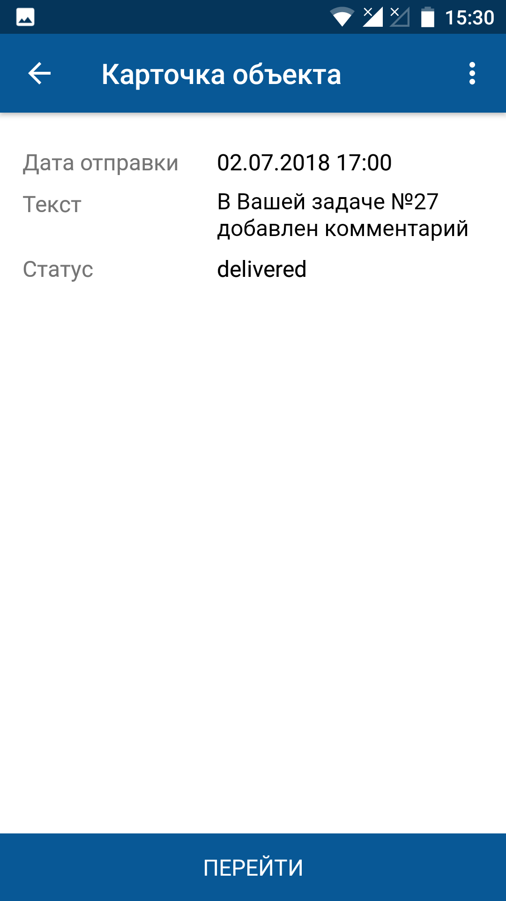

[Для iOS](../how-to-use/notifications)

### Описание

Уведомление в мобильном приложении — это отдельное персонализированное пуш-сообщение, внешний вид которого определяется его шаблоном. При наступлении события, на которое настроен шаблон уведомления, в системе создаются экземпляры уведомлений.

Пользователь получает уведомления по всем своим аккаунтам, которые добавлены в мобильное приложение, из которых пользователь явно не выходил. При нажатии на уведомление пользователь переходит в аккаунт, в рамках которого было получено сообщение. При переходе в другой аккаунт по уведомлению выхода из старого аккаунта не выполняется, пользователь продолжит получать по нему уведомления.

### Место в интерфейсе

Меню мобильного приложения → Список уведомлений.

<note type="info">

Внешний вид всплывающего уведомления и работа уведомления могут отличаться в зависимости от модели устройства и версии операционной системы.

</note>

### Выполнение действия

В меню мобильного приложения нажмите на названии списка уведомлений.

{width=143 height=300}

На экране отобразится экран со списком уведомлений.

{width=169 height=300}

Чтобы просмотреть карточку уведомления, нажмите на уведомление в списке уведомлений.

{width=169 height=300}
