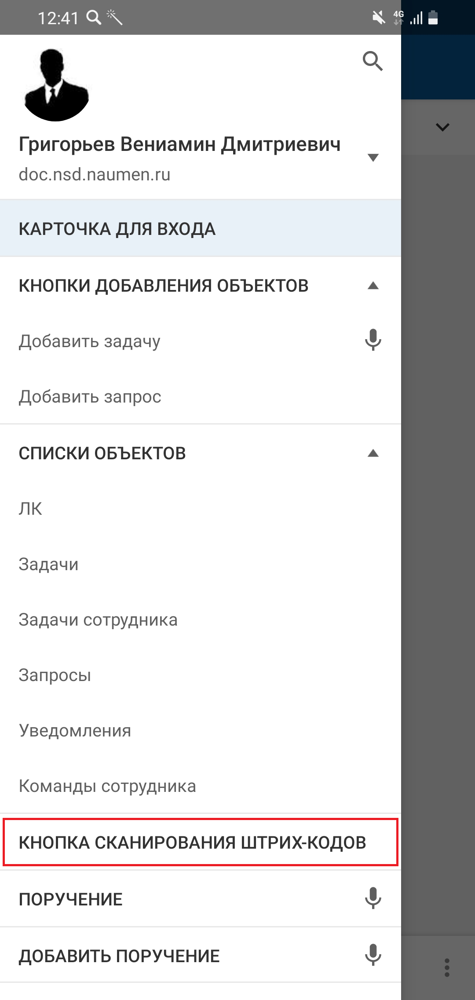

[Для iOS](../how-to-use/scanner)

### Описание

В мобильном приложении предоставляется возможность использовать сканер штрих-кодов для перехода из меню приложения по ссылке в штрих-коде или QR-коде.

Сканирование доступно в онлайн и офлайн-режиме.

<note type="info">

Для использования сканера штрих-кодов необходимо разрешение на использование камеры. Разрешение запрашивается при первом обращении к сканеру штрих-кодов.

</note>

### Место в интерфейсе

Меню приложения "Кнопка сканирования штрих-кодов"

### Выполнение действия

Нажмите кнопку сканирования штрих-кодов.

{width=143 height=300}

На экране сканера штрих-кодов наведите камеру мобильного устройства на код.

### Результат действия

#### Ссылка распознана

Если ссылка распознана, то внизу экрана отображается ссылка и кнопка **Перейти**.

Если ссылка указывает на приложение (карточку или форму), то она открывается в текущем аккаунте или предоставляется возможность выбора аккаунта (кнопка **Перейти в другой аккаунт**).

- Ссылка на карточку объекта — на экране отображается карточка объекта.
- Ссылка на форму добавления — на экране отображается форма добавления объекта с предзаполненными полями. Параметры из ссылки заполняют соответствующие поля на форме и записываются в атрибуты созданного объекта, если атрибуты не выведены на форму.

    После добавления объекта открывается его карточка (если она настроена для мобильного приложения) или выводится сообщение об успешном добавлении объекта.
- Ссылка на форму редактирования — на экране отображается форма редактирования объекта с предзаполненными полями. Параметры из ссылки заполняют соответствующие поля на форме. Если соответствующие поля для параметров из ссылки на форму не выведены, то такие параметры пропускаются.

    После редактирования объекта форма закрывается и отображается экран, с которого вызывали форму.

Если у пользователя нет прав на просмотр карточки или формы, выводится сообщение об ошибке.

Если ссылка указывает на сторонний источник, она открывается в браузере. Если браузеров несколько, предоставляется возможность выбора браузера.

#### Ссылка не распознана

Если распознанный текст не является ссылкой, то внизу экрана отображается **НАЙТИ В СИСТЕМЕ**.

При нажатии на **НАЙТИ В СИСТЕМЕ** открывается экран с результатами поиска по распознанному тексту, см. [Поиск. Android](./navigation-2/search-2).

#### Особенности офлайн-режима

Если код содержит ссылку на карточку объекта, форму добавления или редактирования, переход будет зависеть от состояния кеша:

- Если карточка или форма ранее открывалась и есть в кеше — она откроется в офлайн-режиме.
- Если карточка или форма не была закеширована — она не прогрузится.

Переход по ссылке на сторонние источники недоступен.

Поиск объекта по штрих-коду/QR-коду в офлайн-режиме не осуществляется, даже если сканирование прошло успешно.

Подробное описание офлайн-режима приведено в разделе [Офлайн-режим. Android](./offline-2).
