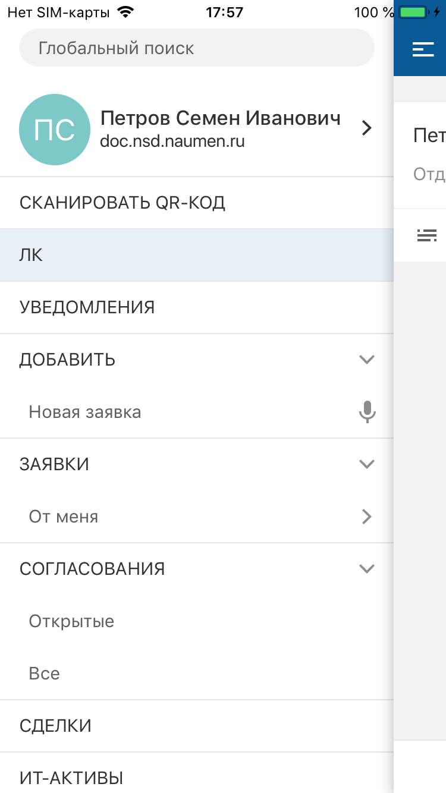
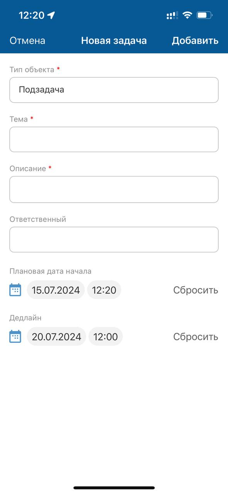

# Добавить. iOS

[Для Android](../../how-to-use-2/actions-2/add-2)

- [В меню приложения](./add#01)
- [Голосовое создание](./add#02)
- [На экране карточки объекта](./add#03)
- [В списке связанных / вложенных объектов](./add)

## В меню приложения {#01}

#### Описание

Добавление объекта доступно в онлайн-режиме.

Возможность добавления объекта зависит от настройки приложения и прав доступа текущего пользователя.

#### Место в интерфейсе

Меню мобильного приложения "Добавить".

#### Выполнение действия

1. В меню мобильного приложения "Добавить" нажмите пункт добавления объекта.

    
2. На экране добавления заполните значения атрибутов объекта. Набор атрибутов зависит от настройки мобильного приложения.

    Для ввода значения отдельного атрибута нажмите на поле атрибута и укажите его значение, подробнее смотри в разделе [Типы атрибутов на формах действий. iOS](./attributes-types).

    На экране добавления может отображаться поле выбора типа. Выбор типа осуществляется на отдельном экране. Выбранный тип определяет набор полей на экране добавления объекта.
3. Нажмите **Добавить** на верхней панели экрана.

    

#### Результат действия

На экране отобразится карточка созданного объекта.

## Голосовое создание {#02}

#### Описание

Добавление объекта голосом доступно в онлайн и офлайн-режиме.

Возможность добавления объекта зависит от настройки приложения и прав доступа текущего пользователя.

#### Место в интерфейсе

Меню мобильного приложения "Добавить". Действие инициируется при нажатии иконки **микрофон** рядом с пунктом добавления объекта.

Экран добавления объекта. Действие инициируется при нажатии кнопки **Создать голосом**.

#### Выполнение действия

1. Нажмите иконку **микрофон** или  кнопку **Создать голосом**.
2. Откроется экран записи голоса.

    Нажмите иконку **Начать запись**, произнесите фразу, например, описание задачи, и нажмите иконку **Остановить запись**.

    После остановки записи голоса, можно продолжить запись, прослушать запись, удалить запись или создать карточку объекта.
3. Нажмите **Добавить объект**.

#### Результат действия

На экране отобразится карточка созданного объекта.

Особенности офлайн-режима:

- После добавления объекта голосом, он помещается в очередь синхронизации. На экране отображается сообщение: "Объект добавлен в очередь синхронизации и будет отправлен при появлении доступа к серверу".
- Для объектов, добавленных голосом, в очереди синхронизации в дополнение к основным параметрам хранятся: код формы, с которой производилось добавление, текст транскрипции и аудио-файл.

Подробное описание офлайн-режима приведено в разделе [Офлайн-режим. iOS](../offline).

## На экране карточки объекта {#03}

#### Описание

Добавление объекта доступно в онлайн-режиме.

Возможность добавления объекта зависит от настройки приложения и прав доступа текущего пользователя.

#### Место в интерфейсе

Экран карточки объекта. Действие инициируется в меню действий с объектом или при нажатии кнопки, иконки, ссылки.

#### Выполнение действия

1. Нажмите **Добавить объект** (Создать подзадачу).

     
2. На экране добавления заполните значения атрибутов объекта. Набор атрибутов зависит от настройки мобильного приложения.

    Для ввода значения отдельного атрибута нажмите на поле атрибута и укажите его значение, подробнее смотри в разделе [Типы атрибутов на формах действий. iOS](./attributes-types).

    На экране добавления может отображаться поле выбора типа. Выбор типа осуществляется на отдельном экране. Выбранный тип определяет набор полей на экране добавления объекта.
3. Нажмите **Добавить** на верхней панели.

    
