[Для Android](../../how-to-use-2/actions-2/attributes-types-2)

- [Строковое поле ввода](./attributes-types#string)
- [Поле ввода текста](./attributes-types#text)
- [Поле ввода временного интервала](./attributes-types#interval)
- [Поле ввода гиперссылки](./attributes-types#hyperlink)
- [Поле ввода даты и времени](./attributes-types#date)
- [Список выбора](./attributes-types#list)
- [Дерево выбора](./attributes-types#tree)
- [Файлы](./attributes-types#file)

### Строковое поле ввода {#string}

Для атрибутов типа "Строка", "Целое число", "Вещественное число".

#### Отображение строкового поля ввода

Строковое поле ввода отображается на экране как однострочное поле.

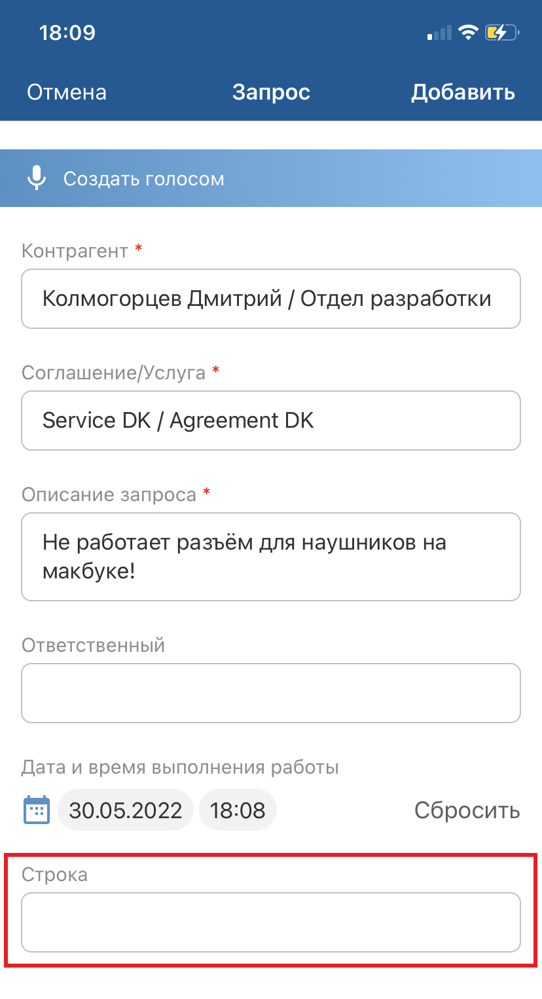{width=163 height=300}

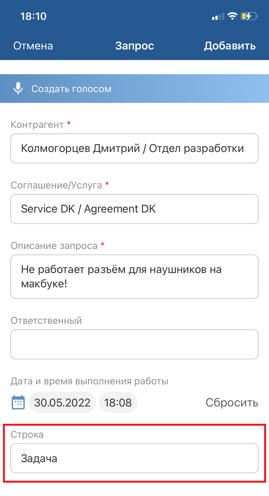{width=163 height=300}

#### Редактирование значения строкового поля

Чтобы перейти в режим редактирования, нажмите на поле атрибута. В поле ввода установится курсор, на экране отобразится стандартная клавиатура для ввода текста. При редактировании значения числового атрибута на клавиатуре отображается раскладка с цифрами. Введите значение атрибута и нажмите **Готово**.

<note type="info">

В мобильном приложении не применяется маска в полях ввода строковых атрибутов, настроенная в SMP.

</note>

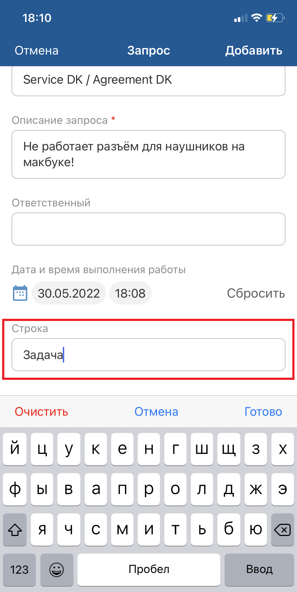{width=151 height=300}

#### Заполнение значения, используя сканер штрих-кодов

<note type="info">

Для использования сканера штрих-кодов необходимо разрешение на использование камеры. Разрешение запрашивается при первом обращении к сканеру штрих-кодов.

</note>

Перейдите в режим редактирования атрибута и нажмите иконку вызова сканера в поле атрибута. Распознанное значение заменит собой текущее значение поля ввода.

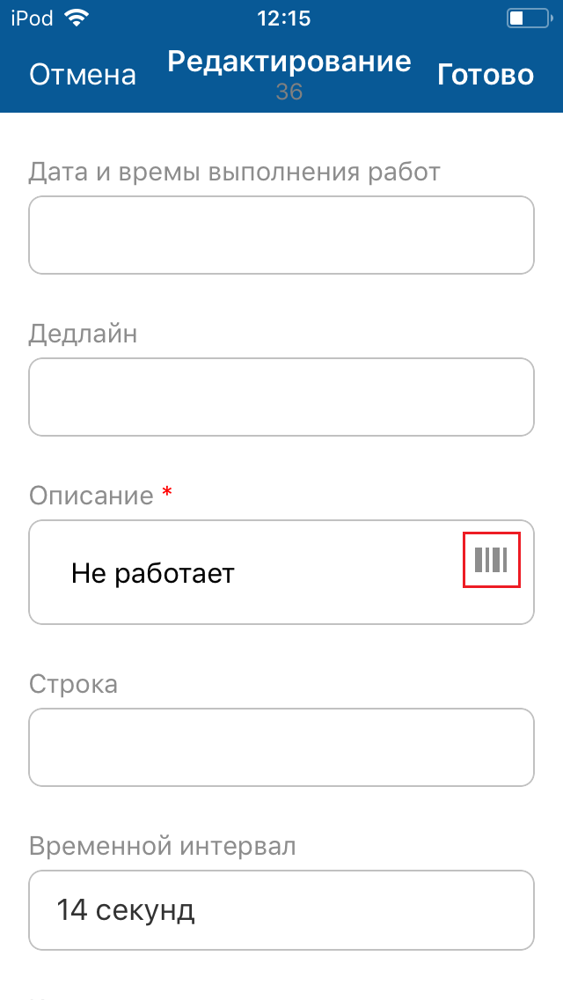{width=169 height=300}

### Поле ввода текста {#text}

Для атрибутов типа "Текст", "Текст в формате RTF".

<note type="info">

Для атрибутов типа "Текст с подсветкой синтаксиса" поля ввода в мобильном приложении не поддерживаются и атрибуты данных типов не отображаются на карточках и формах в мобильном приложении.

</note>

#### Отображение текстового поля

Текстовое поле ввода текста отображается как многострочное поле.

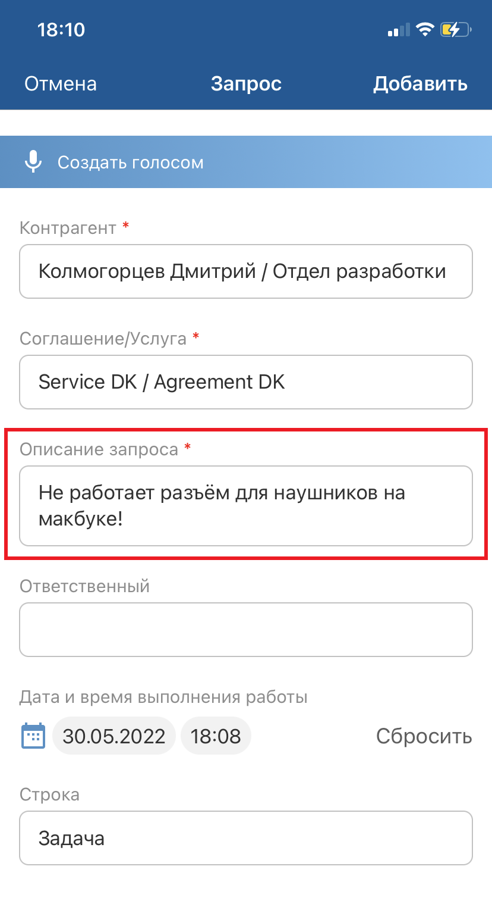{width=163 height=300}

#### Редактирование значения  атрибута типа "Текст"

Чтобы перейти на экран редактирования атрибута, нажмите на поле атрибута. На экране устанавливается курсор в поле ввода текста и отображается клавиатура для ввода текста. Введите значение атрибута и нажмите **Готово** на верхней панели экрана.

#### Редактирование значения  атрибута типа "Текст в формате RTF"

При редактировании значения атрибута типа "Текст в формате RTF" стандартная клавиатура для ввода текста дополняется панелью инструментов и возможностью переключаться между клавиатурой и панелью форматирования текста.

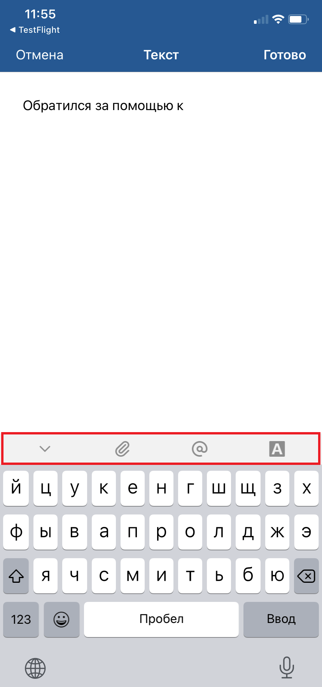{width=141 height=300}

Панель форматирования текста позволяет:

- определить формат абзаца (заголовок, подзаголовок, обычный, моноширинный);
- задать форматирование текста (жирный, курсив, подчеркнутый, зачеркнутый);
- определить формат списка (нумерованный, маркированный);
- увеличить и уменьшить отступ;
- выделить цитату.

Форматирование текста будет сохранено при переключении на клавиатуру.

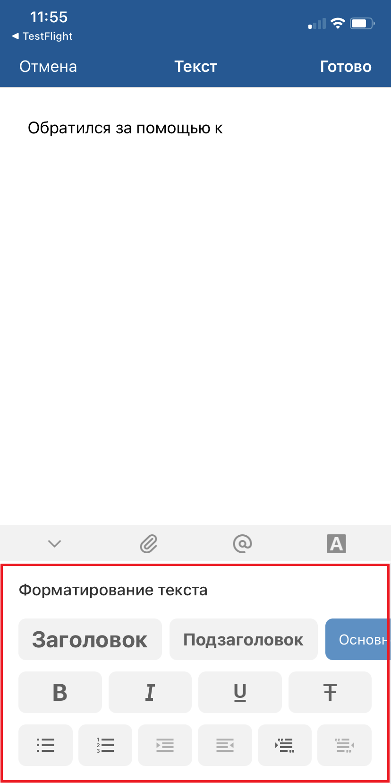{width=150 height=300}

Панель инструментов позволяет:

- сворачивать клавиатуру (чтобы свернутая клавиатура отобразилась, необходимо нажать на область курсора);
- переключаться между клавиатурой и панелью форматирования текста;
- прикреплять изображение в формате jpg, jpeg, gif, png;
- сканировать штрих-код;
- добавлять упоминание объектов — нажмите иконку {width=18 height=18}, затем в меню выберите вид упоминания в списке. Если настроено одно упоминание, то выбор пропускается. На отдельном экране выберите объекты для упоминания и сохраните выбор. Упоминание отобразится в тексте.

    Иконка {width=18 height=18} отображается, если:
    - мобильное устройство имеет доступ в интернет;
    - пользователь обладает правами на добавление упоминаний;
    - пользователь не имеет ограничений, наложенных контекстными переменными в упоминаниях;
    - в мобильном приложении настроено правило упоминаний с префиксом "@";
    - пользователю доступно упоминание по префиксу "@".

#### Заполнение значения, используя сканер штрих-кодов

<note type="info">

Для использования сканера штрих-кодов необходимо разрешение на использование камеры. Разрешение запрашивается при первом обращении к сканеру штрих-кодов.

</note>

Перейдите на экран редактирования атрибута и нажмите иконку вызова сканера в поле атрибута. Распознанное значение записывается с места, в котором установлен курсор. После распознанного значения вставляется перевод строки.

Для текст в формате RTF на экране редактирования атрибута на панели инструментов отображается иконка вызова сканера штрих-кодов. Работа со сканером штрих-кодов выполняется аналогично вызову сканера рядом с полем атрибута.

<note type="info">

Иконка сканирования штрих-кода отображается при наличии соответствующих настроек в веб-интерфейсе.

</note>

### Поле ввода временного интервала {#interval}

Для атрибутов типа "Временной интервал".

#### Отображение поля ввода временного интервала

Поле ввода временного интервала отображается на экране как однострочное поле.

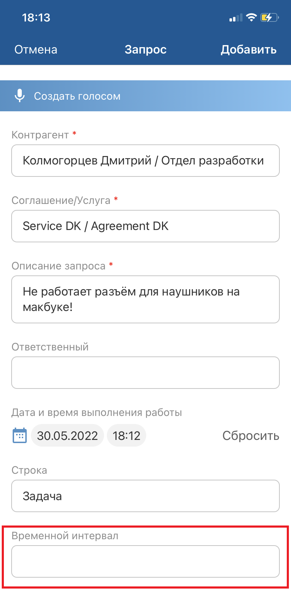{width=147 height=300}

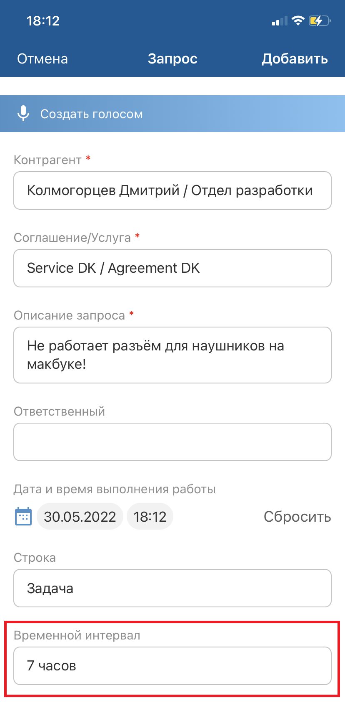{width=147 height=300}

#### Редактирование значения временного интервала

Чтобы перейти на экран редактирования атрибута, нажмите на поле атрибута.

Введите значение атрибута и выберите единицу измерения (по умолчанию выбрано "Секунд"). Единица измерения выбирается из списка при помощи стандартных виджетов iOS. Нажмите **Готово** на верхней панели экрана.

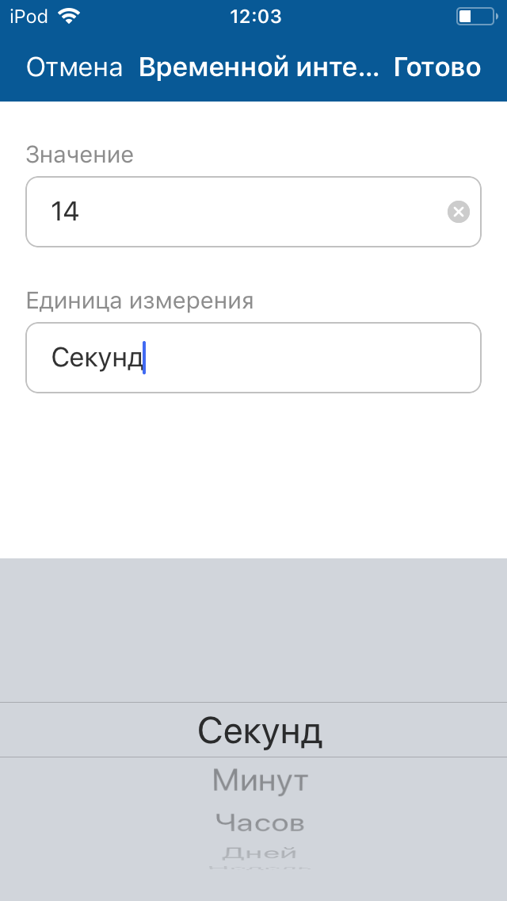{width=169 height=300}

### Поле ввода гиперссылки {#hyperlink}

Для атрибутов типа "Гиперссылка".

#### Отображение поля с гиперссылкой

Поле ввода гиперссылки отображается на экране как однострочное поле.

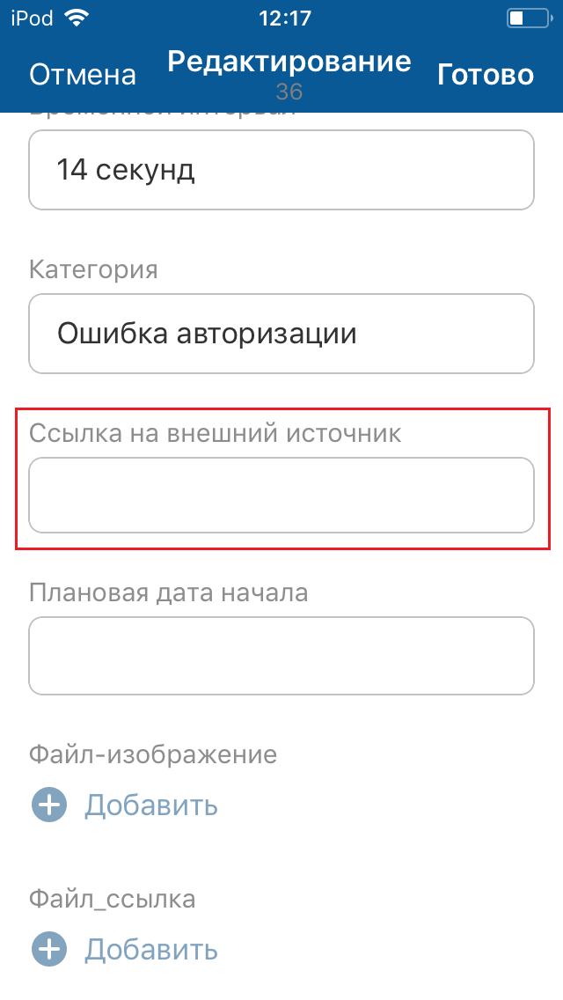{width=169 height=300}

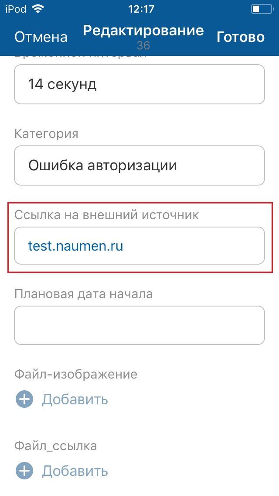{width=169 height=300}

#### Редактирование значения гиперссылки

Чтобы перейти на экран редактирования атрибута, нажмите на поле атрибута. На экране редактирования заполните поля ввода названия гиперссылки и адреса ссылки. Нажмите **Готово** на верхней панели экрана.

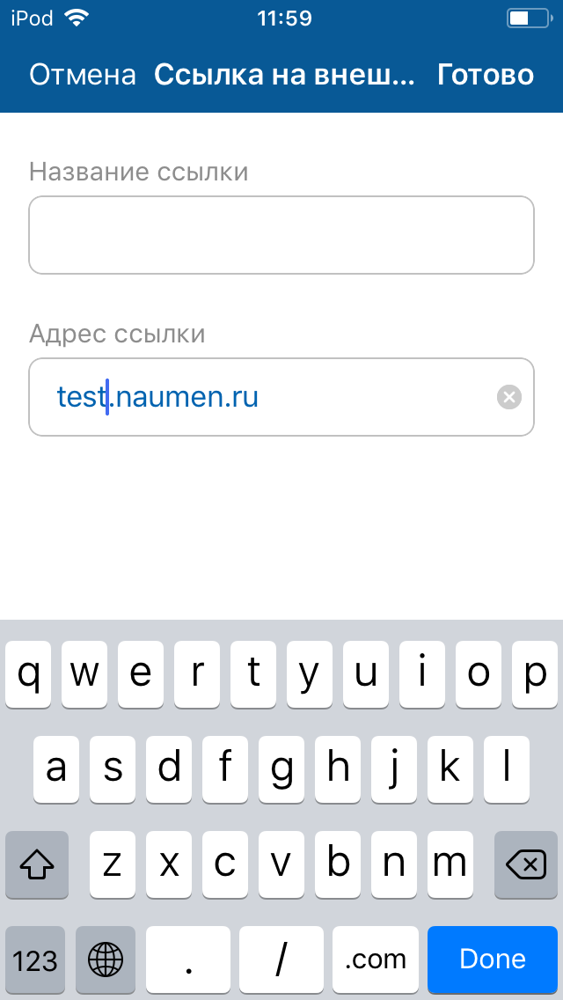{width=169 height=300}

### Поле ввода даты и времени {#date}

Для атрибутов типа "Дата" и "Дата и время".

#### Отображение поля ввода даты/времени

Поле ввода даты и времени отображается на экране как однострочное поле с иконкой {width=16 height=18}. Если поле заполнено, то дополнительно отображается **Сбросить** для удаления значения.

Время отображаются в часовом поясе, установленном для пользователя в системе. Если часовой пояс пользователя не указан, то используется часовой пояс, указанный в мобильном устройстве. Загрузка часового пояса пользователя производится один раз за сеанс при входе в мобильное приложение.

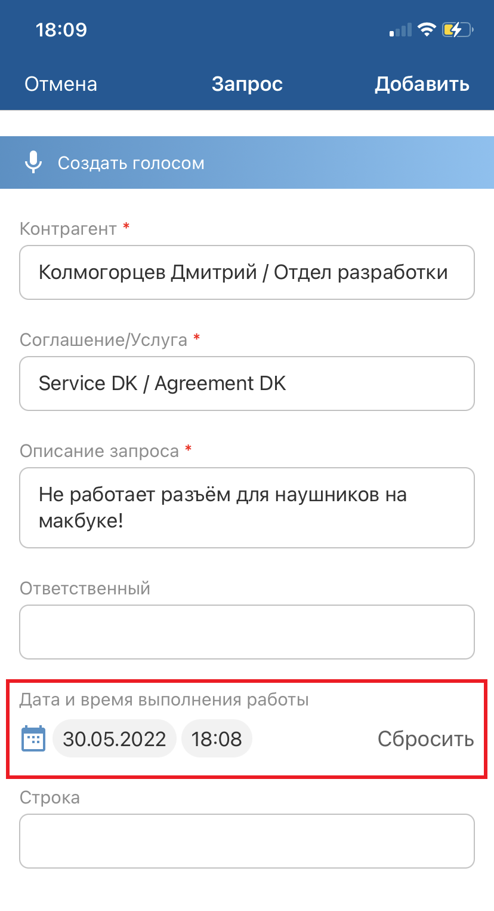{width=163 height=300}

#### Редактирование даты и времени

При переходе к виджету редактирования, если поле заполнено, то его значение сохраняется и отображается в виджете. Если поле пустое, то при нажатии на иконку {width=16 height=18} оно заполняется текущим значением.

Для редактирования атрибута типа "Дата" и "Дата/время" используется несколько виджетов:

- "Календарь",

    Нажмите иконку {width=16 height=18} или на значение даты. Выберите значение даты в календаре. Поле заполнится выбранной датой.

    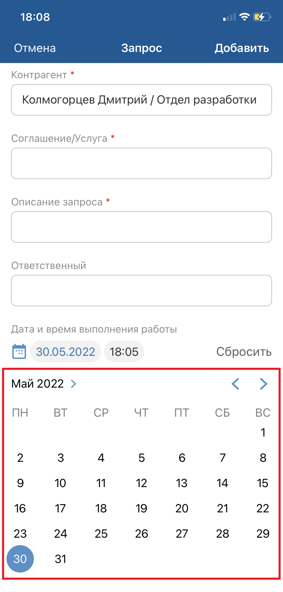{width=143 height=300}
- "Месяц и год".

    Откройте виджет "Календарь" и нажмите на месяц и год.

    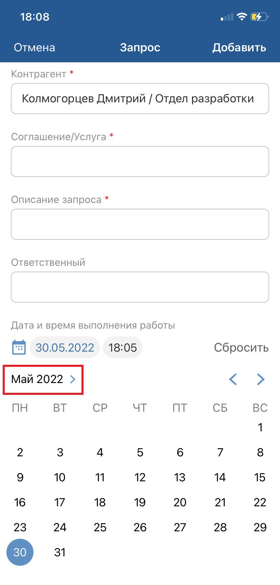{width=143 height=300}

    Откроется виджет "Месяц и год".

    После выбора значения откроется виджет "Календарь" с выбранным месяцем и годом.

    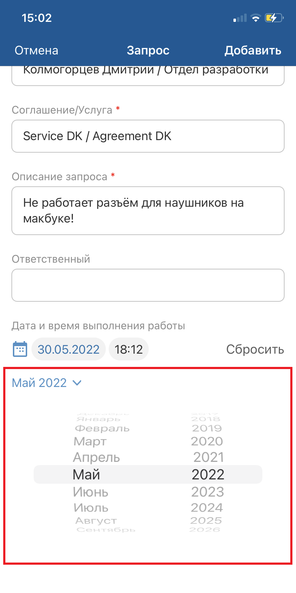{width=150 height=300}
- "Часы и минуты".

    Откройте виджет "Календарь" и нажмите на поле со значением времени.

    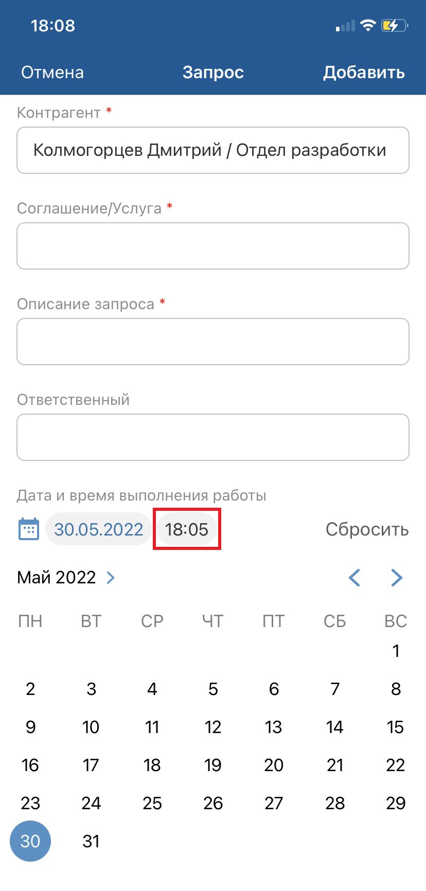{width=143 height=300}

    Откроется виджет "Часы и минуты". После выбора значения поле заполнится выбранным временем.

    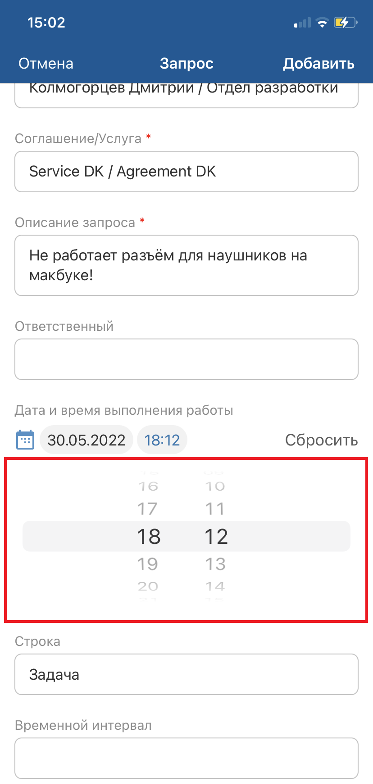{width=143 height=300}

<note type="info">

Часть значений в виджете может быть не доступна для выбора, если настроены ограничения значений атрибута "Дата", "Дата/время". Значения, недоступные для выбора, подсвечиваются серым.

</note>

Особенности редактирования атрибута:

- Часть значений в виджете может быть не доступна для выбора, если настроены ограничения значений атрибута "Дата", "Дата/время" (определяются параметрами "Значение атрибута допустимо указывать" и "Дополнительное ограничение на ввод даты").

    Значения, недоступные для выбора, подсвечиваются в виджете серым.
- Если доступных для выбора значений даты/времени нет, то поле атрибута не доступно для редактирования.
- Если атрибут заполнен недоступным значением, то под его полем отображается информационное сообщение, сохранение экрана редактирования не выполняется.

### Список выбора {#list}

Для атрибутов типа "Ссылка на бизнес-объект", "Набор ссылок на бизнес-объекты", "Набор типов класса", "Набор элементов справочника", "Элемент справочника", "Тип объекта".

#### Отображение списка выбора

Список выбора отображается на экране как однострочное поле. В поле может отображаться последнее выбранное значение или значение по умолчанию.

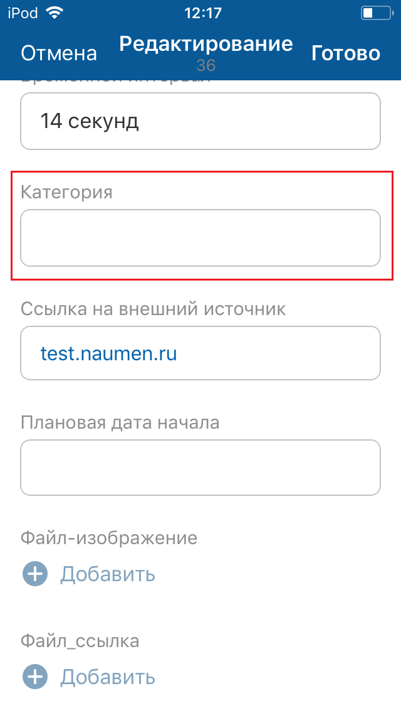{width=169 height=300}

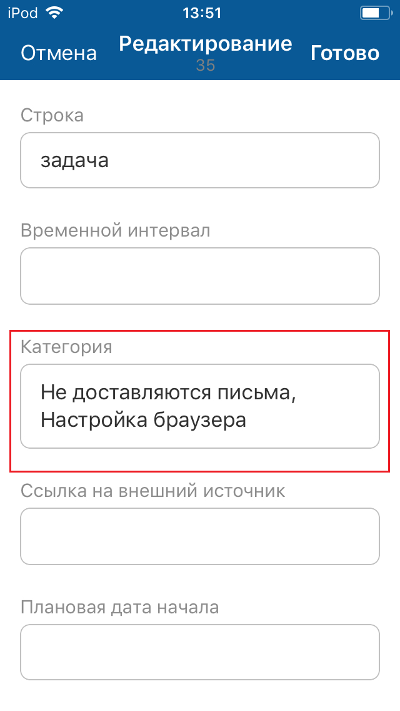{width=169 height=300}

#### Редактирование значения атрибута в списке выбора

Чтобы перейти на экран редактирования атрибута, нажмите на поле атрибута. На экране отображаются значения, доступные для выбора.

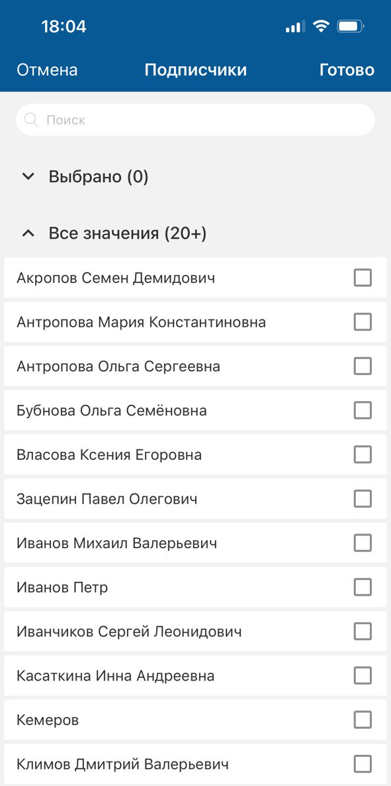{width=149 height=300}

Чтобы выбрать элемент, нажмите на его название. Выбранный элемент отмечается в списке соответствующим символом и дополнительно отображается в блоке "Выбрано".

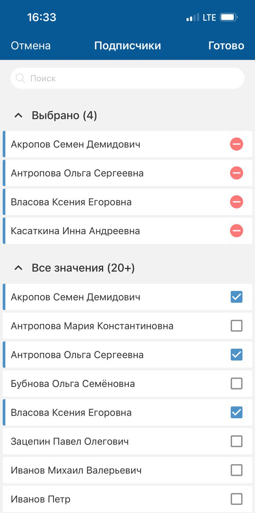{width=150 height=300}

Для выбора значения можно воспользоваться поиском. Нажмите на поле поиска, начните вводить поисковый запрос и в блоке "Результат поиска" выберите нужное значение из предложенных вариантов.

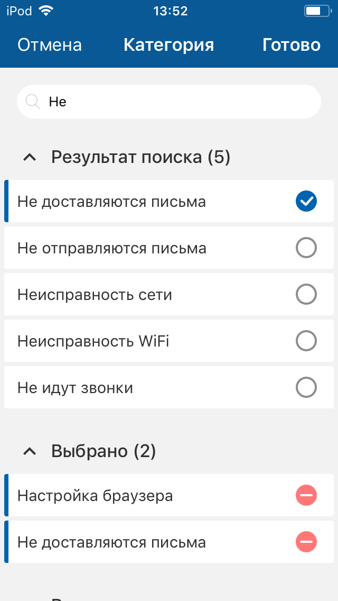{width=169 height=300}

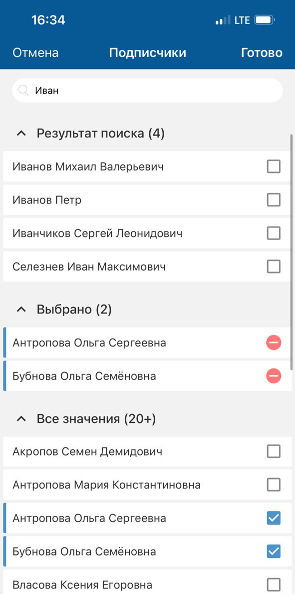{width=149 height=300}

#### Заполнение значения, используя сканер штрих-кодов

<note type="info">

Для использования сканера штрих-кодов необходимо разрешение на использование камеры. Разрешение запрашивается при первом обращении к сканеру штрих-кодов.

</note>

Перейдите на экран редактирования атрибута и нажмите иконку вызова сканера в поле атрибута. Распознанное значение записывается в поле поиска и на экране отображаются результаты поиска. Выберите значение атрибута из предложенных вариантов.

<note type="info">

Иконка сканирования штрих-кода отображается при наличии соответствующих настроек в веб-интерфейсе.

</note>

### Дерево выбора {#tree}

Для атрибутов "Ответственный" (responsible), "Соглашение" (agreement), "Услуга" (service), атрибутов типа "Агрегирующий".

С версии SMP 4.20 для атрибутов типа "Ссылка на бизнес-объект", "Набор ссылок на бизнес-объекты", "Обратная ссылка", "Элемент справочника", "Набор элементов справочника", "Набор типов класса", "Тип объекта".

#### Отображение дерева выбора

Дерево выбора отображается на экране как однострочное поле. В поле может отображаться последнее выбранное значение или значение по умолчанию.

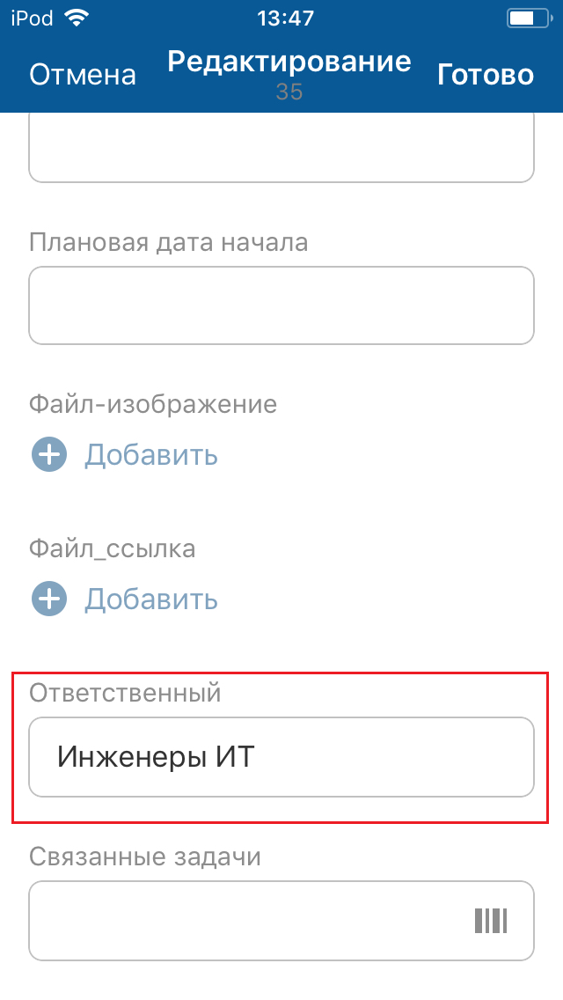{width=169 height=300}

#### Редактирование значения атрибута в дереве выбора

Чтобы выбрать значение атрибута, нажмите на поле атрибута. Отобразится экран редактирования. На верхней панели экрана отображаются: **Отмена**, название атрибута и **Готово**.

Доступные для выбора элементы отображаются на экране в виде иерархического дерева: ветви, содержащие вложенные элементы, и листья.

В дереве выбора могут отображаться папки, если в параметрах атрибута настроено представление для редактирования с папками. Сами папки не доступны для выбора

Выбор элементов на экране:

- При нажатии на ветвь дерева закрытая ветвь открывается, открытая ветвь сворачивается. При нажатии на иконку справа от ветви элемент выбирается.
- При нажатии на лист дерева и на иконку справа элемент выбирается.
- Выбор снимается при нажатии на элемент, который уже был выбран.

Выбранный элемент отмечается в дереве соответствующим символом и отображается в поле выбранного значения.

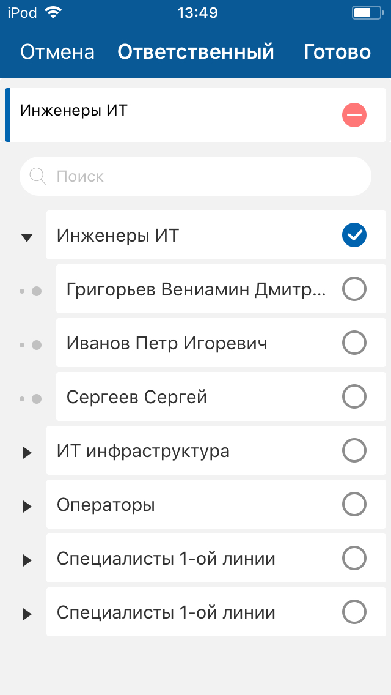{width=169 height=300}

Для выбора значения можно воспользоваться поиском. Нажмите на поле поиска, начните вводить поисковый запрос и в блоке "Результат поиска" выберите нужное значение из предложенных вариантов.

### Файлы {#file}

Для атрибутов типа "Файл".

#### Прикрепление файла как значения атрибута

Чтобы прикрепить файл:

1. В поле атрибута типа "Файл" нажмите **Добавить**.
2. Укажите источник добавления файла.

    Возможные источники добавления файла:
    - Камера — для добавления нового фото или видео (для выбора режим "фото" или "видео" используется переключатель, по умолчанию выбран режим "фото").
    - Изображение — для добавления изображения и видео из библиотеки (галереи) используется специальный виджет с возможностью множественного добавления файлов.
    - Файл — для добавления любого типа файлов с помощью стандартного менеджера файлов с возможностью множественного добавления файлов.

    В списке источников могут отображаться другие программы и приложения, позволяющие работать с файлами на мобильном устройстве.
3. Выберите файл или несколько файлов, если выбранный источник поддерживает множественный выбор и загрузку файлов.

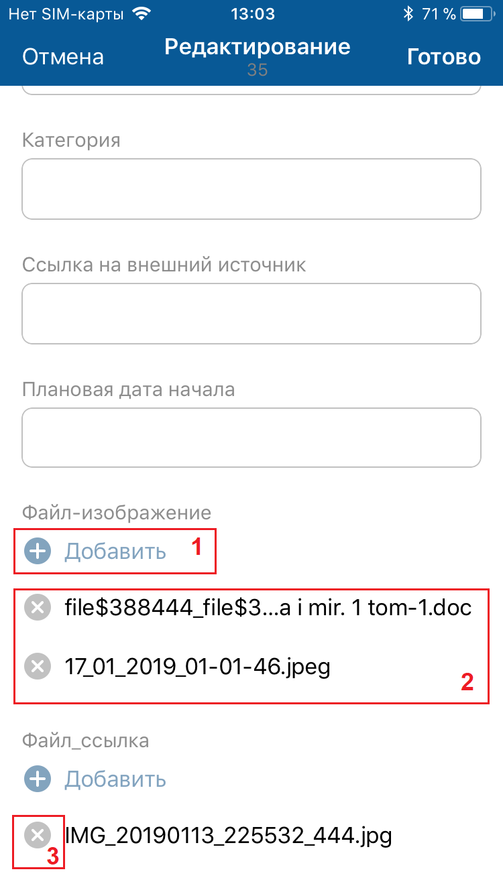{width=169 height=300}

Новый файл отобразится в списке значений атрибута, на время загрузки файла отображается прогресс-бар.

<note type="info">

Размер загружаемых изображений уменьшается, если в настройках приложения включен параметр "[Сжимать отправляемые изображения](../navigation/settings/app-settings#02)".

</note>

Каждый файл проверяется на соответствие наложенным ограничениям на загрузку файлов, которые установлены конфигурационном файле [dbaccess.properties](../../how-to-configure/dbaccess-properties). Если в время загрузки файла произошла ошибка, то название файла выделяется красным и рядом с названием файла отображается иконка {width=17 height=18}.

При нажатии на иконку {width=17 height=18} открывается текст сообщения об ошибке и меню возможных действий с проблемным файлом:

- "Повторить" — для повторной попытки загрузки файла.
- "Убрать из списка" — для удаления файла из списка значений атрибута.
- "Отмена" — для закрытия меню.

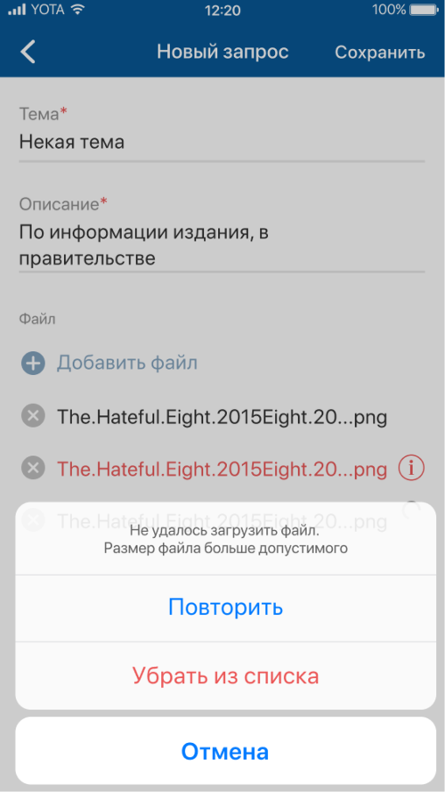{width=169 height=300}
