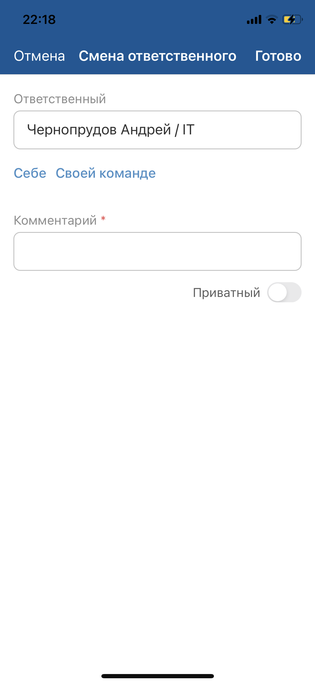

# Сменить ответственного. iOS

[Для Android](../../how-to-use-2/actions-2/change-assignee-2)

### Описание

Смена ответственного доступна в онлайн-режиме.

Возможность смены ответственного зависит от настройки мобильного приложения и прав доступа текущего пользователя.

### Место в интерфейсе

Экран списка объектов. Действие инициируется в меню действий с объектом.

Экран карточки объекта. Действие инициируется в меню действий с объектом.

### Выполнение действия

Нажмите **Изменить ответственного**.

На экране "Смена ответственного" заполните значения полей и нажмите **Готово** на верхней панели.

- В поле "Ответственный" выберите сотрудника или команду. Для заполнения значения используется [Дерево выбора](./attributes-types#tree).

    
- Под полем "Ответственный" могут отображаться кнопки (если у пользователя есть права):
    - **Себе** — принять объект в свою ответственность;
    - **Своей команде** — передать объект своей команде.
- Для заполнения комментария нажмите на поле комментария и на отдельном экране заполните текст комментария.

    Укажите приватность (если у пользователя есть права).

    Добавьте упоминание — нажмите иконку , затем в меню выберите вид упоминания в списке. Если настроено одно упоминание, то выбор пропускается. На отдельном экране выберите объекты для упоминания и сохраните выбор. Упоминание отобразится в тексте.

    Иконка  отображается, если:
    - мобильное устройство имеет доступ в интернет;
    - в мобильном приложении настроено правило упоминаний;
    - пользователь может добавлять упоминания и не имеет ограничений, наложенных контекстными переменными в упоминаниях.

### Результат действия

Ответственный за объект изменен.

Если был добавлен комментарий, то он отображается на экране карточки объекта, а также на экране "Комментарии ()", подробнее смотри в разделе [Просмотр комментариев. iOS](../comments/comment-view).
