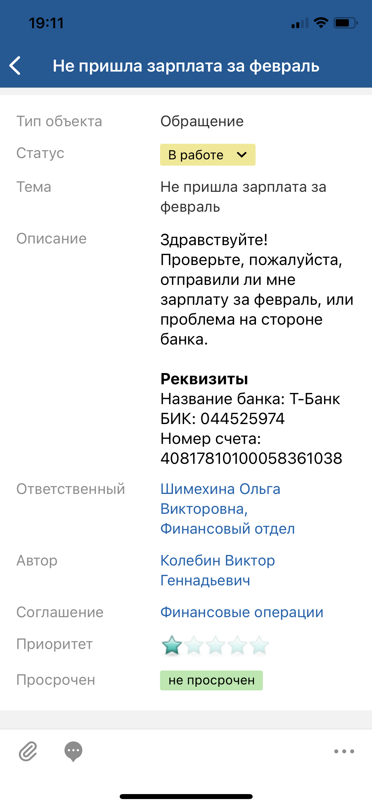
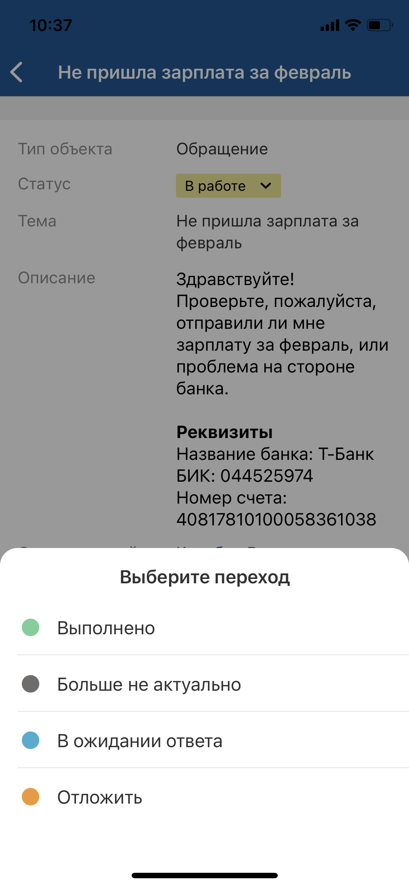
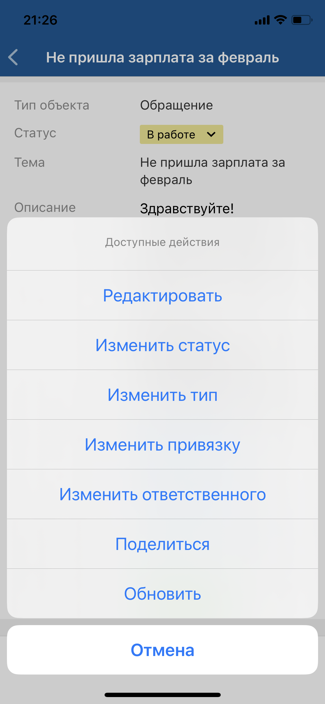
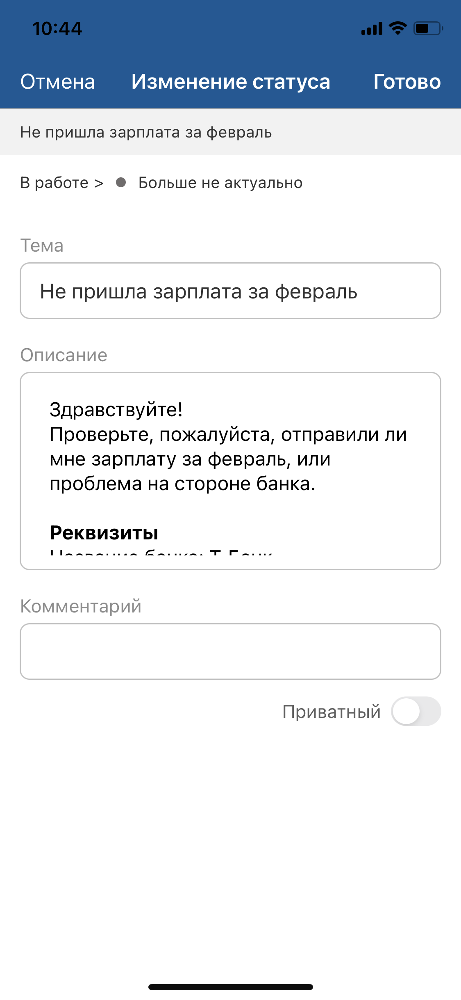

[Для Android](../../how-to-use-2/actions-2/change-state-2)

- [Быстрая смена статуса](./change-state#01)
- [Расширенная смена статуса](./change-state#02)

## Быстрая смена статуса {#01}

#### Описание

Смена статуса доступна в онлайн-режиме.

Возможность смены статуса зависит от настройки приложения и прав доступа текущего пользователя.

#### Место в интерфейсе

Экран карточки объекта.

#### Выполнение действия

Нажмите на шеврон в значении атрибута "Статус" (выделен цветом) и выберите целевой статус.

{width=139 height=300}

{width=139 height=300}

#### Результат действия

Статус объекта будет изменен.

## Расширенная смена статуса {#02}

#### Описание

Смена статуса доступна в онлайн-режиме.

Возможность смены статуса зависит от настройки приложения и прав доступа текущего пользователя.

#### Место в интерфейсе

Экран списка объектов. Действие инициируется в меню действий с объектом.

Экран карточки объекта. Действие инициируется в меню действий с объектом.

#### Выполнение действия

Нажмите **Изменить статус** и выберите целевой статус.

{width=139 height=300}

{width=139 height=300}

Если смена статуса выполняется без редактирования атрибутов, то статус объекта будет изменен.

Если при смене статуса необходимо изменить значения атрибутов, то откроется экран "Изменение статуса". Заполните значения атрибутов объекта и нажмите **Готово** на верхней панели.

- Для ввода значения отдельного атрибута нажмите на поле атрибута и укажите его значение, подробнее смотри в разделе [Типы атрибутов на формах действий. iOS](./attributes-types).

    {width=139 height=300}
- Для заполнения комментария нажмите на поле комментария и на отдельном экране заполните текст комментария.

    Укажите приватность (если у пользователя есть права).

    Добавьте упоминание — нажмите иконку {width=18 height=18}, затем в меню выберите вид упоминания в списке. Если настроено одно упоминание, то выбор пропускается. На отдельном экране выберите объекты для упоминания и сохраните выбор. Упоминание отобразится в тексте.

    Иконка {width=18 height=18} отображается, если:
    - мобильное устройство имеет доступ в интернет;
    - в мобильном приложении настроено правило упоминаний;
    - пользователь может добавлять упоминания и не имеет ограничений, наложенных контекстными переменными в упоминаниях.

#### Результат действия

Статус объекта изменен.

Если при смене статуса были заполнены атрибуты или добавлен комментарий, изменения сохраняются и отображаются на экране карточки объекта.

Добавленный комментарий отображается также на экране "Комментарии ()", подробнее смотри в разделе [Просмотр комментариев. iOS](../comments/comment-view).
