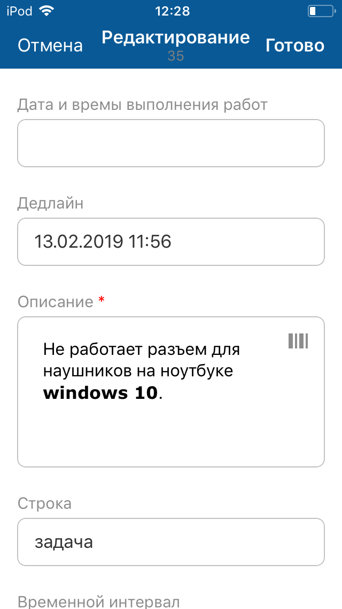

[Для Android](../../how-to-use-2/actions-2/edit-2)

### Описание

Редактирование доступно в онлайн-режиме.

Возможность редактирования зависит от настройки приложения и прав доступа текущего пользователя.

### Место в интерфейсе

Экран списка объектов. Действие инициируется в меню действий с объектом.

Экран карточки объекта. Действие инициируется в меню действий с объектом.

### Выполнение действия

1. Нажмите **Редактировать**.

    {width=139 height=300}
2. На экране "Редактирование" заполните значения атрибутов объекта. Набор атрибутов зависит от настройки мобильного приложения.

    Для ввода значения отдельного атрибута нажмите на поле атрибута и укажите его значение, см. подробнее [Типы атрибутов на формах действий. iOS](./attributes-types).
3. Нажмите **Готово** на верхней панели экрана "Редактирование".

    {width=169 height=300}

### Результат действия

Значения атрибутов объекта изменены.

Изменения сохраняются и отображаются на экране карточки объекта.
