# Карточка. iOS

[Для Android](../how-to-use-2/card-2)

- [Экран карточки объекта](#card)
- [Экран списка объектов на карточке](#list)
- [Действия с объектом](#action)

### Экран карточки объекта

#### Описание

Экран карточки объекта содержит информацию об отдельном объекте.

#### Переход на экран

- Меню мобильного приложения → Название карточки объекта.
- Экран списка объектов → Название карточки объекта.
- Экран карточки объекта → Ссылка с названием карточки объекта.
- Всплывающее уведомление (пуш-сообщения)  → Ссылка с названием карточки объекта.

#### Содержание экрана

На экране списка объектов отображаются:

- Название карточки.
- Атрибуты объекта.

    На экране может отображаться один или несколько блоков с атрибутами. У блока может быть отдельный заголовок. Блоки могут отображаться в развернутом или свернутом виде. Каждый атрибут в блоке отображается с отдельной строки.

    Атрибут, у которого не определено значение, не отображается.

    Атрибуты "Дата" и "Дата/время":
    - Все значения атрибутов типа "Дата" и "Дата/время" отображаются в часовом поясе, установленном для пользователя в системе. Если часовой пояс пользователя не указан, то используется часовой пояс, указанный в мобильном устройстве. Загрузка часового пояса пользователя производится один раз за сеанс при входе в мобильное приложение.
    - Время может быть показано с секундами и миллисекундами, если их отображение настроено для атрибута типа "Дата/время"в веб-приложении.

    Атрибуты типа "Текст в формате RTF" — панель форматирования текста отображается в зависимости от настройки атрибута.

    Файлы:
    - Каждый файл отображается с новой строки. Чтобы перейти на экран предпросмотра, нажмите на название файла.
    - Отображение атрибута зависит от представления для отображения, установленного в параметрах атрибута типа "Файл":
        - Изображение — файлы jpg, jpeg, gif, png, bmp, svg, svgz отображается в виде изображения.

            Файл .pdf будет отображаться как изображение, если в конфигурационном файле dbaccess.properties включен параметр ru.naumen.mobile.showPreviewForPdfFiles, см. [dbaccess.properties](../how-to-configure/dbaccess-properties).
        - Ссылка для скачивания — отображается название файла. На карточке объекта название файла является ссылкой для скачивания файла. В списке объектов название файла не является ссылкой.
- Встроенные приложения в виде виджета.

    Виджет содержит название, иконки  (развернуть на весь экран) и  (свернуть, если виджет сворачиваемый), основной блок.

    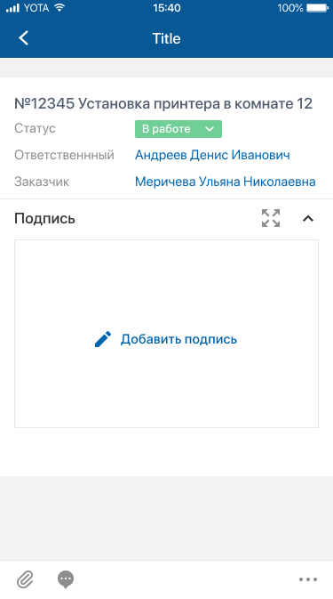

    При нажатии  приложение будет отображаться на отдельном экране. 
    		Верхняя панель экрана приложения содержит название и иконку "крестик" для закрытия экрана.

Отличия карточки архивного объекта: под блоком с названием объекта отображается плашка "В архиве".

#### Навигация на экране

Верхняя панель:

- Иконка возврата к предыдущему экрану (на верхней панели).

    При длинном нажатии (лонгтап) на иконку возврата открывается история посещений. Она отображается поверх экрана и содержит ссылки на ранее посещенные экраны: верхняя — на предыдущий экран, нижняя — на первый посещенный экран. Также в истории посещений отображаются переходы по пуш-сообщению или по ссылке на экран карточки.
    Чтобы скрыть историю посещений, нажмите вне ее области. 
    История посещений сбрасывается, если открывается меню приложения. 
    История посещений сохраняется в кеше приложения, обеспечивая доступ по ссылкам в офлайн-режиме.

Основной блок:

- Кнопка (иконка, ссылка) инициации выполнения действия с объектом. Подробнее смотри ниже [Кнопки на карточке](#but).
- Значение ссылочного атрибута является ссылкой на экран карточки объекта, если карточка соответствующего объекта доступна в мобильном приложении. Ссылка выделяется только цветом (активные объекты — голубым, архивные объекты — серым).
- Ссылочный атрибут и **списком ()** для перехода на отдельный экран списка значений атрибута.

    На экране карточки объекта отображается максимум 3 ссылки. Остальные значения ссылочного атрибута можно посмотреть на отдельном экране.

    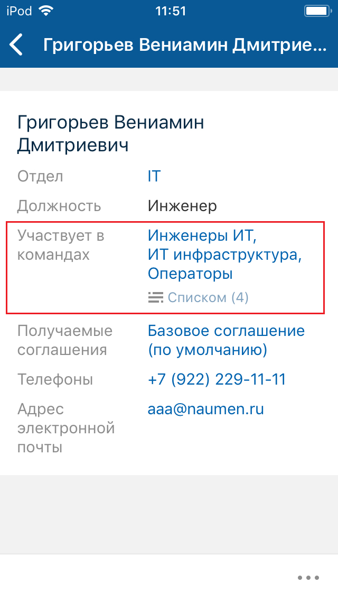 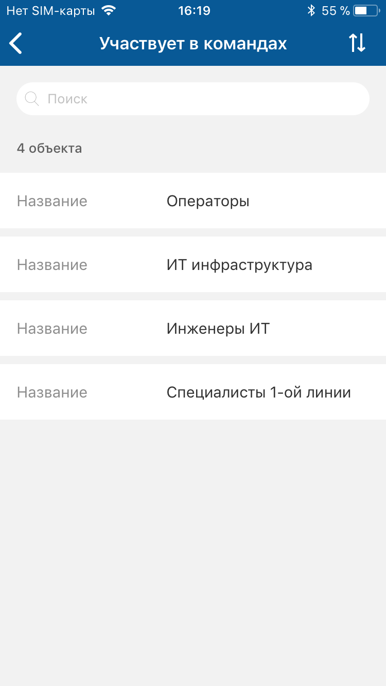
- Телефонный номер и электронный адрес в строковых и текстовых атрибутах (комментариях) является ссылкой для запуска соответствующей системной функции ОС мобильного устройства.
- Гиперссылка в тексте, при нажатии на ссылку выполняется переход по ссылке, подробнее смотри в разделе [Переход по ссылкам. iOS](./links).
- Текст в формате RTF, при однократном нажатии на текст выполняется переход на экран просмотра текста RTF.
- Изображение jpg, jpeg, gif, png, вставленное в текст RTF, при однократном нажатии на изображение, выполняется переход на экране предпросмотра, подробнее смотри в разделе [Файлы. iOS](./files).
- Кнопка для перехода на экран списка объектов (одна или несколько), подробнее смотри ниже [Экран списка объектов на карточке](#list).

    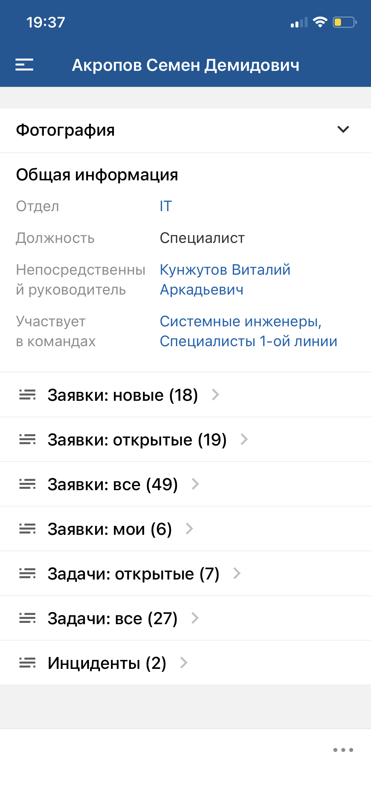
- Кнопка перехода на экран списка объектов (в группе списков), подробнее смотри ниже [Экран списка объектов на карточке](#list).

    Кнопки для перехода к списку объектов могут быть сгруппированы в блоки. Блок может быть свернутым или развернутым.

    

    Если блок содержит больше 10 кнопок, то отображается 9 кнопок и кнопка **Посмотреть все списки**. При нажатии на кнопку происходит переход к экрану со всеми списками, входящими в группу.

    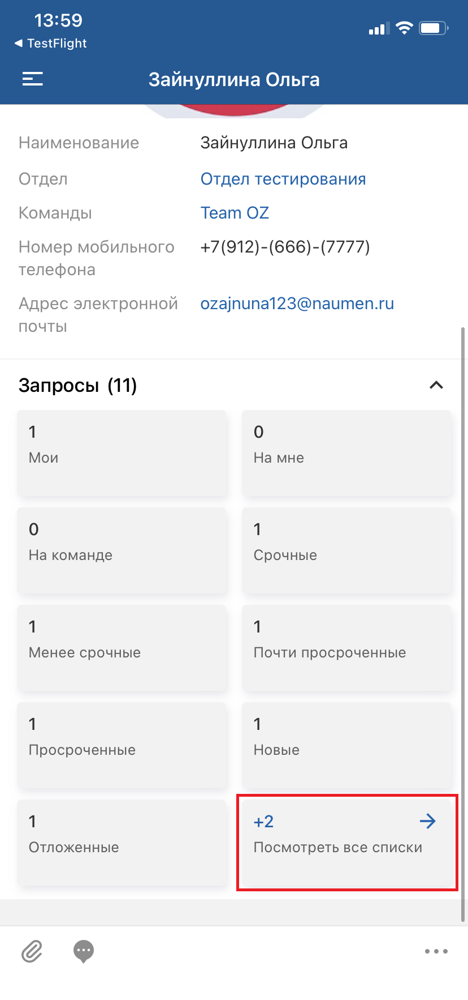 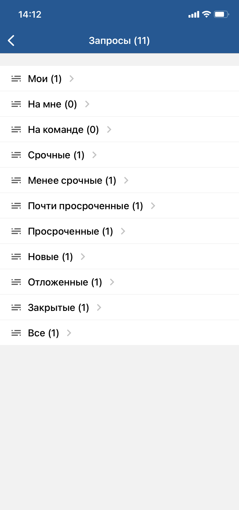
- Кнопка для переход на отдельный экран встроенного приложения. Кнопка содержит иконку и название приложения. При нажатии на блок приложения выполняется переход на экран приложения.

    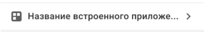

Нижняя панель:

- Иконка "Файлы" для перехода на экран "Файлы". Подробнее смотри в разделе [Файлы. iOS](./files).
- Иконка "Комментарии" для перехода на экран "Комментарии". Подробнее смотри в разделе [Просмотр комментариев. iOS](./comments/comment-view).
- Иконка вызова меню действий с объектом. Подробнее смотри ниже [Меню действий с объектом](#menu_obj).

## Экран списка объектов на карточке

#### Описание

На экране списка объектов, открытом из карточки объекта, отображаются объекты, связанные с объектом, в карточке которого размещена кнопка для перехода к списку, или вложенные в него.

#### Переход на экран

Экран карточки объекта → Кнопка перехода на экран списка объектов (отдельная).

Экран карточки объекта → Кнопка перехода на экран списка объектов (в группе списков).

#### Содержание экрана

- Название списка.
- Блок со списком объектов. Каждый объект отображается как отдельный элемент списка.

    Если в списке нет ни одного объекта, на экране отображается сообщение "Объекты отсутствуют".

В списке объектов доступен просмотр карточки объекта, не открывая ее. Механизм работает только на iOS-устройствах с поддержкой 3D-Touch технологии. Чтобы увидеть превью содержимого карточки, слегка нажмите на элемент списка (Peek). Чтобы перейти на карточку объекта, не убирая палец от экрана, сильнее нажмите (Pop) на элемент списка. Если было достаточно предпросмотра, то уберите палец с экрана.

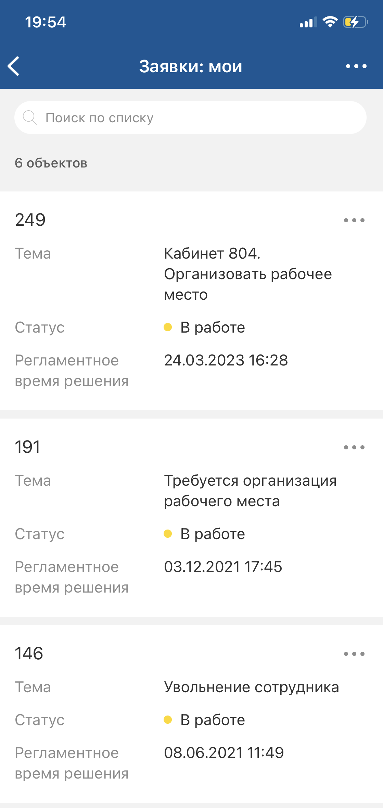

#### Поиск по подстроке. Фильтрация списка объектов на карточке

Поиск выполняется по значениям атрибутов, выведенных в список объектов.

Поисковый запрос может содержаться в начале, в середине или в конце значения атрибута.

<note type="info">

Фильтрация списка возможна только по атрибутам, выведенным в список объектов.

</note>

<note type="info">

Поиск не проводится по значениям атрибутов типа "Дата", "Дата/время", "Временной интервал", "Вещественное число", "Логический", "Счетчик времени", а также по значениям атрибутов с кодом "UUID" и вычислимых атрибутов.

</note>

Выполнение действия: В поле "Поиск" введите поисковый запрос (критерий фильтрации списка). В списке будут отображаться объекты, у которых значения атрибутов содержат искомый поисковый запрос.

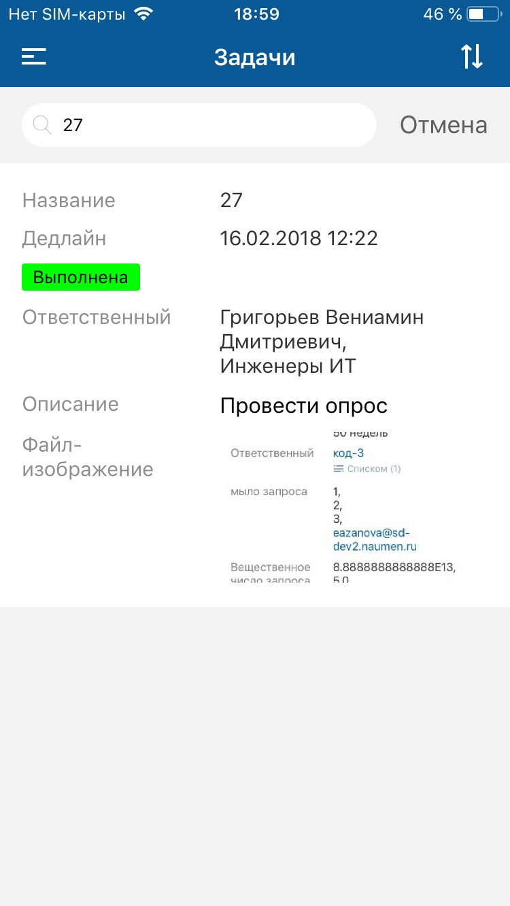

Чтобы сбросить поисковый запрос, нажмите "крестик" справа в поле поиска.

Чтобы вернуться в полный список, нажмите **Отмена** справа от поля поиска.

#### Сортировка списка объектов

Сортировка списка объектов позволяет выводить в список объекты в заданном порядке.

Сортировка списка в мобильном приложении дополняет сортировку, установленную при настройке списка, и имеет больший приоритет.

<note type="info">

Сортировка производится только по одному атрибуту.

</note>

Выполнение действия:

1. Нажмите иконку  (на верхней панели справа).

    Иконка сортировки списка  отображается, если не настроено ни одно действие для списка объектов. Если действие настроено, то отображается иконка меню действий , разверните меню и выберите пункт **Сортировать**.

    На экране отобразится форма настройки сортировки со списком атрибутов.

    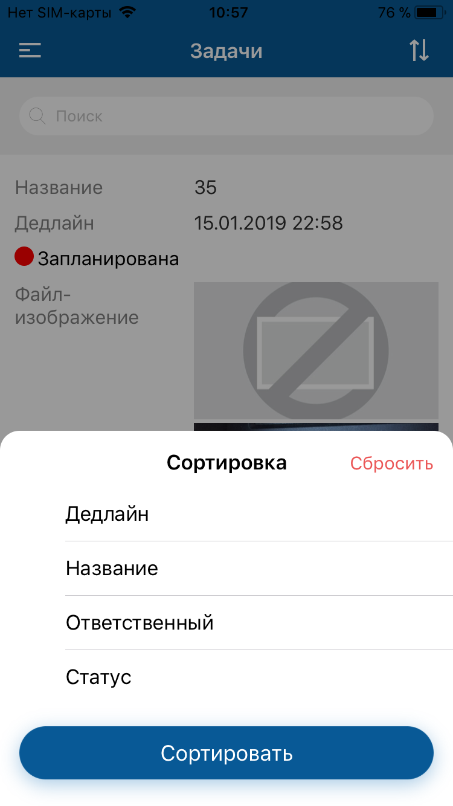
2. Нажмите на название атрибута, выбранный атрибут отмечается .

    В строке атрибута отобразится иконка настройки направления сортировки .

    Направление сортировки меняется при нажатии на название атрибута, по которому отсортирован список. Индикатор направления сортировки изменяется , сортировка выполняется в обратном порядке.

    Чтобы сбросить сортировку списка, нажмите **Сбросить** в правом верхнем углу формы.

    
3. Нажмите **Сортировать**.

Форма настройки сортировки закроется, атрибут для сортировки списка отобразится на экране списка над элементами списка. Список объектов будет отсортирован по выбранному атрибуту в заданном порядке.

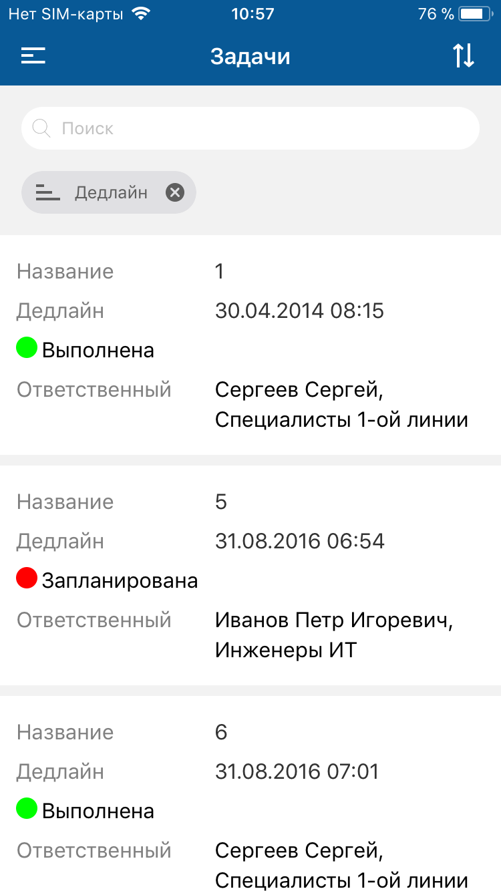

Чтобы сбросить сортировку списка, нажмите крестик рядом с атрибутом, по которому отсортирован список.

#### Навигация на экране

- Иконка возврата к предыдущему экрану.

    При длинном нажатии (лонгтап) на иконку возврата открывается история посещений. Она отображается поверх экрана и содержит ссылки на ранее посещенные экраны: верхняя — на предыдущий экран, нижняя — на первый посещенный экран. Также в истории посещений отображаются переходы по пуш-сообщению или по ссылке на экран карточки.
    Чтобы скрыть историю посещений, нажмите вне ее области. 
    История посещений сбрасывается, если открывается меню приложения. 
    История посещений сохраняется в кеше приложения, обеспечивая доступ по ссылкам в офлайн-режиме.
- Иконка меню действий . Иконка отображается, если настроено хотя бы еще одно действие помимо сортировки списка. Подробнее смотри ниже [Меню действий в списке на карточке](#menu_list).
- Иконка вызова меню действий с объектом (рядом с элементом списка). Подробнее смотри ниже [Меню действий с объектом](#menu_obj).

### Действия с объектом

#### Кнопки на карточке

Доступность кнопок зависит от настройки системы. Действия, которые могут быть инициированы по кнопке, и действия, вызванные из меню действий с объектом, могут отличаться.

Чтобы выполнить действие с объектом, нажмите на соответствующую кнопку на экране карточки.

При длинном нажатии на иконку или кнопку с иконкой отображается подсказка с названием действия.

Пример добавления объекта смотри в разделе [Добавить. iOS](./actions/add) - [На экране карточки объекта](./actions/add).

Описание других действий с объектом в мобильном приложении см. в разделе [Действия. iOS](./actions).

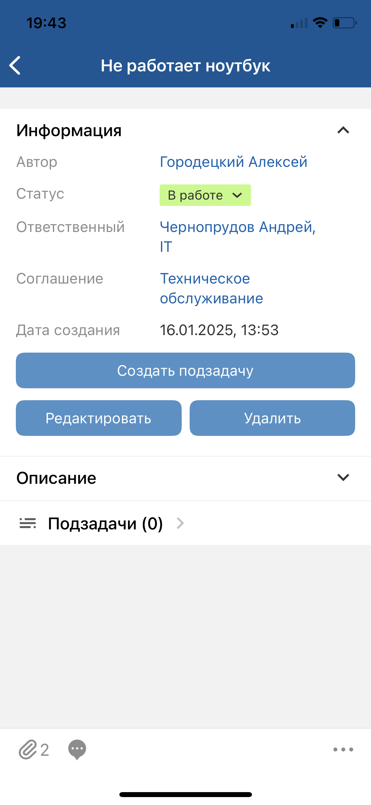

#### Меню действий с объектом

Меню действий вызывается:

- с экрана карточки при нажатии иконки вызова меню действий с объектом;
- с экрана списка на карточке при нажатии иконки вызова меню действий с объектом (рядом с элементом списка).

Меню действий с объектом на экране списка совпадает с меню действий с объектом на экране карточки этого объекта. Набор доступных действий зависит от прав текущего пользователя.

Если у пользователя нет прав ни на одно действие с объектом, отображается сообщение "Нет доступных действий".

Для инициации действия с объектом нажмите иконку вызова меню действий с объектом (рядом с элементом списка) и выберите пункт меню.

Описание действий с объектом в мобильном приложении см. в разделе [Действия. iOS](./actions).

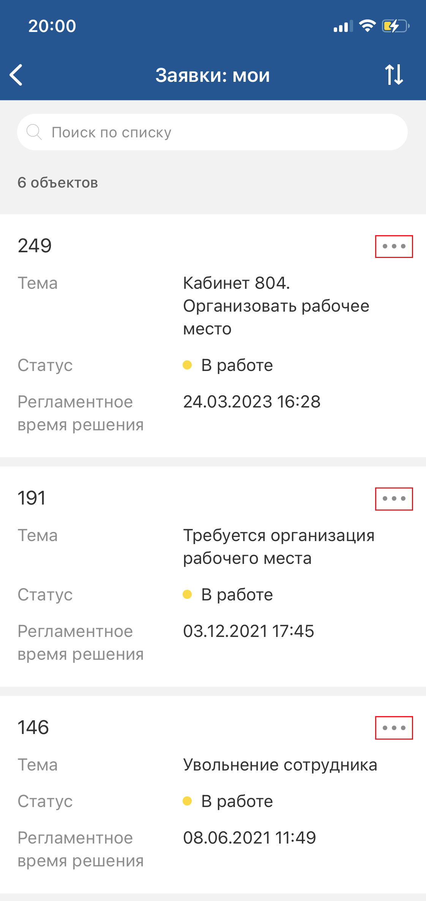 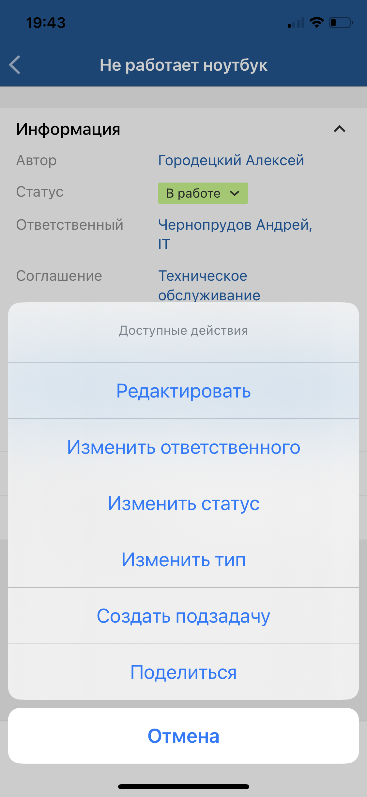

#### Меню действий в списке на карточке

Меню действий вызывается при нажатии иконки  на экране списка на карточке. Иконка отображается, если настроено хотя бы еще одно действие в списке помимо сортировки списка.

Чтобы выполнить действие с объектом, нажмите на соответствующий пункт меню.

Пример добавления объекта смотри в разделе [Добавить. iOS](./actions/add) - [В списке связанных / вложенных объектов](./actions/add).

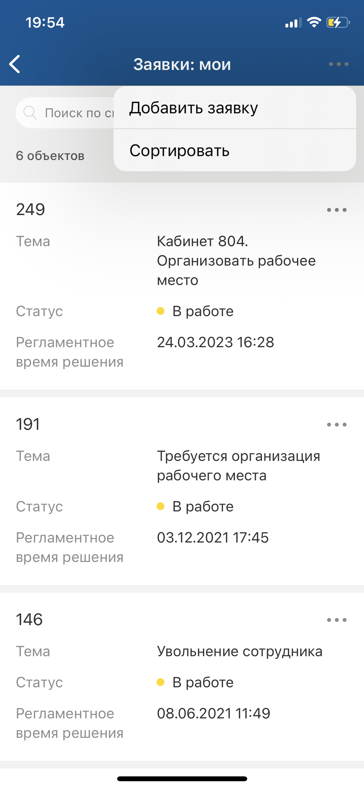
