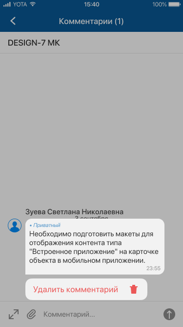

# Меню действий с комментарием. iOS

[Для Android](../../how-to-use-2/comments-2/comment-actions-2)

Меню действий с комментарием вызывается при длинном нажатии (лонгтап) на комментарий и скрывается при нажатии мимо области меню действий.

- [Подробнее](./comment-actions#detail)
- [Редактирование](./comment-actions#edit)
- [Удаление](./comment-actions#del)

### Подробнее {#detail}

Только в меню на экране "Комментарии ()".

Нажмите "Подробнее" для перехода на карточку комментария.

### Редактирование {#edit}

Редактирование комментария доступно в онлайн режиме.

Возможность редактирования комментария зависит от прав доступа текущего пользователя.

#### Место в интерфейсе

Меню на экране "Комментарии ()" и экране отдельного комментария.

Список действий с комментарием кешируется. Если действия с комментарием лежат в кеше, то они будут показаны и в офлайн-режиме.

#### Выполнение действия

1. Разверните меню действий с комментарием и выберите пункт "Редактировать".

    
2. На экране "Редактирование" измените значения атрибутов комментария.

    Для ввода значения отдельного атрибута нажмите на поле атрибута и укажите его значение, см. [Типы атрибутов на формах действий. iOS](../actions/attributes-types).

    
3. Нажмите **Готово** на верхней панели экрана "Редактирование".

    При выходе с экрана редактирования комментария без нажатия **Готово** внесенные изменения не сохраняются.

### Удаление {#del}

Удаление комментария доступно в онлайн и офлайн режимах.

Возможность удаления комментария зависит от прав доступа текущего пользователя.

#### Место в интерфейсе

Меню на экране "Комментарии ()" и экране отдельного комментария.

Список действий с комментарием кешируется. Если действия с комментарием лежат в кеше, то они будут показаны и в офлайн-режиме.

#### Выполнение действия

Разверните меню действий с комментарием и выберите пункт "Удалить".

Подтвердите удаление.

#### Результат действия

Комментарий будет удален.

Особенности офлайн-режима: При удалении комментария в офлайн-режиме действие помещается в очередь синхронизации. На экране отображается сообщение: "Действие добавлено в очередь синхронизации и будет выполнено при появлении доступа к серверу". Комментарий отображается в списке до завершения удаления.

Подробное описание офлайн-режима приведено в разделе [Офлайн-режим. iOS](../offline).
