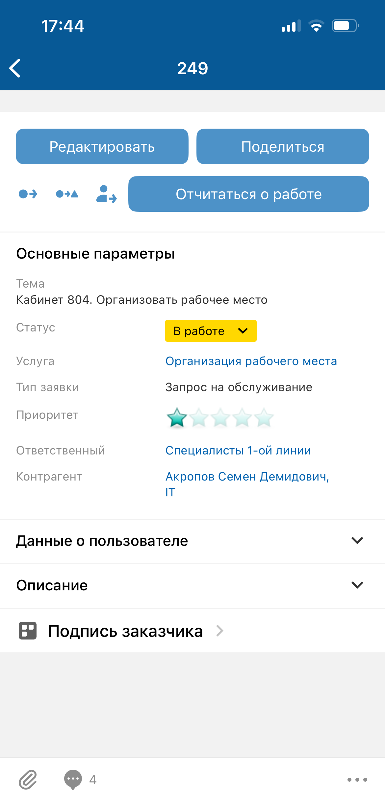
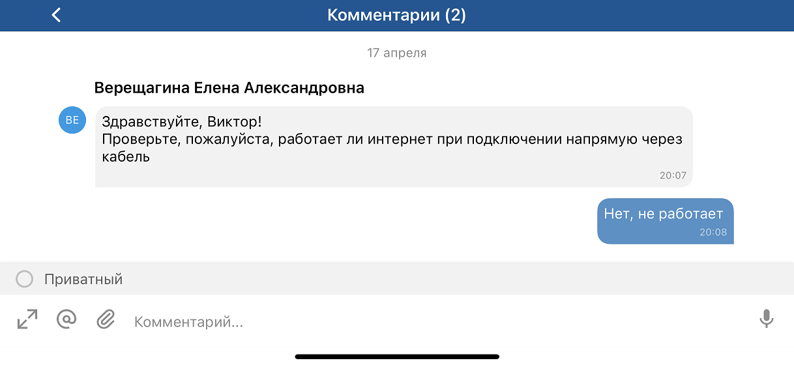
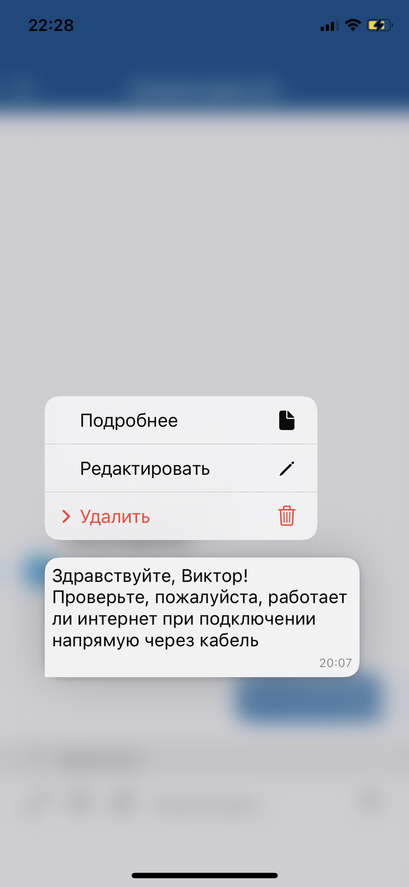
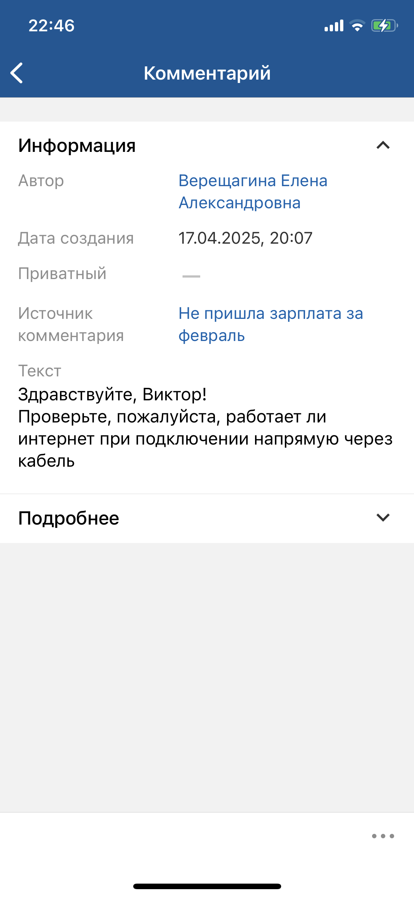

# Просмотр комментариев. iOS

[Для Android](../../how-to-use-2/comments-2/comment-view-2)

- [Экран "Комментарии ()"](./comment-view#1)
- [Экран комментария](./comment-view#2)

### Экран "Комментарии ()" {#1}

Просмотр комментариев доступно в онлайн и офлайн-режиме.

Возможность просмотра комментариев зависит от прав доступа текущего пользователя.

#### Переход на экран

Откройте экран карточки объекта и на нижней панели нажмите иконку .

#### Содержание экрана

В названии экрана "Комментарии ()" в скобках указывается общее количество комментариев. Если к объекту не добавлено ни одного комментария, то отображается картинка "Комментарии отсутствуют".

Экран "Комментарии ()" может отображаться в портретном режиме и в ландшафтном режиме.

Список комментариев:

- В списке отображаются комментарии, добавленные в мобильном приложении (на экране "Комментарии ()", на формах смены статуса, смены ответственного, смена типа и привязки) и в веб-интерфейсе.
- Комментарии отсортированы по дате. Внизу расположены более свежие комментарии, а вверху — старые. Комментарии разбиты по группам по дате добавления комментария.
- Автор комментария и иконка автора отображаются для первого сообщения в группе сообщений от другого пользователя внутри одной даты. Если у текущего пользователя нет права на просмотр автора комментария, то отображается псевдоним автора (по умолчанию "Сотрудник").

Для каждого комментария отображается:

- Отметка о приватности;
- Текст комментария — отображается с учетом переноса строк, с сохранением заданных стилей.

    Контактные данные (телефонные номера и электронные адреса) распознаются в тексте как ссылки. При нажатии на ссылку запускается соответствующая системная функция операционной системы устройства.

    В тексте доступно копирование части комментария — по двойному нажатию на текст комментария появляется ползунок для выделения текста.
- Дата и время отправки, с учетом часового пояса.
- Все изображения, вставленные в комментарий, отображаются в конце сообщения отдельным блоком. Максимум выводится три превью. Если картинок больше трех, то третья картинка затемняется, а на фоне пишется сколько еще картинок не выведено с учетом текущей картинки.

#### Навигация на экране

- Иконка возврата к предыдущему экрану.

    При длинном нажатии (лонгтап) на иконку возврата открывается история посещений. Она отображается поверх экрана и содержит ссылки на ранее посещенные экраны: верхняя — на предыдущий экран, нижняя — на первый посещенный экран. Также в истории посещений отображаются переходы по пуш-сообщению или по ссылке на экран карточки.
    Чтобы скрыть историю посещений, нажмите вне ее области. 
    История посещений сбрасывается, если открывается меню приложения. 
    История посещений сохраняется в кеше приложения, обеспечивая доступ по ссылкам в офлайн-режиме.
- Название объекта, для которого открыт список комментариев, является ссылкой на экран карточки объекта.
- Иконка автора комментария является ссылкой на экран карточки автора комментария.

    Переход на карточку автора комментария выполняется, если автор комментария не является суперпользователем и в мобильном приложении настроена карточка сотрудника (автора комментария), а у текущего пользователя есть право на просмотр карточки сотрудника.
- Иконка  на нижней панели экрана является ссылкой для перехода к экрану добавления комментария. Иконка недоступна для нажатия, пока грузится хотя бы одно изображение, прикрепленное к комментарию.
- При длинном нажатии (лонгтап) на комментарий открывается [Меню действий с комментарием. iOS](./comment-actions).

## Экран комментария {#2}

Просмотр комментариев доступно в онлайн и офлайн-режиме. В офлайн-режиме можно перейти на экран комментария, если он был сохранен в кеше приложения.

Возможность просмотра комментариев зависит от прав доступа текущего пользователя.

#### Переход на экран

На экране "Комментарии ()" раскройте меню действий и выберите пункт "Подробнее".

#### Содержание экрана

- Блок "Информация" с атрибутами "Автор", "Дата создания", "Приватный", "Источник комментария" и "Текст".

    Изображения, прикрепленные к комментарию, отображаются в тексте комментария.
- Блок "Подробнее" с дополнительными параметрами комментария.

Блоки "Информация" и "Подробнее" могут отображаться в свернутом и развернутом виде.

#### Навигация на экране

- Иконка возврата к предыдущему экрану.
- При нажатии иконки меню  на нижней панели открывается [Меню действий с комментарием. iOS](./comment-actions).
