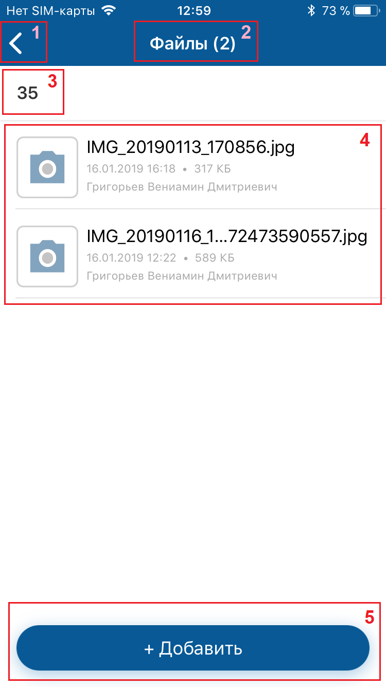
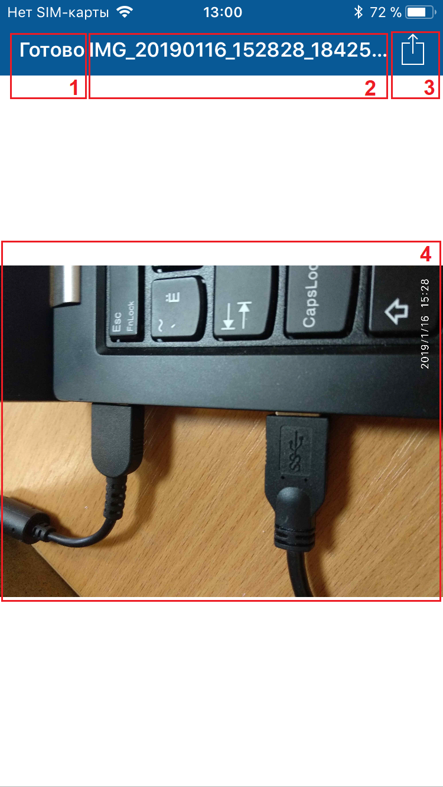
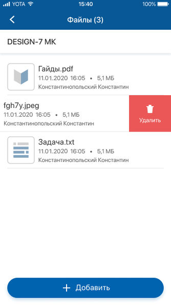

# Файлы. iOS

[Для Android](../how-to-use-2/files-2)

- [Просмотр прикрепленных файлов](#01)
- [Прикрепление файла к объекту](#02)
- [Удаление файла](#04)

## Просмотр прикрепленных файлов

Возможность просмотра файлов зависит от прав текущего пользователя и наличия соответствующих разрешений для мобильного приложения.

### Экран "Файлы"

#### Переход на экран

Откройте экран карточки объекта и на нижней панели нажмите "Файлы ()".

#### Содержание экрана

В названии экрана "Файлы ()" в скобках указывается общее количество файлов.

На экране отображаются файлы, добавленные в мобильном приложении (на экране "Файлы ()" и в веб-интерфейсе в списке файлов.

Файлы разделены горизонтальной линией. Для каждого файла отображается иконка с расширением файла, название, дата и время добавления, размер, автор файла.

#### Навигация на экране

- Иконка возврата на карточку объекта, с которой был открыт экран.

    Если список файлов был открыт из пуш-уведомления, то при нажатии на иконку открывается карточка объекта, а при следующем нажатии — экран, с которого был выполнен переход из пуш-уведомления.

    При длинном нажатии (лонгтап) на иконку возврата открывается история посещений. Она отображается поверх экрана и содержит ссылки на ранее посещенные экраны: верхняя — на предыдущий экран, нижняя — на первый посещенный экран. Также в истории посещений отображаются переходы по пуш-сообщению или по ссылке на экран карточки.
    Чтобы скрыть историю посещений, нажмите вне ее области. 
    История посещений сбрасывается, если открывается меню приложения. 
    История посещений сохраняется в кеше приложения, обеспечивая доступ по ссылкам в офлайн-режиме.
- Название объекта, для которого открыт список файлов, является ссылкой на экран карточки объекта.

### Экран предпросмотра файла

#### Переход на экран

Чтобы перейти на экран, нажмите на название файла. Выполнится загрузка файла на мобильное устройство и файл открывается встроенным просмотрщиком.

<note type="info">

Если загрузка файла занимает длительное время, то на время загрузки файла на экране предпросмотра отображается прогресс-бар. Для отмены загрузки перейдите на другой экран до окончания процесса загрузки.
Если файл не может быть открыт встроенным просмотрщиком, то на экране предпросмотра на сером фоне отображается информация о файле.

</note>

#### Содержание экрана

- Название файла.
- Содержание файла.

#### Навигация на экране

- **Готово** для завершения просмотра файла.
- Иконка для выбора приложения для просмотра файла.

## Прикрепление файла к объекту

Прикрепление файла к объекту доступно в онлайн и офлайн-режиме.

Возможность прикрепление файлов к объекту зависит от прав текущего пользователя и наличия соответствующих разрешений для мобильного приложения.

#### Место в интерфейсе

Экран "Файлы ()".

#### Выполнение действия

1. На экране "Файлы ()" нажмите **Добавить**.
2. Укажите источник добавления файла.

    Возможные источники добавления файла:
    - "Камера" — для добавления нового фото или видео (для выбора режим "фото" или "видео" используется переключатель, по умолчанию выбран режим "фото").
    - "Изображение" — для добавления изображения и видео из библиотеки (галереи) используется специальный виджет с возможностью множественного добавления файлов.
    - "Файл" — для добавления любого типа файлов с помощью стандартного менеджера файлов с возможностью множественного добавления файлов.

    В списке источников могут отображаться другие программы и приложения, позволяющие работать с файлами на мобильном устройстве.
3. Выберите файл или несколько файлов, если выбранный источник поддерживает множественный выбор и загрузку файлов.

#### Результат действия

Выполнится загрузка файла на сервер, на время загрузки файла вместо иконки с расширением отображается прогресс-бар. Новый файл отобразится на экране в верху списка файлов.

<note type="info">

Размер загружаемых изображений уменьшается, если в настройках приложения включен параметр "[Сжимать отправляемые изображения](./navigation/settings/app-settings)".

</note>

Каждый файл проверяется на соответствие наложенным ограничениям на загрузку файлов, которые установлены конфигурационном файле [dbaccess.properties](../how-to-configure/dbaccess-properties). Если время загрузки файла произошла ошибка, то на экране отображается сообщение об ошибке. На серой заглушке вместо расширения файла отображаются элементы управления для запуска повторной попытки загрузки файла или отмены загрузки файла .

Для отмены загрузки перейдите на другой экран до окончания процесса загрузки или нажмите на крестик в центре прогресс-бара .

Особенности офлайн-режима:

- Для добавления файла в офлайн-режиме карточка объекта должна быть сохранена в кеше приложения.
- После добавления файла действие помещается в очередь синхронизации. На экране отображается сообщение: "Файл добавлен в очередь синхронизации и будет отправлен при появлении доступа к серверу".
- Время добавления файла будет соответствовать дате и времени синхронизации с сервером.

Подробное описание офлайн-режима приведено в разделе [Офлайн-режим. iOS](./offline).

## Удаление файла

Удаление файла доступно в онлайн и офлайн режимах.

Возможность добавления файлов к объекту и удаления файлов зависит от прав текущего пользователя и наличия соответствующих разрешений для мобильного приложения.

#### Место в интерфейсе

Экран "Файлы ()".

#### Выполнение действия

Чтобы удалить файл, на проведите справа-налево на строке с файлом и нажмите **Удалить**.

#### Результат действия

Файл будет удален.

Особенности офлайн-режима:

- Для удаления файла в офлайн-режиме карточка объекта должна быть сохранена в кеше приложения.
- После удаления файла действие помещается в очередь синхронизации. На экране отображается сообщение: "Действие добавлено в очередь синхронизации и будет выполнено при появлении доступа к серверу". Удаляемый элемент визуально остается в списке.
- После возобновлении доступа к серверу выполняется удаление файла, если у пользователя есть права на удаление выбранного файла или удаляемый файл уже был удален (пока пользователь был офлайн).

Подробное описание офлайн-режима приведено в разделе [Офлайн-режим. iOS](./offline).
